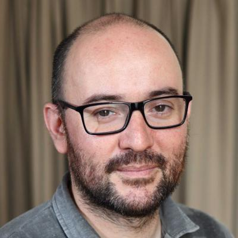

# About me

<!--  -->

Hello! I'm Vasco. I'm an ex-astrophysicist and physics professor turned open source hardware and regenerative systems design enthusiast! I hope to learn everything I can at fablab academy so I can take full advantage of digital fabrication skills to empower communities and engage in social entrepreneurship projects.

## My background

I have an academic background in physics and astronomy. I did my PhD at the University of Porto and Université Joseph Fourier in Grenoble, France. 

I lived five years in Brazil between 2013 and 2019. I worked as a post-doc researcher at Universidade do Rio Grande do Norte, Natal, for 1.5 years and afterwards got a position as physics professor at Instituto Federal do Paraná, a polytechnic institute, in Foz do Iguaçu, ~ 4.100 km from Natal!

During this time at the institute my interest for open source hardware flourished, as I rediscovered [open source ecology](https://wiki.opensourceecology.org/wiki/Main_Page) project and its machines. Soon, I was planning proposal to get some funding and starting building some prototypes!

Unfortunately it was not so easy...the campus had no infrastructure and at this time the Brazilian government started cutting hard on RDI funding. We tried two times to fund for a small fablab and another to create one in a small self-managed community but were not successful.

Nevertheless, during this time at the institute, I got several small grants that funded three projects: a telescope dome automation, a 3d printer build, and a recycled plastic extruder. I will write about them later on.

 I returned to Portugal in July 2019 and from late 2019 onward I'm working with [Associação Portuguesa de Educação Ambiental - ASPEA](https://aspea.org/) (Portuguese Association of environmental education) as a project coordinator. I'm currently coordinating two projects:

* [Future Planning](https://aspea.org/index.php/pt/o-que-fazemos/projetos-internacionais/future-planning) - funded by EEA Grants programme 2014-2020 [Fund for Bilateral Relations](https://www.eeagrants.gov.pt/en/programmes/bilateral-relations/).
* [MAPEAR](https://aspea.org/index.php/pt/o-que-fazemos/projetos-nacionais/mapear) - Mapeamento Ambiental Colaborativo da Qualidade do Ar e Ruído (Air quality and noise collaborative environmental mapping) - we obtained a 50k€ grant in 2020 from Fundo Ambiental - [Educação ambiental + Sustentável](https://www.fundoambiental.pt/avisos-20201/capacitacao-e-sensibilizacao-ambiental/educacao-ambiental--sustentavel.aspx) program.

I've been also working on funding proposals at the national (e.g. Fundo Ambiental, Gulbenkian) and international levels (e.g. Erasmus+, ACTION).

***TBC***

## Previous work

**TBC**

<!-- ### Project A -->

<!-- This is an image from an external site: -->

<!-- 

While this is an image from the assets/images folder. Never use absolute paths (starting with /) when linking local images, always relative.

 -->