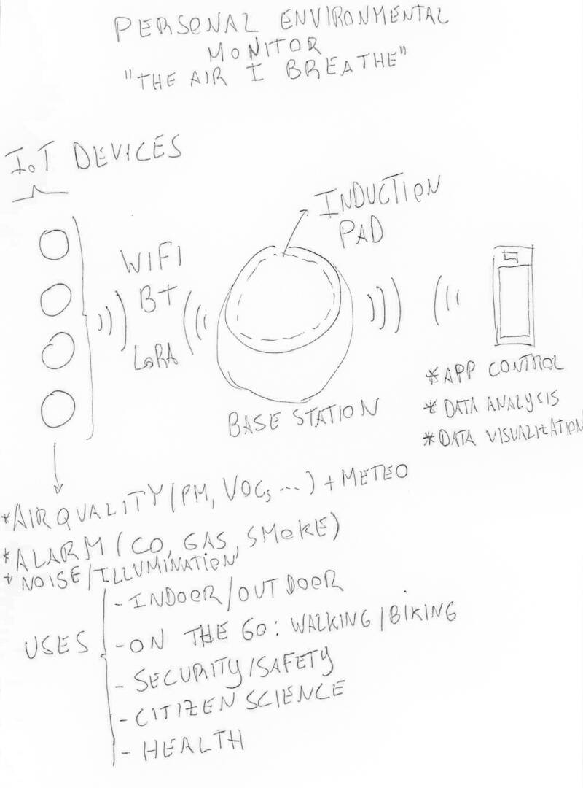

# 1.1 Principles and practices

## Intro

After one of the most exciting weeks ever (and yes I'm talking about the bootcamp!), I started my documentation effort here, in this very page.

My first real commit was on Friday 29th of January. I did a lot of things before documenting and now I have to double my efforts! Working and documenting everything on the fly demands another level of self-organization I still don't have...and it will be an interesting challenge! I'm sure I will be a more organized person after all this :)

Let's start then...from the beginning!

During bootcamp and at the first class on Wednesday 27th of January, we learned about web development and the different tools and languages we have at our disposal.

We only have one week to do our assignments and it is not wise to disperse (too much!).

Following that line of action I chose [Visual Studio Code](https://code.visualstudio.com/) as my language editor and [MKdocs](https://www.mkdocs.org/) as the static framework to lay out my assignments in [Markdown](https://en.wikipedia.org/wiki/Markdown) as advised by the Fab Academy. If possible I will experiment with other static content generators later on. I will also use [HTML](https://en.wikipedia.org/wiki/HTML) when needed.

**During Fablab Academy I'll be using a laptop with [Xubuntu](https://xubuntu.org/) 20.04 Linux distribution.**

**At week 01 I used as reference the [Fab Academy Tutorials](https://fabacademy.org/2019/docs/FabAcademy-Tutorials/index.html), the [Fab Academy 2021 Assignments and Assessments](https://fabacademy.org/2021/docs/assessment/index.html), and the bootcamp information contained in the [2021 Fablab Schedule](http://fabacademy.org/2021/schedule.html).**

<!-- add here two images one with visualstudio code and another with markdown -->

## Assignments

* *Plan and sketch a potential final project*

## Initial product design idea

The initial idea is to create a customizable, modular, IoT, on-the-go environmental indoor/outdoor personal monitoring ecosystem. It is comprised of a base station and a few modular devices with specific functions:

* **Micrometric particle concentration measurement (PM10, PM2.5, PM1)**
* **Meteorologic physical variables measurement (Temperature, Humidity, Pressure)**
* **Integrated CO, Smoke and Gas Alarm device (indoor)**
* **Cell phone App with control and simple data analysis capability**
* CO2, VOCs, Noise and Illumination measurement
* Air quality forecast information (App + Base)
* Smog sensor (?)
* ...

The ones this project will address first and foremost are in **bold**.

The base station connects to the internet via wi-fi and to the other devices via wi-fi or/and bluetooth or/and LoRa or/and radio. The devices recharge their batteries via an [inductive charging](https://en.wikipedia.org/wiki/Inductive_charging) pad or surface. All devices are controlled by a simple cell phone app.

The intended audience would be: 

* Everyone who has the need to know their own personal air quality, whether it may be inside, outside or on the go.
* People with respiratory conditions to know the quality of the air around them and act accordingly.
* People with fireplaces and appliances that use gas to know if they have a potentially deadly problem on their hands, and it can also double up as a smoke detector.
* Everyone working inside all the time during the pandemic and worried about indoor air quality.

I (tried to) sketched this idea by hand. I hope you can understand it! :) I will start with the base station and one device and, if time allows, I will move on to other devices.

<!-- image with sketched idea -->

I did a brainstorming session with the [mindmap](https://en.wikipedia.org/wiki/Mind_map) technique using the [Miro](https://miro.com/) online tool. The parts the project recognizes as priority are highlighted with the red boxes.

**Click on the image to enlarge it.** 

<!-- image with miro mindmap -->

<!-- Trigger the Modal --

 
<!-- The Modal --

  <!-- The Close Button --
  &times;

  <!-- Modal Content (The Image) --
  

  <!-- Modal Caption (Image Text) --
  

 
-->

I also placed some "random" (associative) design examples in my miro board as well to get inspired. The most important keyword here is 'organic design'.

<!-- image with miro pictures -->

## Tentative GANTT Chart

Taking a quick look at the following weeks up to the end of the course, I plot here a tentative [Gantt Chart](https://en.wikipedia.org/wiki/Gantt_chart) made with [Mermaid](https://mermaid-js.github.io/mermaid/#/) so that I can steer a little better in the rough seas ahead :)

**Click on the image to enlarge it.** 

<!-- image with GANTT --

<!-- Trigger the Modal I need more time to fix this --

 
<!-- The Modal --

  <!-- The Close Button --
  &times;

  <!-- Modal Content (The Image) --
  

  <!-- Modal Caption (Image Text) --
  

 

<!--

gantt
  	title FA project Gantt Diagram
   	dateFormat  YYYY-MM-DD
    axisformat %d/%m
    
%%<!-- class: 03/02
    section Web dev

    Web dev                : active, 2021-01-27, 20w

	section CAD Design

    Base (D1) 			    : a1, 2021-02-03, 15d
   	PM/Meteo (D2)	    	:     2021-02-03, 15d
	Alarm 	 (D3)   		:     2021-02-03, 15d
	Other Dev. (D4)			:     2021-02-03, 15d
   	
	section Materials
	BOM						: 	  2021-03-10, 28d

	section Electronics 
%%<!-- class: 17/02,03/03,07/04,21/04
	production	  	: bd1,	2021-02-17, 2w
   	design		    : bp1,  2021-03-03, 2w	
	input         	:       2021-04-07, 2w
	output          :       2021-04-21, 2w

	section Programming
%%<!-- class: 17/03,07/04,21/04,28/04,05/05
	Embedded/Firmware   	: 2021-03-17, 7w
	Networking  			: 2021-04-28, 4w
	Mobile App 				: 2021-05-05, 4w

	section Prototyping
%%<!-- class: 10/02,24/02,14/04 --
	CNC cutting         	:	2021-02-10, 15d
	3D Printing     		:	2021-02-24, 15d
	Molding/casting     	:	2021-04-14, 15d
	Laser engraving     	:	2021-04-25, 15d
	
	section Integration
%%<!-- class: 02/06 --
	Part integration		: 2021-05-12, 5w
	Final version			: 2021-06-02, 2w
	
	section Presentation
%%<!-- class: 09/06 --
	Slides					: 2021-06-09, 7d
	Videos					: 2021-06-09, 7d

	-->

## References

- [2021 Fablab Schedule](http://fabacademy.org/2021/schedule.html)
- [Adam Pritchard's Markdown Cheatsheet](https://github.com/adam-p/markdown-here/wiki/Markdown-Cheatsheet)
- [Fab Academy Tutorials](https://fabacademy.org/2019/docs/FabAcademy-Tutorials/index.html)
- [Fab Academy 2021 Assignments and Assessments](https://fabacademy.org/2021/docs/assessment/index.html)
- [HTML5 Tutorials](https://www.w3schools.com/html/)
- [Markdown](https://en.wikipedia.org/wiki/Markdown)
- [Miro](https://miro.com/)
- [MKdocs](https://www.mkdocs.org/)
- [The Markdown Guide](https://www.markdownguide.org/)
- [Visual Studio Code](https://code.visualstudio.com/)

