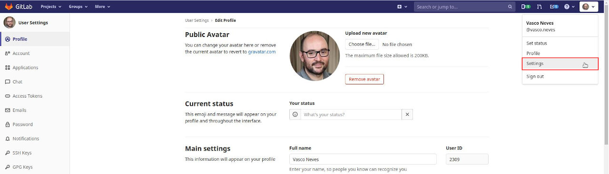
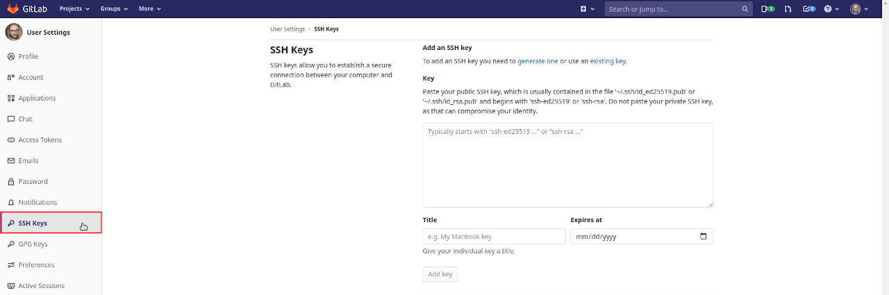
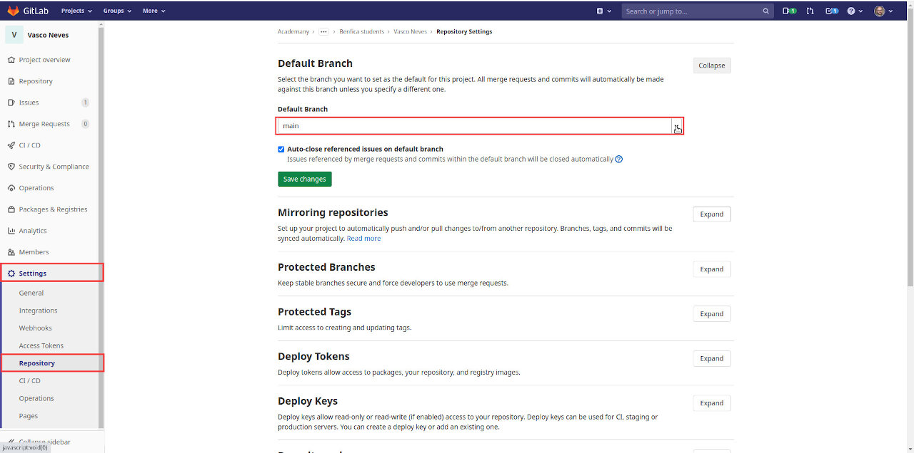
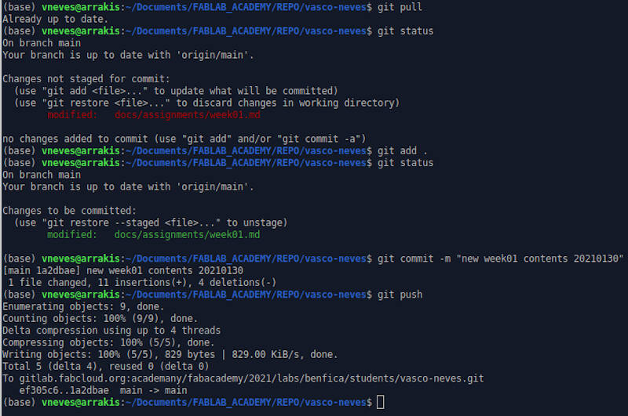

# 1.2 Project management

## Assignments

*1.2.1 Work through a git tutorial.*

*1.2.2 Build a personal site describing you and your final project.*

*1.2.3 Upload it to the class archive.*

## 1.2.1 GIT tutorial and procedures

<!-- add two images here, one with git and another with gitlab -->

During Fablab Academy we will be using Gitlab as a cloud repository. Gitlab is an open source repository hosting service using Git distributed version control system. With Git and Gitlab all modifications done to this page and its contents are saved and accessible through the different versions submitted to the Gitlab server. The advantage of using Gitlab when compared to other similar tools resides in the possibility of setting up local servers, such as the one running within Fablab Academy.

### Generating the SSH key

The first thing we need to do to get started is to generate a SSH key. This key will enable us to get direct access to gitlab without the need of a password. **Bear in mind that this key is unique to your computer and if you use multiple devices you will need a key to each one of them!**

To generate a SSH key, we just need to type in the terminal the following command

```
ssh-keygen -t rsa -C "your_email"
```
This will generate a RSA key pair. I obtained the following (censored) output:

```
Enter file in which to save the key (/home/vneves/.ssh/id_rsa):
/home/vneves/.ssh/id_rsa already exists.
Overwrite (y/n)? y
Enter passphrase (empty for no passphrase):
Enter same passphrase again:
Your identification has been saved in /home/vneves/.ssh/id_rsa
Your public key has been saved in /home/vneves/.ssh/id_rsa.pub
The key fingerprint is: ...(etc etc)
The key's randomart image is: (blablabla)
```

Why censored? Because you must never **EVER** share your RSA key with the public! It may be the end of you :) Just press enter when the program asks you for a password.

The public key was saved in my home directory under .ssh/id_rsa.pub. To obtain it I used the UNIX cat command in the terminal

```
cat .ssh/id_rsa.pub
```

Then I just copied the key content to my clipboard. We will need this for the next step, that will involve the gitlab page.

### Setting up the SSH key in the gitlab page

Fablab Academy has its own Gitlab Server which host the student's repositories, organized by different labs all over the world. In my case, I'm a student at FabLab Benfica in Lisbon, Portugal.

When uploaded, this gitlab page generates the student's web page which will be (almost) immediately online.

Now, I need to introduce the SSH key to have direct access to my repository so I can easily obtain and submit modifications to my page. To do this, I opened the web browser with my [page address](https://gitlab.fabcloud.org/academany/fabacademy/2021/labs/benfica/students/vasco-neves) and clicked on **User settings** as shown on the top right corner of the following figure.



Then, I clicked on SSH keys option, on the left, added the key into the key box on the right and clicked add key just below. That's it! Now we're ready to set up a copy of the repository so we can work on the site locally.



In order to do this, we need to install git. In my case, git was already installed, but to be sure I ran the following command line in the bash terminal

```
sudo apt-get install git
```

and I got the following reply

```
Reading package lists... Done
Building dependency tree
Reading state information... Done
git is already the newest version (1:2.25.1-1ubuntu3).
0 upgraded, 0 newly installed, 0 to remove and 43 not upgraded.
```

Ok! So we are ready to proceed.

### Configuring git global environment

It is important to configure the git global environment before anything else. To do this I wrote in the terminal

```
git config user.name "My_name"
git config user.email "my_email"
```

The **user.name** and **user_email** should be the same as used on the cloud Fab Academy server.

### Cloning the repository at the local computer

The first thing we need to do now is to clone the repository. Do to this, I used the following command line in the terminal in a convenient directory inside my computer.

```
git clone git@gitlab.fabcloud.org:academany/fabacademy/2021/labs/benfica/students/vasco-neves.git

```
This command created a new directory with the full repository which, at this time, is only comprised be the initial skeleton provided by the Academy, including the mkdocs initial profile.

### Changing the main branch name from MASTER to MAIN (Optional)

During bootcamp Kris showed us how to change the name of the main branch. So I tried it out to gain some more experience, but there was a problem afterwards as I'm going to show here.

I followed this [tutorial](https://www.git-tower.com/learn/git/faq/git-rename-master-to-main/) from git-tower.com as suggested by Kris.

First you rename the master branch **locally** in the directory of your computer

```
git branch -m master main
```

To check if this worked out, I typed

```
git status
```

and obtained

```
On branch main
Your branch is up to date with 'origin/master'.

nothing to commit, working tree clean
```

The local branch has been renamed but this change must also be done on the remote server. We cannot simple rename the original branch directly, we will need to add the new main branch and then delete the master branch.

To create a new branch in the remote server I simply typed

```
git push -u origin main
```

I checked in my web page that the new main branch existed with all info inside. Before deleting, I needed to change the default branch in the gitlab page. To do this, I clicked on **Settings - Repository**  and changed my **Default Branch** from **master** to **main**.



This change enabled me to delete the master branch from my computer with the terminal command

```
git push origin --delete master
```

and I obtained

```
git push origin --delete master
To https://gitlab.fabcloud.org:academany/fabacademy/2021/labs/benfica/students/vasco-neves.git
 - [deleted]           master
```

That's it. **Or maybe not!** Later on I tried to update the site from my local repository. Everything checked out fine, the pipeline gave the <span style="color:green;">green lights</span>, I checked all files from the remote repo and...even if the page was updated on the gitlab server it did not update the my web page!!

***What was happening?*** &nbsp;Two days later I found out by myself that I needed to modify the file ```.gitlab-ci.yml``` so that where it appears **master** it should appear **main**. And that was it, problem solved! :)


#### <a name='mantra'></a> The Git Mantra

A mantra is something you want to repeat over and over again, in principle for your own well-being and peace of mind. In this case, it does apply exactly as it is crucial for our digital integrity to follow the **git mantra**, as shown to me by André, my local instructor. Otherwise, we may lose stuff or things may stop working entirely and one must start over from scratch. **It is something you should repeat at least every day.**

The usefulness and power of the full mantra will become clearer once one starts to collaborate in coding projects with multiple people.

```
git pull
git add .
git status
git commit -m "useful annotation describing what I have done so far"
git push
```

- **The first line** pulls all modifications from the cloud. This is not apparently useful right now but It would be critical if I was collaborating with multiple people. As I'm alone updating the site, it will mostly state that everything is up to date. The only exception to this is when I change something in the cloud, and then ```pull``` will update the local repository with these changes.
- **The second line** adds every new modification about to be committed as a new version.
- **The third line** gives the status of the branch I'm working on and if all changes are staged for commit. If they are staged they will appear in **<span style="color:green;">green</span>**. Otherwise, they will appear in **<span style="color:red;">red</span>**.
- **The fourth line** makes a snapshot of the local branch to be uploaded to the Fab Server, with a (hopefully) useful annotation for versioning purposes.
- **The fifth line** will upload the new version to the cloud.

**DON'T FORGET : Recite the Mantra and REPEAT** :)

In the example below I added a second ```git status``` just for demonstration purposes.



## 1.2.2 Personal site creation

### Installing and setting up Mkdocs

During week 01 I've been learning to use the static content generator [MKdocs](https://www.mkdocs.org/) as my web development tool, as suggested by the Academy. We'll see if I have time to use other tools as well... ;)

To install Mkdocs I just used pip on the terminal

```
pip install mkdocs
```

And it was successfully installed (just the last two lines of the installation)

```
Installing collected packages: mkdocs
Successfully installed mkdocs-1.1.2
```

After the installation I run the Mkdocs local server at my computer **inside** the directory where my repository is installed so I can check any changes made to the site in real time.

```
mkdocs serve
```

To access it, I just need to insert the web address ```http://127.0.0.1:8000``` in my browser.

### Installing Visual Studio Code

At this time I will be using [Visual Studio Code](https://code.visualstudio.com/) as the tool to code my site in Markdown](https://en.wikipedia.org/wiki/Markdown).

To install it I just downloaded the .deb file from the web site and used the terminal

```
sudo dpkg -i code_1.52.1-1608136922_amd64.deb

```

### Creating my personal page

From here I added my [personal info](http://fabacademy.org/2021/labs/benfica/students/vasco-neves/about/), and all the needed info to the cloud to fulfill the [week 01 assignments](http://fabacademy.org/2021/labs/benfica/students/vasco-neves/assignments/week01/). I also signed the [Fablab Student Agreement](http://fabacademy.org/2021/labs/benfica/students/vasco-neves/about/agreement/).

I used [BIMP](https://alessandrofrancesconi.it/projects/bimp/), a [GIMP](https://www.gimp.org/) plugin to batch compress and optimize my pictures to 800 px maximum (except the ones taken as screenshots) and compressed my videos with [Handbrake](https://handbrake.fr/).

I also used here and there some HTML code, such as `<span style="color:COLOR_HERE;">TEXT_HERE</span>` to change the color of a text section or `&nbsp;` when I needed a whitespace to prevent character conflicts.

In the end I added one two css files and one js file in the `mkdocs.yml` configuration file under `extra_css` and ``extra_js: 

* The `body.css` controls general properties of the text, such as justification and hyphenation. 
* The `modal.css` and `modal.js` files allow the use of modal images in the site ([source](https://www.w3schools.com/howto/howto_css_modal_images.asp])).

However there was a catch: **[Mkdocs ignores the path of raw html](https://www.mkdocs.org/user-guide/writing-your-docs/#linking-from-raw-html)**, and the image did not appear! So I had to inspect the file (after some lengthy research) and found out that the output was pointing one level above the docs directory. Problem solved! ;)

## 1.2.3 Uploading to the Fablab Academy repository

Using the [git mantra](#mantra) shown above I regularly upload the page to the Fablab Academy server.


## References

- [2021 Fablab Schedule](http://fabacademy.org/2021/schedule.html)
- [Adam Pritchard's Markdown Cheatsheet](https://github.com/adam-p/markdown-here/wiki/Markdown-Cheatsheet)
- [CSS Tutorial](https://www.w3schools.com/css/default.asp)
- [Fab Academy Tutorials](https://fabacademy.org/2019/docs/FabAcademy-Tutorials/index.html)
- [Fab Academy 2021 Assignments and Assessments](https://fabacademy.org/2021/docs/assessment/index.html)
- [GIMP](https://www.gimp.org/)
- [Handbrake](https://handbrake.fr/)
- [Markdown](https://en.wikipedia.org/wiki/Markdown)
- [MKdocs](https://www.mkdocs.org/)
- [Visual Studio Code](https://code.visualstudio.com/)
- [W3 Schools](https://www.w3schools.com/)

<!-- STYLE -->
<style>body {text-align: justify}</style>

