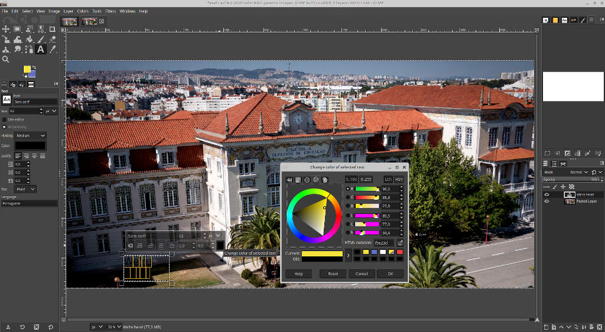
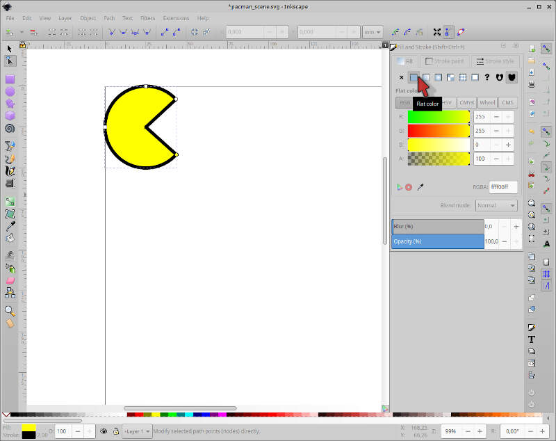
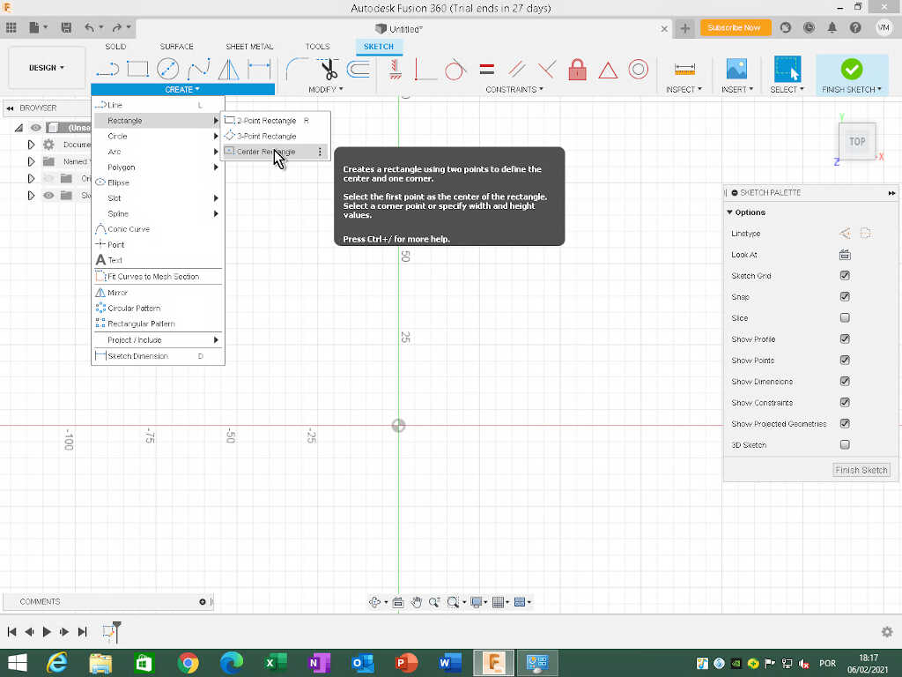
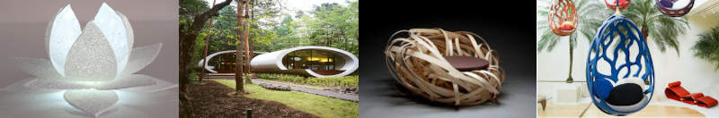
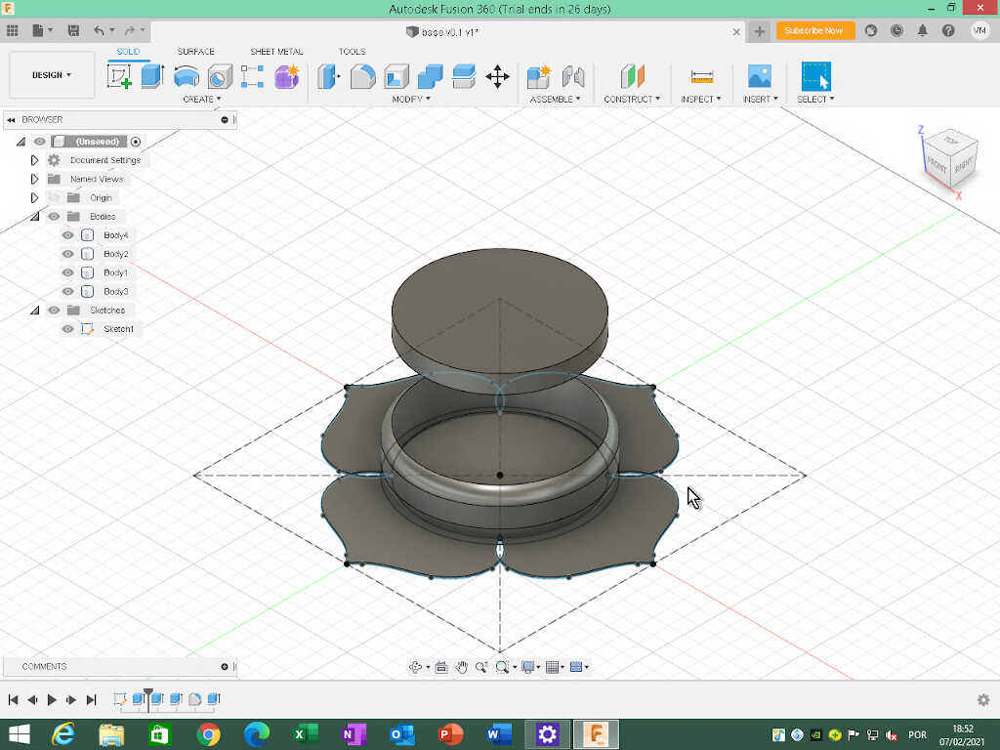

# 2. Computer Aided design

During week 02 we will be learning about [Computer Aided Design](https://en.wikipedia.org/wiki/Computer-aided_design).

I exemplify here basic demonstrations of:

* Raster-based program use to manipulate a picture.
* Vector-based program use to create a vector image.
* 2D/3D CAD modeling to create 3d objects.
* A simple CAD animation example.
* A simple CAD simulation example.

## Assignments

* *Model (raster, vector, 2D, 3D, render, animate, simulate, ...) a possible final project, compress your images and videos, and post it on your class page*

## 2.1 Raster

[Raster graphics](https://en.wikipedia.org/wiki/Raster_graphics) are matricial data structures represented, in general, as a rectangular grid of pixels where its properties (e.g. position, size, color,...) are encoded with one of the many [raster graphics formats](https://en.wikipedia.org/wiki/Image_file_formats#Raster_formats) available today (e.g. GIF, JPEG, PNG).

To demonstrate a simple use of raster graphics, I show here how I manipulated the image of ESELx located at my home page. To this end, I used [GIMP](https://www.gimp.org/), the **G**NU **I**mage **M**anipulation **P**rogram.

To begin, I simply copied the image from the web page of [ESELx](https://www.eselx.ipl.pt/) - Escola Superior de Educação, where Fablab Benfica is located. In fact I could not copy it directly, so I went to google search, typed `eselx`, clicked on [google search images](https://www.google.com/search?q=eselx&sxsrf=ALeKk029UGMrvPK35obuZfEVq-9gL0iGeA:1612606421408&source=lnms&tbm=isch&sa=X&ved=2ahUKEwjG-aOHg9XuAhV2QEEAHVCcDCEQ_AUoAnoECA0QBA&biw=1920&bih=891) and picked the [image link](https://www.eselx.ipl.pt/sites/default/files/media/2020/banner_site_dro-08.jpg) of the first image. This is a huge image (3000x1876) and we will resize and compress it when batch optimizing all images for the web.

<!-- gimp paste image -->

From here, I opened GIMP, copied the image directly to the clipboard, and pasted it as a new image. 

<!-- gimp pasted image -->

I didn't like the bottom of the image, I consider it a "dead space" so I used the crop tool of GIMP to remove it. I used the shortcut `shift+c` to activate the crop tool and cut the bottom of the picture. To use this tool, just click on the image and drag the mouse to create a crop rectangle. From here you can adjust the crop area by clicking and dragging on the areas of the rectangle highlighted in yellow.

<!-- gimp crop image 1 -->

I adjusted the crop rectangle to fill the width of the picture.

<!-- gimp crop image 2 -->

Finally, I pressed enter and I obtained the cropped image. The image resolution is down to 3000x1446.

<!-- gimp crop image 3 -->

Now, I wanted to make some simple modification to the whole image in general. To that end I used the **Colors menu**. Here you can change many color image properties, such as color balance, color temperature, saturation, brightness-contrast and so on. 

<!-- gimp color properties -->

The image is too bright, so to correct it and enhance the image features I chose the `Brightness-Contrast` tool, reduced the brightness by 25 points and increased the contrast by 25 points as well.

<!-- gimp color properties 2 -->

From here, I wanted to highlight the location of the Fablab from the outside. To this end, I used the `text tool`, located in Tools/text drop down menu or accessible by the `t` shortcut. Then I wrote `We're here!` in the defined location as shown in the picture. 

<!-- gimp text 1 -->

However, the characters are black and I can hardly see them! To change the color, I selected the text and clicked on the box on the bottom right corner of the text window. I also changed the font to `Sans-serif Bold`.

<!-- gimp text 2 -->

Now, I wanted to add a rough arrow made by hand. To do that, I used the `Paintbrush tool`, accessible with the shortcut `p`. If you use the tool directly nothing will happen. Why? 

GIMP organizes each new feature by layers. In this case, I have two layers, the pasted image layer and the text layer I've just added. When I inserted the text layer, it became the active layer, and the paintbrush will only be applied to the active layer. The active layer appears enclosed within a yellow dashed line box, as seen in the previous image around the text layer.

To change the layer I'm in I just need to press `page up` and `page down` keys. When the yellow dashed line box appears around the image, we're ready to apply the brush.

The Paintbrush tool has a lot of options, depicted in the left hand side of the window. Here we can change its mode, opacity, size, hardiness and so on. In this case I will go with the default options. 

<!-- gimp brush 1 -->

Additionally one can also use other kind of "brushes" such as as Pencil, Airbrush and Ink, as shown in the picture below.

<!-- gimp brush 2 -->

Now I just used the brush. To do this, I dragged the mouse from the text box to the window, and then added the two top parts of the arrow. Done! 

<!-- gimp brush 3 -->

But it is not finished yet! To end the process I needed to export the image to a JPEG file to be able to use it on the site. First, I went to the drop down menu File/Export.

<!-- gimp export 1 -->

Then I just changed the name of the file with the suffix ending on `.jpg` and saved the file to an appropriate location. There's a menu after clicking on `Save`. I just clicked on `Export` with the default settings. I will do the image resize and optimization later on. The image is ready to be processed and published!

<!-- gimp export 2 -->

## 2.2 Vector

[Vector graphics](https://en.wikipedia.org/wiki/Vector_graphics) are images defined not as matrices and pixels but with simple geometric relations: points in a Cartesian plane connected by lines and curves to form polygons and other shapes. The big advantage of vector graphics is that there is no loss of resolution in scaling. This derives directly from the geometric nature of vector graphics. However, vector graphics are not suited to represent photo realistic images because they don't store the information of a photo as efficiently as raster methods.

For this reason vector graphics are used mostly for typesetting or for graphic design (CAD, digital illustration,...). The most common file formats are SVG, EPS, PDS, and AI.

To illustrate how vector graphics work I'll do a simple drawing using the open source vector graphics program [Inkscape](https://inkscape.org/). Our theme will be...[Pac-Man](https://en.wikipedia.org/wiki/Pac-Man). 

<!-- pacman picture -->

I will show you how to draw two Pac-Man characters from Ferdi's class @ [Fablab Kali](https://fablab.hochschule-rhein-waal.de/) shown below for reference.

<!-- video do Ferdi -->
<iframe width="560" height="315" src="https://www.youtube.com/embed/jLdZHgAYfJ4" frameborder="0" allow="accelerometer; autoplay; clipboard-write; encrypted-media; gyroscope; picture-in-picture" allowfullscreen></iframe>
<iframe width="560" height="315" src="https://www.youtube.com/embed/Mby4SZTL9p4" frameborder="0" allow="accelerometer; autoplay; clipboard-write; encrypted-media; gyroscope; picture-in-picture" allowfullscreen></iframe>

So, I start with a blank canvas and I'll draw a Pac-Man scene, with a Pac-Man and a ghost. I'll start with Pac-Man.

Pac-Man is a yellow character contained within a circle. From this observation we will use the circle tool to create the first approach to the design. To activate it I clicked on the icon under the mouse icon on the left of the screen or I can use the shortcut `e`.

<!--  - MODEL -->
<!-- inkscape circle 1 -->

I created the circle by dragging the mouse in a diagonal line.

<!-- inkscape circle 2 -->

Then, I selected the big arrow (the first icon on the left set of icons - shortcut `s`) and moved the circle to the top left corner of the page.

<!-- inkscape circle 3 -->

To be really sure the circle is in the proper place I changed the values of X and Y located on the top of the screen to zero, where the red mouse arrow is. Additionally I will change the width (W) and the height (H) of the circle to 50 mm.

<!-- inkscape circle 4 -->

Now we need to change the circle properties. To do that, we need to access the drop down menu Object/Fill and Stroke or by using the shortcut `Shift+Control+f`.

<!-- inkscape circle 5 -->

The Fill and Stroke menu will appear on the right. This menu has the sections Fill, Stroke paint, and Stroke style. Within the Fill section, I clicked on Flat color and choose the pure yellow color (R:255;G:255;B=0). Here we will always leave the opacity (A) at 100%.

<!-- inkscape circle 6 -->

Now I want to thicken the contour around my circle. To do that, I clicked on Stroke style and choose a line with of 2 mm. 

<!-- inkscape circle 7 -->

Ok! We know Pac-Man has a big mouth to eat the ghosts! To open his big mouth, I clicked first on the edit paths by node icon, on the left of the screen or by using the shortcut `n`. 

<!-- inkscape circle 8 -->

Three points appeared on the circle contour line. These points allow us to edit the shape. First I clicked and dragged the point **up** on the right **outside** the circle to open his "mouth" until I reached an angle of ~ 45 degrees, using the corner of the dashed black box around the circle. If you try doing it on the inside it will do something else! 

<!-- inkscape circle 9 -->

Then I dragged the same point downards and stopped when the dashed horizontal line of the box, which followed my movement was coincident with the point I moved first.

<!-- inkscape circle 10 -->

What is missing? Yes, the eye! To do the eye we just add another circle, using the shortcut `e`. What? I drew a mini Pac-man instead of the eye! This happens because Inkscape will repeat the previous geometrical form. To "fix" this we just need to close the contour line, clicking on the icon in the mouse arrow location, on the top of the screen. 

<!-- inkscape circle 11 -->

To end our drawing, I just need to change the color inside the eye. The circle is already selected so I just clicked on the Fill section on the right and choose white on the color wheel or choose full color RGB intensity.

<!-- inkscape circle 12 -->

One down, one to go!

I will go faster on the ghost. First I drew a square on the right of pac-man, with 40mm width and 50mm height. I will also moved away pac-man and the ghost from the margins by 5mm. I also changed the stroke width of the square to 2mm, and the fill color to blue.

<!-- ghost1 -->

Then I clicked on `Path/Object to path` with the square selected, clicked again on the second arrow icon on the left `(shorcut n)`, and clicked again on the bottom side of the blue square.

<!-- ghost2 -->

From here, I clicked **three times** on the icon indicated by the red mouse arrow to insert new nodes into the selected segment. 

<!-- ghost3 -->

In the end we get 9 nodes at the bottom of the blue square. Now I selected the even nodes of the segment **by shift clicking on them** as shown in the picture. The active nodes appear in yellow. **Note: the nodes should not change shape!**

<!-- ghost4 -->

Next, I clicked repeatedly with the up arrow key to lift the nodes until I get a reasonable height.

<!-- ghost5 -->

Then, I clicked on the icon indicated by the mouse arrow to smooth **all the inner nodes** and give a rounder appearance to the ghost "dress".

<!-- ghost6 -->

I made the ghost too high :) so I needed to cut a bit of the upper part. To do this, I clicked on the upper section of the ghost and inserted 25mm on the Y coordinate, located by the mouse arrow.

<!-- ghost7 -->

Afterwards, I clicked and dragged the upper segment with the mouse more or less at the middle, and oriented the auxiliary lines of the nodes to coincide with the vertical auxiliary dashed lines of the ghost and also to be coincident with the limit of the drawing area. This is an art drawing you don't need to be precise on the measurements :)

<!-- ghost8 -->

To do the eyes, I first created a circle with 7.5 mm diameter and stroke with, equal do the one of pacman's and removed the blue fill. Then, I did a simple copy paste of the eye and moved the right eye more or less to a symmetrical location relative to the left eye. To precisely place the eyes, I input the horizontal location of the left one 8mm away from the left segment and the right one 8mm away from the right segment, using simple maths with the coordinate system. The vertical location is, of course, the same for both eyes. 

<!-- ghost9 -->

To finish the eyes I added a small 3mm diameter black circle inside each eye. The ghost is ready!

**Don't forget to group both drawings so that you can freely move each object!**

<!-- ghost10 -->

I will continue this design in week 03 to create a scene and cut it in vinyl or/and laser!

## 2.3 2D/3D CAD 

[CAD](https://en.wikipedia.org/wiki/Computer-aided_design) is the acronym for **C**omputer-**A**ided **D**esign. CAD can be defined as the use of computers to facilitate the design creation, modification, analysis, simulation, and optimization and can be seen as a natural evolution of the hand-made technical drawing, but with many ramifications. The advent of CAD had a significant impact on the productivity and evolution of design in many areas such as manufacturing, architecture, and electronics.

To learn 2D/3D CAD I initially chose [Autodesk Fusion 360](https://www.autodesk.com/products/fusion-360/). Fusion 360. I will start by highlighting the most important things I've learned and then using them to create the objects of interest for my project.

I took my learning lessons from André (Fablab Benfica)...

<iframe width="560" height="315" src="https://www.youtube.com/embed/_RVJTP8JTPs" frameborder="0" allow="accelerometer; autoplay; clipboard-write; encrypted-media; gyroscope; picture-in-picture" allowfullscreen></iframe>

<iframe width="560" height="315" src="https://www.youtube.com/embed/4EfU1cK8q-k" frameborder="0" allow="accelerometer; autoplay; clipboard-write; encrypted-media; gyroscope; picture-in-picture" allowfullscreen></iframe>

<iframe width="560" height="315" src="https://www.youtube.com/embed/7idGQXQP7y4" frameborder="0" allow="accelerometer; autoplay; clipboard-write; encrypted-media; gyroscope; picture-in-picture" allowfullscreen></iframe>

...and from Daniele ([Fablab Kali)](http://wiki.fablab-kali.de/doku.php?id=start).

<iframe width="560" height="315" src="https://www.youtube.com/embed/fYc201yTPao" frameborder="0" allow="accelerometer; autoplay; clipboard-write; encrypted-media; gyroscope; picture-in-picture" allowfullscreen></iframe>

 

Later on I hope I will do similar designs but on [Freecad](https://www.freecadweb.org/), an open source CAD program.

### Fusion 360

#### Sketches

Sketches are two dimensional designs. Here, I will mostly use sketches in 2D to build 3D objects from them. 

In the Fusion 360 environment we can create (almost) anything...at least virtually! We will follow here two basic rules:
* All designs will be created at the origin of the design area (the circular icon where the green and red lines intersect).
* We will use a rectangle or construct to aid us in our design.

Why a construct? Because it will become a very useful reference to constrain the design elements as we will see later on. It is also easier to add additional construction lines if needed when you have a frame of reference.

The pre-design phase will be then to create the rectangle construct. To do this I need to know beforehand in which plane (X, Y, or Z) I will be working on first.

To start a sketch, I clicked on the icon of a sketch in the SOLID section of icons, as located by the mouse arrow. 

<!-- sketch 1 -->

Fusion will ask which plan I want to create the sketch. I will chose the Z or Top plane. When I clicked on the plane, I was taken to a 2D view where I can sketch my construct. Note that the cube that shows the 3 dimensions, located on the top right corner of the picture changed to the top plane. I am now looking from above.

<!-- sketch 2 -->

To draw our rectangular construct, I clicked on the CREATE drop down menu, just below the big icons on the top.

<!-- sketch 3 -->

Then, I clicked on the center of the planes and dragged without clicking the rectangle, filling the width and height values with 100 mm. In this case we will do a square. To change the values I just clicked on each dimension box and changed it or pressed tab to change from one dimension to the other. **Note:** these are just indicative values! The construct should be **slightly larger** than the object we are trying to draw.

<!-- sketch 4 -->

Now we have a sketch, but I don't want a sketch to draw an object, I want a reference construct sketch. To change all lines of the sketch to construction lines I selected all of them with the selection tool (just click and drag from the left to fully encompass the square) and clicked on the Construction icon in Linetype at the Sketch palette window, on the right.

<!-- sketch 5 -->

All the lines are now dashed lines. This means they are auxiliary reference lines and will not appear as a sketch.

<!-- sketch 6 -->

To adjust the dimensions of the square/rectangle, just click on a corner point and click and drag to the desired dimensions to fit your design. This example is completely generic and should be adapted to the personal needs of the designer.

**Note: the construction lines will follow the modifications of the sketch design once you draw it, so think ahead so that the design lies inside the construction lines or is coincident to them.

From this point on, I will make a first draft of three(?) designs for my project with the current (v0.1) intended functions or features: 

* Base station
  * Inductive charging of other devices - needs to accomodate circular charging pad ([example](https://en.wikipedia.org/wiki/Inductive_charging#/media/File:Wireless_Charging_Pad_2018.jpg)).
  * Indicator LEDs that change color and rythm to convey a more empathic message regarding air quality. This light should be propagated indirectly and obscured by the "leaves" or "petals".
  * Small OLED Screen (optional) with basic information about all attached devices
  * Eletronic board to control the LEDs and communicate with the device(s).

This enumeration will aid me in the object design thinking.

#### Base station Design

Ok, let's move on to the first draft, the v0.1 of the base station. The initial design idea here was inspired by several organic designs around the circular charging pad to make it emotionally more appealing and interesting. I thought to add to the design, for example, some lotus flower petals or some leafs (left image). I also thought about using an ellipsoidal form (middle left image), a bird's nest design (middle right right image) or a more organic, tree like structure around the base (rightmost image).

<!-- place here an example of lotus leafs, architecture design, and bird's nest -->

However, I ended up with some bi-dimensional entities! In time (I hope!), they will evolve into a three-dimensional design.

In this design, I used a 150mm square with construction lines as a reference.

In Fusion 360, I created two circles on the Z (top) plane, centered at the origin, with 100mm and 110mm. I am assuming for this initial design a diameter of 10 mm for the inductive pad, base on [this Anker Model](https://www.anker.com/products/variant/powerwave-pad/A2503011), with a diameter of 100mm.

<!-- base 1 -->

From here I will extrude (shortcut `e`) the outer circle to 300 mm height. 

<!-- base 2 -->

Now, I used the Modify/Fillet tool (shortcut `f`) with a radius value of 10mm to round the corners of the upper and lower outer edges of the cylinder at the same time, by previously selecting the outer face of the body perpendicular to the Z plane. 

<!-- base 3 -->

The object does not have a bottom, so I went back to the original sketch, selected the inner circle and extrude it 1mm up.

<!-- base 4 -->

This basic design has an inner volume of 	$\pi r^2h$, meaning a useful inner surface area of ~ $78.54 mm^2$ and a useful volume of ~ $23483 mm^3$. This will be the area and volume we will have to install the inner components of the base.

The next step will be to add a "lid" that will roughly represent the induction pad. From the specifications of the Anker Model, I estimated the thickness of the pad will be around 12mm. 

I went back to the initial sketch, selected the inner circle and did a new extrude, but this time with an offset of 80mm and a distance of 12mm. This will also be a new body.

<!-- base 5 -->

Why 80mm? For clarity, so that we will have a good visual separation between the two elements.

To add an initial design touch, I also experimented with a spline pattern to somehow emulate the leafs I mentioned before. 

Again, I went back to the original sketch I drew one symmetrical spline one one side. Before that I also place two points `(Create/Point)` at the right side of the intersection of the inner circle with the two diagonal construction lines. This is quite easy to do as Fusion helps you with the placement when it "senses" the intersection.

I noticed that I needed more space in the horizontal direction so I changed the value of the  dimensions of the construction plane square from 150mm to 200 mm.

Then, I drew the 7 point spline `(Spline/Fit Point Spline`) in the right corner of the design.

<!-- base 7 -->

Why a 7 point spline? First, I did with with only 3 points and then mirrored it but the "leaf" gets pointy, and for safety reasons I decided not to go with that design, despite being more aesthetically pleasing.

Next, I created a circular pattern `(Create/Circular Pattern)`, chose the enclosed area within created with the spline and with center point at the origin. This created a simple "petal" pattern.

<!-- base 8 -->

Then, I selected the areas of the petals plus the little sections between the circles to extrude.

<!-- base 9 -->

Finally I extruded this selection by 1 mm. 

<!-- base 10 -->

I will leave this design at this point. Things than need to be done:

* Create realistic leafs. I am thinking about a 3D 3 spline leaf design: four going from the middle center down and 3 or 4 going up.
* Adding some tolerances.
* Create an alternative design for the base station.
* Set up places for the leds, PCB, wiring, components.

<mark> [If I have time I will do one or two more designs. This is an ongoing work anyway! :)] </mark>

### Blender

I also learned the basics of [Blender](https://www.blender.org/) during week 02. I learned it through Ferdi's online class videos for beginners. 

<!-- Ferdi blender tutorial 1 -->
<iframe width="560" height="315" src="https://www.youtube.com/embed/IQBpVZCpm8M" frameborder="0" allow="accelerometer; autoplay; clipboard-write; encrypted-media; gyroscope; picture-in-picture" allowfullscreen></iframe>

Blender is an open source 3D creation suite. It is possible to do *modeling, rigging, animation, simulation, rendering, compositing and motion tracking, video editing, and 2D animation!*

Here I'm going to do a very simple exercise and build a totem and an arch around it to honor the horned goddess [Suzanne](https://www.dummies.com/web-design-development/meet-suzanne-the-blender-monkey/) :)

In Blender we start in the main view with a square. I will use this square to begin the totem construction. The central target points to the origin of the world and is called `cursor`. New objects will be created where the cursor is. There is also a camera, on the left side of the square, and a light source, on the right side of the square. I will leave that for later walkabouts. The red and the green lines represent the x and y axis respectively.

<!-- totem1 -->

We have three kinds of movement in Blender: 

* zoom in/out `(mousewheel)`
* rotate `(movement with middle mouse button pressed)`
* pan `(shift + middle mouse button)`

It is very important to know these by heart, as we will be using them all the time. 

I will skip the movement, rotation, and scaling tutorial and respective shortcut keys and mention them when appropriate.

The cube at the center has a side of 2 meters. To build our totem and make it rise to the skies we need to pile up other objects. To do that, I use the shortcut `shift+a` and then Mesh/Cylinder. Now a cylinder appears where the cursor is but it is inside the square! Suzanne will not be pleased with that, so we now need to move the cylinder up 2 meters. 

<!-- totem2 -->

To do that we use the shortcut sequence `g` (movement) `z` (axis), and `2` (number of units). To finish the sequence I just pressed `enter` or clicked on the left mouse button (LMB). We can do this in the same manner for rotation `(r)` and scaling `(s)`. To toggle negative and positive values just press `-` before or after inserting the final number of units.

<!-- totem3 -->

To increase the size of the cylinder, I select it with the LMB and use the shortcut sequence `s,z,2`. However, the 4 meter cylinder is now inside the rectangle again, by one meter. To place it on top of the rectangle again, I moved the cylinder by one meter up `(g,z,1)`. 

**Note that when you press the first shortcut, other contextual shortcut combinations appear at the bottom of the window!**

<!-- totem4 -->

Now I will add another object, a cone. To add a cone, I just used `shift+a` and then Mesh/Sphere. Again, the cone is inside the square. I just moved it up by 6 meters using the shortcut keys `g,z,6`.

<!-- totem5 -->

How can we be sure that everything is aligned? We can change our perspective by using the numpad keys `1,3,7` that will move to the front, right, and top views respectively. I moved to the front view, zoomed in, and checked if everything is well aligned.

<!-- totem6 -->

The next step will be to add a tours to the design. To add a tours I used `shift+a` again Mesh/Torus, and used the shortcuts `g,z,5` to put it in place. The design is almost complete! 

<!-- totem7 -->

The last and most important part is to place Suzanne figurehead! To do this, I used `shift+a` and Mesh/Monkey, and then `g,z,7`. However, I want her to face the camera, so I rotate Suzanne by 45 degrees using `r,z,45`.

<!-- totem8 -->

Now, let's build a ceremonial arch for Suzanne! To do this, we add another square, rotate it by 45 degrees `(r,z,45)` and place it 4 meters away `(g,x,x,-4)`. I used here `x` two times to change from global to local coordinates, so I could easily move the square diagonally.

<!-- totem9 -->

To do the arch, I need to change to *Edit mode*. To do this, I just clicked `tab`. In edit mode, we can choose vertex, edge, and face select, in the three icons indicated by the red mouse arrow. The mouse is pointed to the face select icon that I will use now.

<!-- totem10 --> 

The next step will be to select the top face of the cube. Afterwards, I extruded the face (shortcut `e`) 6 meters up. Then I applied a sequence of similar commands to make half of the arch: `r,y,y,30` and `e,2` two times and `r,y,y,30` and `e,3`.

<!-- totem11 --> 

To finish the arch, I used the same commands but on the inverse order.

<!-- totem12 --> 

The shading from our model doesn't look so good. So we add some some to soothe our Goddess. To do this, we change to object mode, choose all objects, shortcut `a` and right click on any one of them, choosing shade smooth at the menu. 

<!-- totem13 --> 

Ok, but **WHERE** is our **HORNED GODDESS**? Good point, we need to make some horns! Or else Suzanne will be really mad at us and float our fields with lava and destroy our houses with earthquakes!

First, I selected our figurehead and pressed keypad `/` to have a local perspective view. This will only show on the screen the selected object. Then, I pressed `tab` to change to edit mode, then edge select, and I selected the two edges shown in the picture. 

<!-- totem14 --> 

From here I pressed `g,z,1` to add some horns! :) However, our Goddess has rounder, smaller horns, not pointy ones like this! What can we do?

<!-- totem15 --> 

So here is a neat trick: to obtain rounder, smoother surfaces, we can use the Modifier `Subdivision Surface` located at Modifier Properties, the little blue wrench on the right of the picture. Then I clicked on `Add Modifier` and `Subdivision Surface`. Here I chose a `Viewport = 3` to obtain an excellent result. I hope our Goddess will be pleased! 

<!-- totem16 --> 

Now we move to the general perspective and appreciate the shrine we made to our beloved (even if terrible!) Goddess Suzanne! 

<!-- totem17 --> 

The next steps will be rendering the scene and make some simple animation in Blender. Stay tuned! ;)

## 2.4 Animation

In the CAD Animation section I will show a simple and quick animation example I learned with Daniele during his [Fusion 360 class](#Dclass). I will start by creating a sketch of a circle in the top plane. Let's make it 20mm diameter and do a symmetric extrude of 50mm.

<!-- animation 1 and 2 -->

Then I did another sketch on the plane coincident with the cylinder top, and added a 40mm diameter circle, and one "tooth" with the measures indicated in the picture. Then I mirrored it to the other side.

<!-- animation 3 -->

Next, I extruded `(shortcut e)` the three areas 10 mm down **as a new body**, and I obtained a circular piece with two "teeth and a 20mm diameter hole in the middle.

<!-- animation 4 -->

I made a copy of this body do the other extreme of the cylinder `(shortcut m)` **with Create Copy option** -190mm down and with a 90º offset on the z axis.

<!-- animation 5 -->

Afterwards, I rotated the new body 90 degrees. 

<!-- animation 6 -->

Now we are ready to animate! But first we need to assemble the three bodies together. To do that, I clicked on *Assemble/New component* and chose the option *From Bodies* and clicked on the three bodies. Now I will have three new components shown at the left of the screen on the Browser menu.

<!-- animation 7 -->

We can also rename the components. *Component 8* will be the shaft and *Component 9 and 10* Bearing 1 and 2. So now with the three components ready I can make 2 *As-build joints* `(shortcut shift+j)`. 

<!-- animation 8 -->

It is very important to **select the component that will move relative to the other first**. So in this case, I chose the bearing 1 first and then the shaft. In the menu of the *As-build joints* you can test different kinds of Joint types with motion, and check how the two components behave together. 

To achieve my own dark purposes, I chose *cylindrical joint type*, which makes the bearing travel along the shaft in the z axis direction and rotate at the same time. You also need to choose the *snap position* on the bearing which, in this case, will make my bearing rotate clockwise. If I animate I will get something similar to the following video.

<!-- video animate01 -->

<video width="800" height="600" controls>
  <source src="../../files/week02/animation01.m4v" type="video/mp4">
Your browser does not support the video tag.
</video>

Now I need to adjust the limits. To do that I went to the Browser menu on the left, chose the corresponding join and clicked on the icon of *Edit Joint Limits*. Then, I chose *slide motion* a minimum limit of 0 and maximum limit of 90mm. This will be the limit of the travel.

<!-- video animate02 -->

<video width="800" height="600" controls>
  <source src="../../files/week02/animation02.m4v" type="video/mp4">
Your browser does not support the video tag.
</video>

I did a similar procedure for the bottom part. To observe the animation of the two joints with the limits in place, I used a motion study, in *Assemble/Motion Study*. I chose each joint sequentially and make them travel 90mm up or down and do a full rotation for the length of the motion study, divided in 100 steps. If you try to input more than 90mm the study will not allow the movement ;). 

<!-- video animate03 -->

<video width="800" height="600" controls>
  <source src="../../files/week02/animation03.m4v" type="video/mp4">
Your browser does not support the video tag.
</video>

Ok, but is this useful for something? In fact yes! **It is a critical component of a secret [perpetual motion machine](https://en.wikipedia.org/wiki/Perpetual_motion)!** So you can generate your energy for free....forever! (good luck!). On the other hand, you can use it, if you place more bearings with the appropriate teeth, for instance to create the inner shaft of the [Precious Plastic shredder](https://community.preciousplastic.com/academy/build/shredder).

## 2.5 Simulation

To demonstrate a simple simulation I took the base station design I have made and added a very thin ring of material to support the inductive pad. This ring does not have any support so we can test the quality of the Fusion 360 simulation.

I used the generic plastic first as the material of choice but the ring supported the force too well to my taste, so I added Polylactic acid to the material library, taking the physical properties information from an [user from Autodesk forums](https://forums.autodesk.com/t5/fusion-360-ideastation-archived/add-pla-polylactic-acid-in-the-material-browser/idi-p/8627210). From here I redid the simulation that I will show here.

The first thing I did was to add the thin ring 19mm from the z plane origin so that I could fit inside the pad. To do that I first created a plane `(Construct/Offset Plane)` at a height of 19mm. Then, I drew two circles with 99mm and 100mm diameter respectively.

<!-- sim 1 picture -->

Next, I extruded 1mm up, and obtained this small ring. **Note that I'm doing this without any kind of support to the ring to test if the material holds in the simulation!**

<!-- sim 2 picture -->

Now I just placed the pad on top of this ring...and we're ready for the **Static Stress Simulation** where I will place a force to see if the ring holds.

<!-- sim 3 picture -->

I went to Simulation menu, and chose `Study/New Study` and then `Static Stress` and clicked on create study.

<!-- sim 4 picture -->

First, I chose the study materials. I clicked on `Materials/Study Materials` and chose PLA for everything.

<!-- sim 5 picture -->

Then I went to `Constraints/Structural Constraints` and selected all the bottom bodies so that they would not fall off with gravity.

<!-- sim 6 picture -->

Next, we need to define the loads `(Loads/Structural Loads)`. In my case I only need a very small load of 1N which corresponds approximately to the weight of the inductive pad (~ 100g).

<!-- sim 7 picture -->

I chose `Force Type` and the target is on the top of the pad. I also toggled gravity on `Loads/Toggle Gravity On`.

<!-- sim 8 picture -->

The only thing left is to set up the contacts between the bodies. I chose `Contacts/Automatic Contacts` with a contact detection tolerance of 0.1mm.

Ok, we're ready to go! To start the simulation, I went to `Solve/Pre-check` first to see if there are any problems, and then `Solve`.

At the Solve menu, we should be careful and choose to **solve locally**. Else you will spend credits solving this simple problem on the cloud! I chose the Study 2 (ignore the study one here) and clicked on `Solve`. The computation make take a few seconds.

The simulation shows that the ring body can take perfectly well the small force of the pad on top of its support, with a minimum safety factor of 15. It is realistic? We will see later on! ;)

<!-- sim 9 picture -->

What if? (yes...a dangerous question) What if an adult sits on the base station? What would happen? Let's add 600N of force to the poor pad! So we have in total now 601N of force. In fact, the safety factor does not change and there is no deformation which is strange. Can we trust its results? I don't know. Maybe the forces are being distributed to the sides of the object, as they are in contact, but the force is vertical, and the contact between the surfaces is horizontal.

I will look into it later on.

## Files

- [Raster](../../files/week02/eselx_v3.jpg)
- [Vector](../../files/week02/pacman_scene.svg)
- [Fusion](../../files/week02/base.f3d)
- [Blender](../../files/week02/monkey_totem.blend)

## References

- [Computer Aided Design](https://en.wikipedia.org/wiki/Computer-aided_design)
- [Blender](https://www.blender.org/)
- [GIMP](https://www.gimp.org/)
- [Fablab Benfica Youtube page](https://www.youtube.com/channel/UCkjaSC1Vzg8OtVQWADQhCvg)
- [Fablab Kali Fab Academy 2021 page](http://wiki.fablab-kali.de/doku.php?id=documentation:fabacademy2021)
- [Fusion 360](https://www.autodesk.com/products/fusion-360/)
- [Inkscape](https://inkscape.org/)
- [Raster Graphics](https://en.wikipedia.org/wiki/Raster_graphics)
- [Vector Graphics](https://en.wikipedia.org/wiki/Vector_graphics)
- [Wikipedia](https://en.wikipedia.org/wiki/Main_Page)

