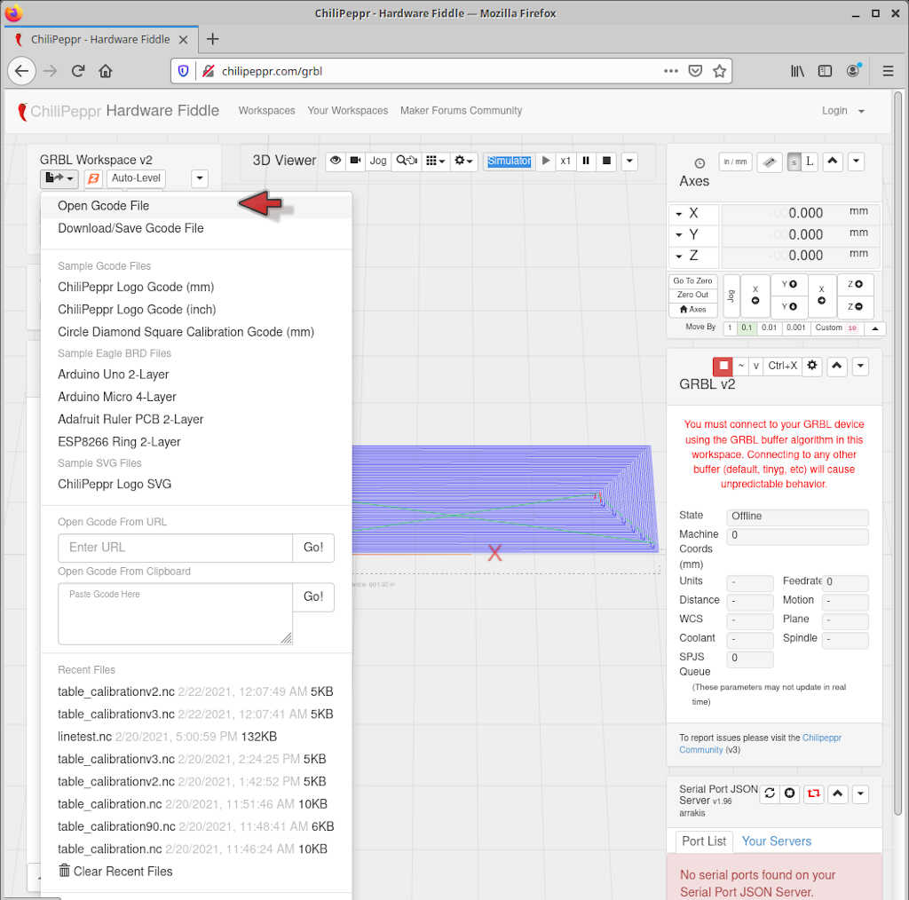
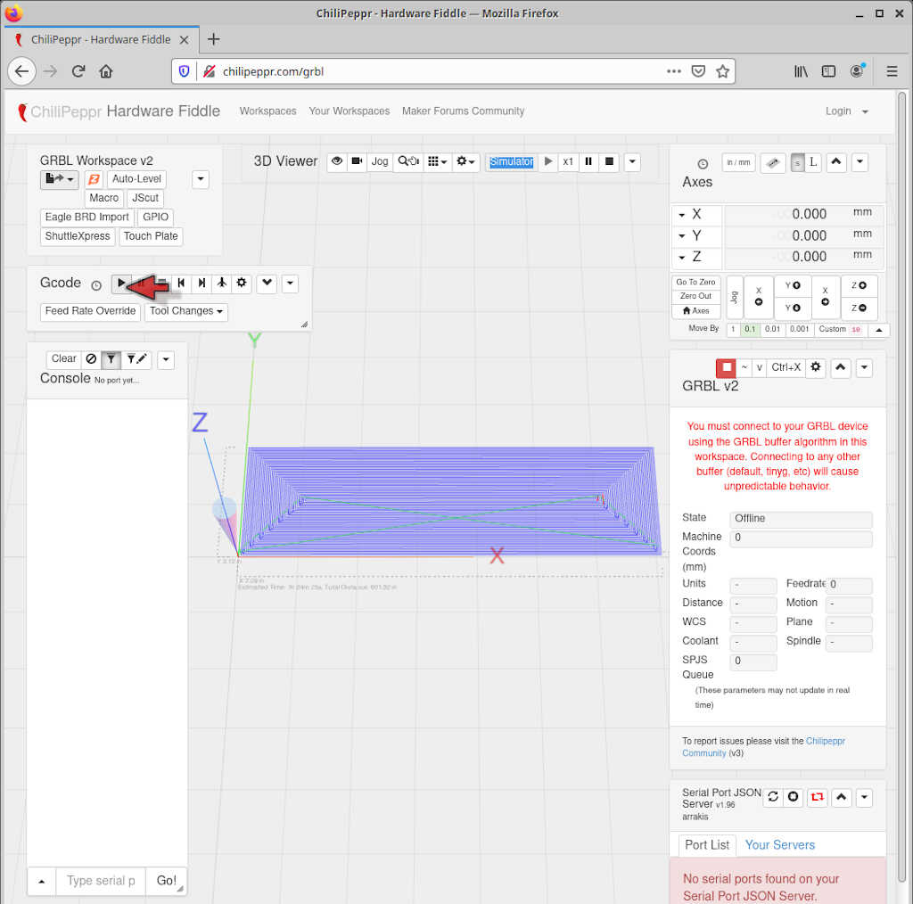
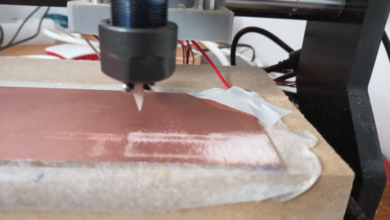
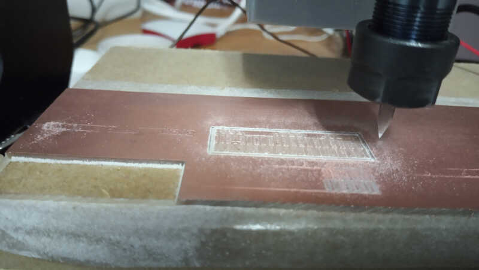

# 4. Electronics production

In week 04 we're going to produce some electronics for the first time!

## Assignments

* *Group assignment*

    * *Characterize the design rules for your PCB production process: document feeds, speeds, plunge rate, depth of cut (traces and outline) and tooling.*
    * *Document your work (in a group or individually)*

* *Individual assignment*

    * *Make an in-circuit programmer by milling and stuffing the PCB, test it, then optionally try other PCB fabrication process.*

This week we continue on lockdown in Portugal and therefore I had to set up my home lab.

André, my local instructor sent me some items for this week, including a generic [Genmitsu 1060 CNC milling machine](https://www.aliexpress.com/item/32904695111.html?spm=a2g0o.productlist.0.0.1aaa695br0FgQt&algo_pvid=56c65135-a6d8-4fda-9fc0-33a69bfdb82b&algo_expid=56c65135-a6d8-4fda-9fc0-33a69bfdb82b-4&btsid=0bb0623c16139435482358417e3b10&ws_ab_test=searchweb0_0,searchweb201602_,searchweb201603) and a [Yihua 8786D hothair rework station with soldering iron](http://yihua-soldering.com/product-1-2-5-hot-air-rework-station-en/147661/).

<!-- cal1 -->

<!-- cal2 -->

## 4.1 Calibration of the CNC milling machine

I began with assignment 0, the calibration of the CNC milling machine.

After plugging everything in, the first thing I did was to check if the dimensions of the machine were correct. To do this, I measured first an arbitrary position of the X,Y and Z axes to each respective limit with a caliper first, then moved the machine 10 mm, and made the measurements again.

In general the measurement differences were within 0.5 mm of the 10mm mark which I considered acceptable, considering the difficulty of making accurate measurements with the caliper due to the awkward measuring positions :)

The next step involves setting up the sacrificial board. This is very important, because if something wrong happens, you don't mill the base of the machine! I had a piece of MDF laying around in my workshop so I just measured the length and width of the machine's base and cut the MDF with a hacksaw and sanded the rough edges.

<!-- cal9 -->

<!-- cal10 -->

With the MDF board ready it is time to glue it to the milling machine base. To do this, I used tesa double face tape. I attached two non-overlapping layers of tape, left 1 mm between them, and carefully placed and pressed the MDF board on top of them. The MDF board never moved ever again. :)

<!-- cal11 -->

<!-- cal12 -->

**NOTE: It is very important NOT to overlap or fold the layers of tape to minimize possible offsets on the board orientation.**

Now it's time to prepare the sacrificial board to place the PCB. In order to do the circuit on the PCB the machine must be perfectly aligned. One technique to achieve this is to fully mill the surface of the MDF board so that any Z offsets will be compensated by the cut.

I noticed I was missing the bit to cut through the MDF so we had to improvise and I used a rotary multi tool to cut the tip of the 1/64'' bit until it had a tip length of 1.3mm.

<!-- cal13 -->

<!-- cal14 -->

To cut the full length of the MDF board would take a few hours with such a small tip so we decided to cut only half of it, meaning an area of 180 by 50 mm.

First we needed to prepare a PNG image on GIMP. To do this I opened a new image `(File/New)` on the program and chose an image size of 180 by 54 mm. **Don't forget to check if the image has 300 DPI on the Advanced options drop down menu.** I ended up with a white canvas. The extra 4 mm are the tolerance to adjust the PCB on top of the MDF board.

Then, I used the bucket fill tool `(SHIFT+B)` with the black foreground color to paint the canvas black.

<!-- cal15 -->

Now, we need to add a 1 mm margin that works as the boundary for the cut. To do this, I clicked on `Image/Canvas Size` and added 1mm to its length and height. Then I clicked on `Center` button to center the offset, chose `All layers` on `Layers/Resize layers` and `Fill with: Background color` which in my case was white. Finally, I clicked on `Resize`. From here I exported the image in the .png format to use afterwards.

<!-- cal16 -->

The end result is shown on the picture below.

<!-- cal17 -->

Then, I accessed [Fab Modules](http://fabmodules.org/) on the web browser and chose:

* input format --> image (.png) --> uploaded the image made with GIMP.
* output format --> gcodes (.nc)
* process --> PCB traces (1/64)
* cut speed: 4 mm/s
* cut depth: 0.1 mm to test, then 0.5mm on the second run.
* tool diameter: 1.3 mm
* number of offsets: -1 (to fill)

I left all other options as default. Then I checked if the image size in mm was the correct one as well as the DPI (300) and clicked calculate.

<!-- cal18 -->

After fab modules finished the gcode calculation I clicked on save.

<!-- cal19 -->

Ok! We are ready to begin the cut! But first we need to insert the bit on the machine head. To do this I just unscrewed the nut of the spindle tool holder chuck which has an ER-11 collet inside. I placed the bit inside the collet aligned at its extreme and screwed the nut back into the chuck.

<!-- cal20 -->

<!-- cal21 -->

To control the machine I first used the online [Grbl workspace](http://chilipeppr.com/) of the [Chilipeppr](http://chilipeppr.com/grbl) javascript online app. Within the app I chose `Open Gcode File` as shown in the picture below and opened the saved gcode file from Fab Modules.

<!-- cal22 -->

At this time I just needed to test if the machine was working properly. I moved the machine head to the bottom left corner of the MDF board above its surface and clicked on the play button of the Chilipeppr app as shown by the mouse arrow in the picture below.

<!-- cal23 -->

I observed that the machine moved in the air with the expected pattern.

<!-- cal24 -->

To cut the MDF I first aligned the bit with the bottom left edge of board, using the Chilipeppr motion keys located at the position of the mouse arrow and taking care to give some space so that the mill could cut the edge of the MDF.

<!-- cal25a -->

I forgot to take the picture here :\ but I have some pictures and videos of the milling.

<!-- cal25b - get some aligned picture here -->

First I milled at 0.1 mm depth...

<!-- calv1 -->
<!-- cal26 -->

...but it missed most of the board. Then I used the 0.5 mm depth setting, making everything equal at the fab modules settings...

<!-- calv2 -->

...and the result was much better!

<!-- cal27 -->

<!-- cal28 -->

<!-- cal29 -->

Again, I forgot to take a picture of the cleaned board, for some random reason! :\ Tiredness I think.

### Milling precision test

The milling precision test consists in the milling of a test pattern that will give us both the measure of how thin a line it can mill with the 1/64'' bit as well as the thinnest line it can mill between two close traces. The test [traces](http://academy.cba.mit.edu/classes/electronics_production/linetest.png) and [interior](http://academy.cba.mit.edu/classes/electronics_production/linetest.interior.png) png files I used can be downloaded from the [week 04 class files](http://academy.cba.mit.edu/classes/electronics_production/index.html).

<!-- cal30 -->

<!-- cal31 -->

As the PCBs have a width of ~ 10 mm and my milling has a 5.4mm width I had to cut my PCB in half. I cut the copper surface first with a straight edge a few times with the aid of a ruler and then used the hacksaw cut through it.

<!-- cal32 -->

Before placing the PCB on the MDF table it is worth mentioning that the PCBs can have a **not so small** bend, as observed in the following picture.

<!-- cal33 -->

**NOTE: You can check for bending by using a opaque ruler and placing it next to the PCB on the Z dimension against a bright source of light. If there is a non uniformity in the light spacing then your PCB is bended.**

To mitigate this problem, I gently bended the PCB back with my hand to try to straighten it. This is not enough however to precisely remove the bending, so I stuck the PCB to the MDF with double tape in a similar manner as I described before for the MDF table.

<!-- cal34 -->

Then I aligned the bit with the bottom left corner of the PCB, giving a few mm of its edge to ensure that I can mill through the trace.

<!-- cal35 -->

Before turning on the mill, we need to pick the .nc file from fab modules. I chose the following options:

* input format --> image (.png) --> uploaded the test image
* output format --> gcodes (.nc)
* process --> PCB traces (1/64)
* cut speed: 4 mm/s
* cut depth: 0.1 mm
* tool diameter: 0.2 mm
* number of offsets: 4

The rest are the default options.

<!-- cal36  -->

To adjust the z position, I turned on the spindle and moved the mill head in 0.01 steps until it reached the surface of the PCB. There is a slight noise difference when it starts milling. Then, I move the mill up by 0.01 mm.

<!-- cal37 -->

<!-- cal38 -->

<!-- cal39 -->

From here, I needed to cut through the outline. First I went back to Fab Modules, and chose the following options:

* input format --> image (.png) --> uploaded the test interior file
* output format --> gcodes (.nc)
* process --> PCB outline (1/32)
* cut speed: 4 mm/s
* cut depth: 0.1 mm
* stock thickness: 1.6 mm
* tool diameter: 0.4 mm
* number of offsets: 1

The rest of the options are the default ones.

<!-- cal40 -->

I went back to Chilipeppr, loaded the new gcode, and send it to the CNC maintaining the same zero point.

<!-- cal41 -->

<!-- cal42 -->

Then I gently removed the PCB part by carefully exerting some leverage on its bottom with the help of a small 2 mm screwdriver. The end result can be seen here after some polishing with a thin stainless steel scouring pad and some sanding as well.

<!-- cal43 -->

Finally I measured the x and y dimensions of the PBC and obtained a length of 36.30 mm and a width of 11.78mm. Comparing that to the measurement obtained with GIMP (length = 36.323 mm, width = 11.784 mm) I can say that I'm confident with the result as the caliper's precision is 0.02 mm.

<!-- cal44 -->
<!-- cal45 -->

Building on this result, I attempted to do more of the same. Unfortunately three of the subsequent trials didn't work as well due to a slight misalignment of the bed.

### Setting up the auto-leveling feature

I needed to align my table and fortunately my milling machine allows electric signal probing using the conductivity of the tip and the copper layer of the PCB. I just need to connect two jumpers on the two A5 pins as shown on the picture below.

<!-- cal46 -->

To to this, I made two simple cables from two FF jumper cables. I remove one of the jumpers in each and replaced one by a crocodile clip and the other by a metal ring. I didn't solder the wire to the ring just wrapped one around the other :) If you want to make it permanent, just solder the ring to the wire ;)

<!-- cal47 -->

Afterwards, I connected the jumpers to the A5 ports.

<!-- cal48  -->

And then taped the ring to the PCB.

<!-- cal49 -->

I did the conductivity test before and after installing and voila it was working well!

Now I need a program to make a Z-height mapping of the surface and correcting the bias. I chose another program, [Candle](https://github.com/Denvi/Candle), to help me doing this. Candle can probe and set the z-height of a point as well as doing automated maps of the milling region.

First I opened the `linetest.nc` file into Candle with `File/Open`. Then I moved the bit to the right milling position by controlling the tip the Jog arrows located at the bottom right corner of the picture. I also set up the spindle speed at 10000 rpm. **Careful with the Step and the Feed: The step will be the distance traveled and the feed will be the speed.**

<!-- cal50 -->

Next I needed to set the zero of the z-height. To do this I plugged the crocodile clip to the machine's bit...

<!-- cal51 -->
[FALTA ESTA FOTO]

...and clicked on the icon to the right, next to the mouse arrow, with a looking glass and a down arrow as shown in the previous picture. **Be really careful with the bit is going down to the PCB. If it does not stop you need to immediately pause the machine and then abort.**

With the machine head in place **it is critical to assign the zero points in x,y and z**. To that end, I clicked on the zero point icons on the right of the picture. The first sets the xy zero and the second the z zero.

<!--cal52  -->

Next, I created a Heightmap. I clicked on `Create` in the Heightmap menu, on the right side of the picture.

<!-- cal53 -->

First I clicked on Auto so that the leveling grid will adjust to the limits of the milling area. Then I needed to choose how many points I will place on the probe grid, located in the rectangle at the bottom center of the picture. The rule of thumb here is to create a point for each 10 mm of length. As we have a width of 36.14 mm, I chose 3 points here, and then 2 for Y, which is the minimum. Therefore 2x3 = 6 probe points in total.

<!-- cal54 -->

We are ready to probe! Now I just need to click on `Probe` and carefully check if all the probing is being done without damaging the PCB copper layer. **This operation should be done with the closed probing circuit (i.e.with the crocodile biting the bit) at all times!**

After a few seconds the probing is done. We can leave the Heighmap section by clicking on `Edit mode`.

<!-- cal55 -->

When in G-code program section again, I clicked on Use heightmap, and I was set to go! Next I clicked send and there it went! :) **NOTE: Don't forget to take out the crocodile or it will go for a very fast spinning! :O It happened to me two times...**

<!-- cal56 -->

The procedure was similar as the one I described before: I milled the tracer with a sharp mill, then changed mills and did the outline with an "outline" mill. The picture also shows my previously failed attempts due to z-height misalignment.

<!-- cal57 -->
<!-- cal58 -->

After removing it and polishing a bit with steel straw I obtained this result. The image is not very good, but e can see that the small wires in the lower part now go up to 0.005! the rest being equal. :)

<!-- cal59 -->

## 4.2. Programmer fabrication

I am now ready to produce and test my first board. I chose to fabricate a version of the **hello.serial-UPDI.FT230X board** as shown in the [*Embedded programming class repository*](http://academy.cba.mit.edu/classes/embedded_programming/index.html#programmers), under *in-system development*.

<!-- ISP1 -->

The differences between the original board and the one I fabricated are as follows:

* IC FT231X instead of FT230X
* 3-pin UPDI output with 5V instead of 2-pin UPDI output. This new version doesn't need an outside source to power to programming board.

I used the [FT231X](https://ftdichip.com/products/ft231xs/) because it was the only available to purchase at the time. The big difference between the chips is that FT231X has full [UART](https://en.wikipedia.org/wiki/Universal_asynchronous_receiver-transmitter#UART_models) handshake capabilities (i.e. TXD, RXD, RTS, CTS of the FT230X plus DTR, DSR, DCD, and RI - check the [datasheet](https://ftdichip.com/wp-content/uploads/2020/08/DS_FT231X.pdf) page 8), meaning a broader applicability where the extended UART may be needed (not it this case!).

To implement these two changes, I used [Kicad](https://kicad.org/) open source software suite for Electronic Design Automation (EDA).

I will describe in more detail the Kicad design process during week06. At this time I will only show here the final results. The next three picture show the Kicad schematic,

<!-- ISP2 -->

the PCB design,

<!-- isp3 -->

and the 3D CAD picture.

<!-- isp4 -->

**Note: The pin header is actually female, not male**

<mark> [ADD The project files here!!!] </mark>

From here I exported the traces and the edge cuts in .svg format. I noticed some issues with the edge cuts .svg file within [MODS](http://mods.cba.mit.edu/) so I converted them to 1500 DPI .png files with Inkscape.

To prepare the g-codes for board fabrication I used MODS in the configuration showed in the picture.

<!-- isp5 -->

This configuration allowed a very good fabrication of the board. However I had to experiment a bit until I ended up with this version, v4!! So I'll show here its story ;) 

The v1 had the following different settings:

* tool diameter: 0.2 mm

Ok so afterwards I noticed I forgot to change to the trace v-bit. I'm using a used v-bit to cut through the board and the end result was this :)

<!-- isp6 -->

Version 2 is basically the same as v1 but with the correct v-bit. It is much better, but I noticed the pads of the IC are almost gone and are too thin! Some of the traces are also thinner than the expected 0.4 mm. This means I am underestimating the diameter of the bit.

After doing some calculations with trigonometric relations, taking into account an estimated angle of the v-bit from center to the edge of 11,5º. I estimated a tip diameter of 0.04 mm at 0.1 mm depth.

I went back to mods and changed the tool diameter to 0.04 mm. I also changed the offset stepover to 0.7 so that the four offsets would be closer together. The version 3 was better but...

<!-- isp7 -->

...it was overestimating the tip diameter now. It didn't cut the copper completely and there were continuity issues all over the place! The pads are now beautifully crafted but some are fused together!

<!-- isp8 -->

So, version 4 with the settings I mentioned before was the best so far and I decided it was enough to solder the components on it. The pads are now well defined and separated and the traces are with the correct width.

<!-- isp9 -->

I assembled all the stuff I needed for the task ahead: 

* The solder station
* 0.8mm solder
* Desoldering wick wire
* Solder tip cleaner
* Some twizzers to hold the SMDs (not pictured)

<!-- isp10 -->

Then I watched several soldering videos from Fablab Academy...

...Daniele showing us the basics of soldering...

<iframe width="560" height="315" src="https://www.youtube.com/embed/aqwZ9HDJmC8" frameborder="0" allow="accelerometer; autoplay; clipboard-write; encrypted-media; gyroscope; picture-in-picture" allowfullscreen></iframe>

...and Kris demonstrating a very useful technique to solder "microscopic" ICs (mine is even more microscopic!)

<iframe width="560" height="315" src="https://www.youtube.com/embed/JzYb50gEK6c" frameborder="0" allow="accelerometer; autoplay; clipboard-write; encrypted-media; gyroscope; picture-in-picture" allowfullscreen></iframe>

...as well as the excellent [Duaa Alaali pdf presentation](https://gitlab.fabcloud.org/academany/fabacademy/2021/bootcamp/students-bootcamp/-/blob/master/FabLab-Bahrain/Day1/soldering_training_compressed.pdf) from the Bootcamp week.

Before I begin, I did some test soldering on the previous versions of the boards and also checked for continuity between the different tracks and pads with a multimeter. It all checked out fine. :)

<!-- isp11 -->

First I laid out the IC on the little pads and checked out if pin one (it is the one marked by the little circle on the bottom left side of the IC) corresponds to the place on the PCB schematic.

 <!-- isp12  -->
 

 Then using Kris's technique, I placed a little solder on the bottom left pad, corresponding to pin 1, and pressed it down a few seconds to fix it to the board. I did the same for the pad and pin located at the upper right corner to fix the whole circuit. 

 The next step consisted in laying some solder evenly on all pins left and right as shown by Kris' video. Then I pressed for a few seconds on each pin to let the solder fill out the gaps and fix to the board pads. 

<!-- isp13 -->

As expected a continuity check showed that many of the pins were soldered together. First I took away most of the solder with the wick wire but pressing a few seconds between each pin and removing the iron and the wick at the same time. 

Unfortunately this was not enough and in some cases I had to separate the connection between the pins with a sharp cutter knife. This took me a while but eventually I could separate all the pins. 

Finally I started placing and soldering all other components. First I soldered two 49 $\Omega$ resistors (R1 and R2)...

<!-- isp14  -->

And then the rest of the components: one 4.99 $K \Omega$ resistor (R3), two 10 pF (C1 and C2) and one 1 $\mu F$ (C3) capacitors, and the 1x03 female connector (J2).

<!-- isp15  -->

Ok, and now the moment of truth! I tripled checked the connections and the IC for continuity, placed the board inside the female USB extension and the computer gave the familiar "USB connected" sound! :) I was not expecting that! ;) What a relief!

<!-- isp16 -->

Then windows showed it was installing the drivers for the FT231X UART device...

<!-- isp17 -->

...and appeared in device manager as working properly! I will leave it to that at this time. Let's continue at week06 ;)

<!-- isp18 -->

