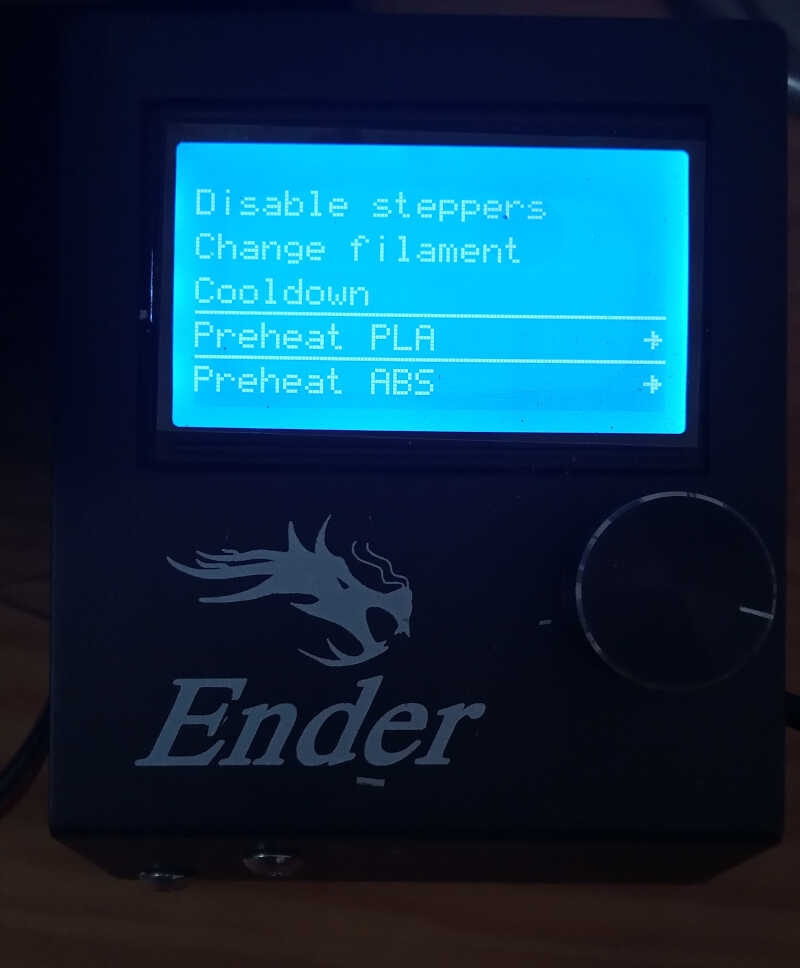
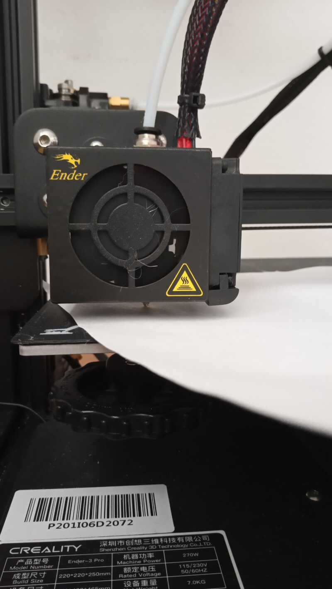
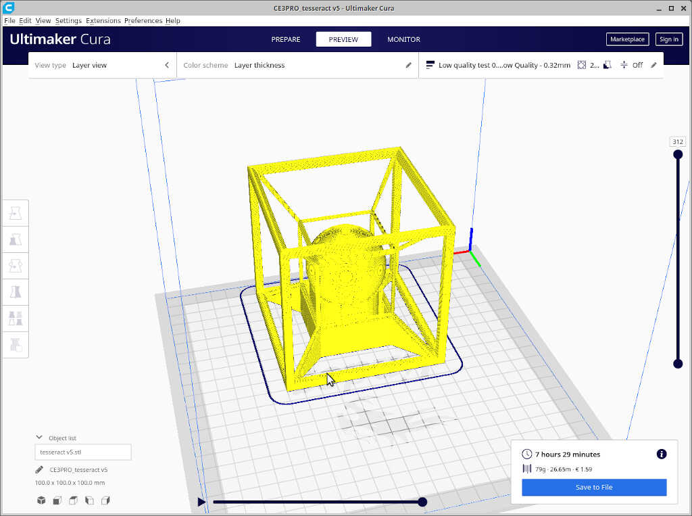

# 5. 3D Scanning and printing

This week I'm going to do 3D printing. We're still in lock down in Portugal so I'll leave the 3D scanning for another time, when I'm at the Lab in Lisbon.

##Assignments

* *Group assignment*

    * *Test the design rules for your printer(s).*
    * *Document your work and explain what are the limits of your printer(s) (in a group or individually).*

* *Individual assignment:*
    * *Design and 3D print an object (small, few cm3, limited by printer time) that could not be easily made subtractively.*
    * <del>3D scan an object, try to prepare it for printing (and optionally print it)</del>

## 3D Printing

According to [wikipedia](https://en.wikipedia.org/wiki/3D_printing) 3D printing, or additive manufacturing, is the construction of a three-dimensional object from a CAD model or a digital 3D model.The term "3D printing" can refer to a variety of processes in which material is deposited, joined or solidified under computer control to create a three-dimensional object, with material being added together (such as plastics, liquids or powder grains being fused together), typically layer by layer.

I'm going to use my own 3D printer, an [Creality Ender 3 PRO](https://www.creality.com/goods-detail/ender-3-pro-3d-printer), based on the [Fused depoisition modeling](https://en.wikipedia.org/wiki/Fused_filament_fabrication#Fused_deposition_modeling) (FDM) as printing process. In FDB, the printing process uses a continuous filament of a [thermoplastic](https://en.wikipedia.org/wiki/Thermoplastic) material. The filament is fed from a large spool through a moving, heated printer extruder head and is deposited, layer by laryer, on the growing object. 

A typical plastic FDM 3D printer has the following basic parts, shown in the following picture.

<!-- 3dp1 -->


* The build plate....
* The X, Y, and Z stepper motors
* The extruder, which also includes a stepper motor
* The Power supply
* The Controller display
* The main board...
* The hotend

There are two types of extruders, the Bowden and the Direct Drive. The major difference between them is that the Bowden extruder is separated from the moving hot end. In the case of my printer, which is very similar to the one from the picture, the Bowden extruder is separated from the printing head, which contains the hotend. The filament is fed through a PTFE (Teflon) tube directly to the hot end upper part. 

During this week I'll be using two types of materials: [polylactic acid](https://en.wikipedia.org/wiki/Polylactic_acid) (PLA) and [polyethylene terephthalate  glycol-modified](https://en.wikipedia.org/wiki/Polyethylene_terephthalate) (PETG).


### 3D Printer Calibration

I received two 1 kg spools containing PLA and PETG from my Fablab to play with. 

<!-- 3dcal1 -->
<!--  -->


The first thing I needed to do was to calibrate my printer. I did it first for PLA. I need to place the PLA spool onto the printer holder and push it into the extruder, where it goes through the teflon tube to the hot end. 

To do this, I need to heat up the hot end first to a temperature of 200º C so that the PLA can melt and be turned into a very small 0.4 mm filament that then goes through the nozzle. To do this, I chose the `PREPARE/PREHEAT PLA/PREHEAT PLA END` option as shown in the pictures below...

<!-- 3dcal2 -->
<!-- 3dcal3 -->



...and then waited until the temperature of the hot end reached the right temperature. Now the hotend is ready to receive the PLA filament.

<!-- 3dcal4 -->


Then, I took the tip of the PLA filament and cut it in a 45º angle with a pliers as shown in the two pictures below. **It is important that the filament tip has this edge so that it can easily go through the extruder opening into the PTFE tube**.

<!-- 3dcal5 -->
<!-- 3dcal6 -->


With the tip ready, I placed the spool into its place at the top of the printer. **Note that the component on the left of the picture where the filament goes through is a printed add-on to ease the angle between the filament and the extruder hole. It helps prevent that the filament breaks when pushed by the extruder.**

<!-- 3dcal7 -->


The filament should then be inserted into the entry hole of the extruder, as shown on the bottom center part of the picture. It is necessary to gently press the lever with the string (on the left center) so that the extruder gear and bearing separate a little, allowing the filament to have space to move forward. Then the filament leaves the extruder by the exit hole into the PTFE white tube, shown on the top right corner of the picture.

<!-- 3dcal8 -->


From here, I just keep pushing the filament until it reached the nozzle and started producing the very thin 0.4 mm PLA filament. **This movement should not offer much resistance. If there is considerable resistance there may be a clog at the nozzle.**

<!-- 3dcal9 -->


Now I need to calibrate the 3D printer plate. To do this I will use the *paper technique* that consists in placing one sheet of normal printer paper between the plate and the nozzle to infer the best z height of the plate. I will keep the nozzle at 200º C and the plate at 60º C so that it will be calibration to the printing conditions. 

First I disable the steppers so I could freely move the printer.

<!-- 3dcal10 -->


Then I did a `AUTO HOME` command to bring the printer head to its starting place.

<!-- 3dcal11 -->


From here I moved the printer head to the bottom left corner of the plate and placed a paper sheet between the plate and the nozzle. **Note that you need to check first if the nozzle is above the plate! If not you need to lower the plate by turning the knobs of the plate counter-clockwise, as shown in the [picture](https://files.helpdocs.io/hj2i3yt73y/articles/0bwiehyjlg/1595323312404/image.png)**.


<!-- 3dcal12 -->


Now, I needed to move the knob of the picture so that you can move the sheet of paper but let it scratch it only slightly. This takes some time and experience to perfect. After the first corner I moved to the other three corners and did the same, and then repeated again the process for all four corners.

In the end I also did it at the center of the plate to check if all went well.


### Temperature test

The first test I did after calibrating the printer plate was to print a temperature test. I downloaded a calibration tower test .stl from [thingiverse](https://www.thingiverse.com/thing:2729076) designed by the user [gaazolee](https://www.thingiverse.com/gaazolee/designs) and sliced it with [Ultimater Cura 4.8](https://ultimaker.com/software/ultimaker-cura). This is a nice test because you can check out the printer's performance at different temperatures, that go from 180 to 225º C on:

* overhangs - from 25 to 60 degrees - to evaluate if the machine can print at steep angles.
* bridges - from 15 to 30 mm - to evaluate how well the machine can build connect points with material in midair
* stringing test - to check if there is ooze left by the nozzle at a certain temperature. 
* curvy shapes - to test if the printer performs curvy overhangs well.

<!-- tt1 -->


I loaded the .stl in Cura and chose the following settings for the Ender 3 Pro 3d Printer and everything else as default:

* layer height: 0.2 mm
* infill: 20%
* print speed: 50 mm/s
* 1st layer speed: 10 mm/s (instead of 20 mm/s)

<!-- tt2 -->


I also needed to add extra gcode lines at certain heights so that the printer would change the temperature of the hotend. To that end, I went to `Extensions/Post Processing/Modify Gcode` and added the following command as shown in the picture, starting at z = 1.6 mm @ 225º C and ending at z = 91.6 mm @ 180º C.

<!-- tt3 -->


I clicked on slice and this generates a gcode for the printer.

Next, I uploaded the gcode to the [octoprint](https://octoprint.org/) applet on the browser. I have a [raspberri pi 3]() running next to my printer so that I can control it remotely from my office.

<!-- tt4 -->
<!-- tt5 -->


I clicked print, and off it went! 

<!-- tt6 -->
<!-- tt7 -->


Observing from the back of the tower, we can observe that there is considerable stringing at higher temperatures, up to 190º C which is surprising because I'm used to see no difference among the different temperatures when using other brands of PLA ,and I usually print at 200º C with no stringing problems. The only temperature at which there is no stringing is 180º C.

<!-- tt8 -->


### Calibration test

To ensure this is indeed the right temperature, I printed the same calibration tests, taken again from [thingiverse](https://www.thingiverse.com/thing:1019228) and designed by user [ctrlV](https://www.thingiverse.com/ctrlv/designs). It tests the following features:

* size: the object is 2x50x30mm (baseplate)
* hole size: 3 holes (3/4/5mm)
* Nut size: M4 Nut should fit perfectly
* fine details: pyramid, cone, all numbers
* rounded print: wave, half sphere
* minimum distance & walls: 0.1/0.2/0.3/0.4/0.5/0.6/0.7mm
* overhang: 25°/30°/35°/40°/45°
* bridge print: 2/4/8/16mm
* surface: all the flat parts

Using the same steps and settings as before but now printing at the same temperature, I obtained the two parts shown in the picture below, where the left part was printed at 180º C and the right part was printed at 200º C. 

In general the dimensions are more or less correct, but the one from the left shows much less stringing and more detailed features. The bridges and overhands also look better on the left image. The following table shows contrasts both trials.

| Feature     | @ 180º C     | @ 200º C |
| ----------- | ----------- | ----------- |
| Size      | 1.42x48.2x29.98mm       | 1.30x48.3x30.11mm |
| Hole size   | 2.8,3.73.4.71mm       | 2.54,3.53,4.55mm |
| Fine details | Excellent reproduction | Looks overextruded with stringy parts |
| Rounded print | Some strings | Some strings and the half sphere looks overextruded |
| Minimum distance | Goes down to 0.3 mm | Goes down to 0.3 mm | 
| Overhangs        | Goes up to 45º with some, uniform, stringing | Goes up to 45º with a lot of stringing in the last angle |
| Bridge print     | Can print the bridges well with some stringing. Has one or two failed fibers @ 16mm | Prints all bridges well with a lot of stringing |
| Surface          | Looks uniform            | Looks uniform |

**This shows that it is important do temperature and calibration tests when changing printing materials or even when changing brands within the same material! Testing can save a lot of printing material and time!**
''
<!-- tt9 -->
<!-- tt10 -->
<!-- tt11 -->


## PETG

The next step would be to do the same thing but this time on a different material: PETG. PETG melts at higher temperature, but after a quick research I found that I should not go beyond 240º C because above that the PTFE tube that is in direct contact with the hotend starts to emit toxic fumes. 

So I experimented printing at that temperature but the prints wouldn't adhere to the plate. After doing some research, I increased the bed to 70, then to 80º C and finally I got some adherence! 

Then started the problem I could not solve this week. The nozzle was continuously clogging, and the needle trick didn't work. I have some very narrow needles I use to unclog the nozzles. I just stick the needle into the nozzle tip when it's hot and usually with PET it starts flowing abundantly. This was not the case with PETG however. 

I tried some different things that didn't work: opening the top of the hotend and removing the filament and adjusting the PTFE tube so that it would be flush against the hotend. The result would be the same: it works for a minute then clogs. So I concluded that the problem should be between the PTFE tube and the nozzle, unscrewed it and cleared its path with the tube. I decided to replace the nozzle and when I was screwing it back it place it didn't screw. 

<!-- tt12 -->


So this time I was screwed...literally :O I'm now waiting for a new heatblock...this is it for this week folks! Back to electronics tomorrow.

---

## *Intermission*

---

After several weeks, at the beginning of July, I resumed week05. Two months ago I ordered a new heat block and installed it. Everything is working fine now.

### Designing a weird object

Weird? Yes, why not? In this case, I designed an object that was impossible to create (I think!) subtractively.

I design it in [Fusion 360](https://www.autodesk.pt/products/fusion-360/overview?term=1-YEAR). The general ideia was to draw a [tesseract](https://en.wikipedia.org/wiki/Tesseract), which is the ```four dimensional analogue of the cube``` with a sphere that cannot escape in the middle.

We cannot draw in four dimensions so I will design a [Schlegel diagram](https://en.wikipedia.org/wiki/Schlegel_diagram) of the hypercube in 3 dimensions, as shown in the picture.

<!-- tesseract -->
{:style="width:40%"}

First, I drew two squares, the first with 100 mm and the second with 90 mm. They were parametrized taking into account the side of the bigger square and the thickness of the square (10 mm). 

<!-- cad1 -->
{:style="width:100%"}

Then, I extruded 100mm from the sketch. 

<!-- cad2 -->
{:style="width:100%"}

From there, I used the **press/pool tool** to remove 90mm of the four solid faces of the cubic shape. 

<!-- cad3  -->
{:style="width:100%"}

Subsequently, I created a copy of this structure and used the **scale tool** to reduce it to half its size. Then, with the **align and the move tool** I centered it. 

<!-- cad 4 -->
{:style="width:100%"}

To connect the two structures I had to chanfer all their sides first. I chanfered the small cube first...

<!-- cad 5 -->
{:style="width:100%"}

...and then the big cube.

<!-- cad 6 -->
{:style="width:100%"}

Finally, I could create the paths between both cubes using the **loft tool**.

<!-- cad7 -->
{:style="width:100%"}

The last part involved creating a sphere with 50 mm diameter at the center of the piece so it would be stranded inside.

<!-- cad8 -->
{:style="width:100%"}

Ok, this is it! **Does it print? ;)**


### Printing a weird object

The object I'm trying to print has a side of 100mm. It takes ~  8 hours to print so I decided to make a prototype first. To print the object I used Cura first to slice it and then [octoprint](https://octoprint.org/) to print it. Cura reads a [stl](https://en.wikipedia.org/wiki/STL_(file_format)) exported from fusion 360 which is transformed into a [gcode](https://en.wikipedia.org/wiki/G-code) by Cura.

All prints had the common settings, except when said otherwise:

* layer height: 0.32 mm
* 20% infill
* speed: 60 mm/s
* some supports (check below)

In my first attempt, shown below, I sliced the stl file with support for the horizontal walls of the hypercube everywhere. 

<!-- slicing1 -->


This would take more than 16 hours, so I **resized the model to 1/2** and the estimated time to print it was reduced to four hours.

<!-- slicing 2 -->


I saved the file, uploaded it to octoprint and printed it as shown below

<!-- 3dp1 -->

<!-- 3dp2 -->


Unfortunately I could not remove the support walls as they were too attached to the printed part.

In my second print I changed the ```Support/supporting placement``` settings from ```everywhere``` to `touching buildplate`. The sliced model is shown below.

<!-- slicing 3 -->


Before printing this part, I reduced the model to 50% the original size (from 100 mm side to 50mm side) so that I could observe it it would print fine. This took **1.5 hours**. The part is shown below before removing the supports...

<!-- 3dp3 -->


...and after removing the supports. It is observed that the printing part is not perfect, it has some failed bridges and the connections between the two walls are very fragile. **Nevertheless I think this is a good example of a part that is impossible to do at once with a subtractive CNC technique, at lease a 2.5/3 CNC machining.**

<!-- 3dp4 -->


Assuming that the walls on the original part would be stronger, I printed out the ~ 8 hour part. We can see here the printing in progress from the octoprint dashboard.

<!-- octoprint1 -->


The result is shown below. It is already possible to see that the part was printed much better, despite some failed bridges across the 100mm sides. 

<!-- 3dp5 -->


Here we can see the three trials side by side. Now I just need to remove the failed bridges to obtain a functional part! 

<!-- 3dp5 -->


## 3D Scanning

Let's now [3D scan](https://en.wikipedia.org/wiki/3D_scanning) a (not so) random object! The technique I am going to use for scanning is called [photogrammetry](https://en.wikipedia.org/wiki/Photogrammetry) which is the

> science and technology of obtaining reliable information about physical objects and the environment through the process of recording, measuring and interpreting photographic images and patterns of electromagnetic radiant imagery and other phenomena.

To this end I will be using the open source software [Meshroom Software](https://alicevision.org/ and https://github.com/alicevision/meshroom) which uses the [Alicevision pipeline](https://github.com/alicevision/AliceVision) at its core. 

### First try: the calibration test 3d printed part

For the first try with the program I used the 3d printed calibration part, with dimensions 2x50x30 mm. Yes, this is a very small piece, but I wanted to test the limits of the program. (**Note to self: I really needed to have put much more images, made the session outdoors and chose another color for the base which is almost the same as the scanning piece!**)
<!-- calibration test picture -->
{:style="width:50%"}

After installing meshroom, I ran it directly. 

Meshroom has the following parts, as shown in the picture below: 

* Images window (green box - left) where you can drop and check your input pictures that are about to be processed. In this case we have 75 pictures.
* Image viewer windows (red box - center) where you can see the image that is selected on the Images window.
* 3D viewer windows (blue box - right), where we can observe the preview of the output, shown at the final of the **StructureFromMotion** node or the final result, when we reach the final node.
* Graph Editor and Task Manager windows (yellow box - bottom), where we can observe the 12 graphs and the relations among each other as well as the structured tasks in order in the Task Manager. 
* Node window (rose box - bottom right) show us information related to the selected node, including a real time log and statistics.
<!-- ctest -->


The first step consisted in dragging the pictures of the calibration test part **to the images window** as shown in the picture below
<!-- ctest0 -->


The creators of meshroom suggest making a preview first to show us if the results are going well and if we need more pictures for a more consistent effort. To obtain this preview we need to compute **Views and Poses** (just right click it) at the **Structure from Motion** node. 
<!-- ctest1 -->


After some time we obtain the following result as shown here. The camera icons show the relative position of each picture that was taken, and the dotted points below show the preview of the 3d image. We observe a brown background (the box) and also the brown part we want to scan (not such a good combination of colors!)
<!--ctest2  -->


Should I continue? It's a very hard call as I'm using this for the first time. Why not? Let's see what we get at the end of the process. To this end, I right clicked on compute on **Folder** at the final node, **Texturing**.
<!-- ctest3 -->


To locate the 3d image I had to right click on **Folder** at the final node **Texturing** and then clicking on **folder**. This opens the place where the .obj 3d image is located. Then, by dragging that image to the 3d view window I could view the final result, as shown below.
<!-- ctest4  -->


Okay, the results are not very satisfying, BUT i) I only had 74 pictures (the developers suggest 150-200) and I think I needed much more close up pictures which was impossible with the mobile phone: the object is very small and the focal distance is limited. 

Despite that, we observe some feature were reproduced: the convoluted hole path in the middle of the part, the holes and numbers. The bridges, overhangs, minimum distance and fine detail features are missing. The bigger features at the end of the part are distorted and didn't retain their original form.

### Second try: A very small tree in a vase

This time I scanned a very small tree in a vase. In this case we're talking about an object that is 1000x300 in size, so we don't have the focus problem anymore, **but there is a lot of detail that will be difficult to scan**.


Here I followed the same worflow as before. I obtained the following result for preview mapping, shown below. This time I used 100 images. The preview looks promising, let's move on and find out what we get!
<!-- tree3 -->


And here is the final result. For some reason it didn't get any foliage and the vase is there but is not perfect. There's still some information missing as we can see from the holes.
<!-- tree4 -->


### Third try: A rusty old clock

In this last try I tried to add more images (200!) but I suspected that my 8gig computer would complain. I had an initial swap file of 8gig but I had to increase that to 16gig because the program at the **Meshing** node uses 20gigs of memory. This, of course, took a huge amount of time to execute, some 16 hours due to swap use. Hopefully I have a SSD but I wouldn't do this again!

In this first try I had a memory overload program and this [link](https://github.com/alicevision/meshroom/issues/195) shows that you should change **Maxpoints** to 1 or 2 million instead of 5 million. **You need to check if the trade off is worth it.**

So, first, as usual, I did a preview, that can be see here. Looks very promising as all the features are there.
<!--clock1  -->


The final result is spectacular but not without its flaws. **The image through glass is one of the weak points of alicevision but here it can do it well (more or less!)**. The front view can be see here...
<!-- clock2 -->


...and a rear view here, showing the place in space where it needed more information to accurately render the 3d image.
<!-- clock3 -->


**For some reason it didn't render correctly the ring at the top of the clock**. The following video shows the a 360º depiction of the rendered clock.

<video class="center" width="800" controls>
  <source src="../../files/week05/clock.m4v" type="video/mp4">
Your browser does not support the video tag.
</video>

## Files

* [Calibration .stl files](../files/week05/calibration_stl_files.zip)

* [Tesseract files](../files/week05/tesseract.zip)

## References

* [3D Printing](https://en.wikipedia.org/wiki/3D_printing)

* [3D Scanning](https://en.wikipedia.org/wiki/3D_scanning)

* [Alicevision](https://github.com/alicevision/AliceVision)

* [Cura](https://ultimaker.com/software/ultimaker-cura)

* [Fused deposit modelling](https://en.wikipedia.org/wiki/Fused_filament_fabrication#Fused_deposition_modeling)

* [Fusion 360](https://www.autodesk.pt/products/fusion-360/overview?term=1-YEAR)

* [Meshroom](https://alicevision.org/%20and%20https://github.com/alicevision/meshroom)

* [Octoprint](https://octoprint.org/)

* [Photogrammetry](https://en.wikipedia.org/wiki/Photogrammetry)

* [Wikipedia](https://en.wikipedia.org/wiki/Main_Page)


