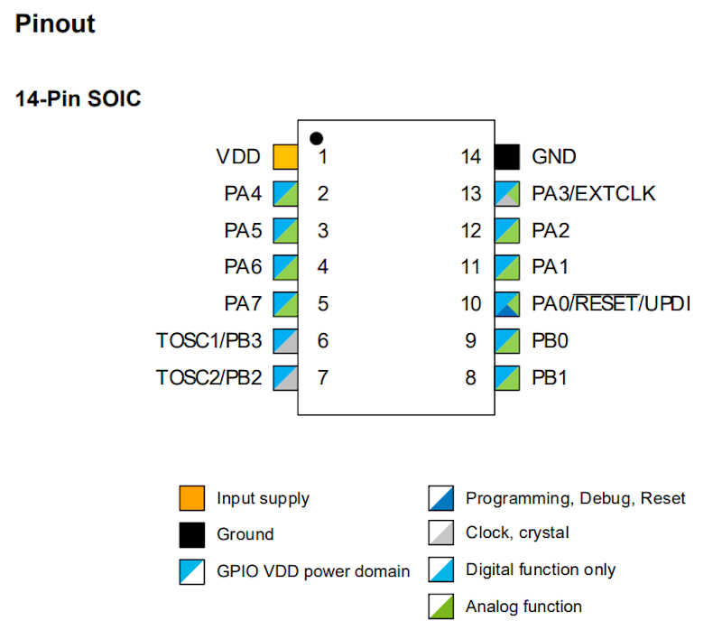
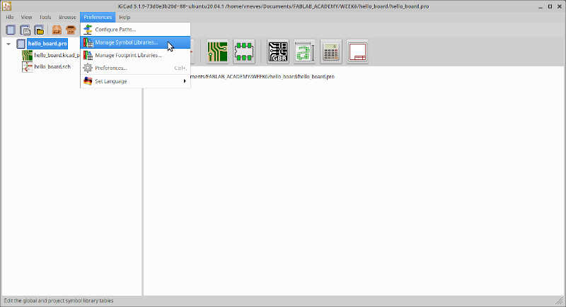
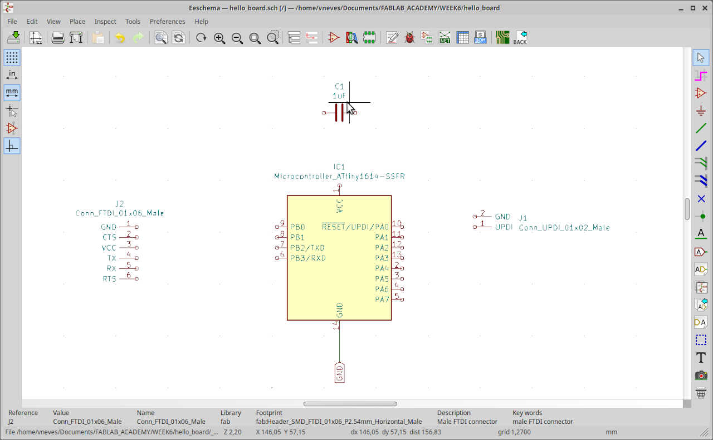
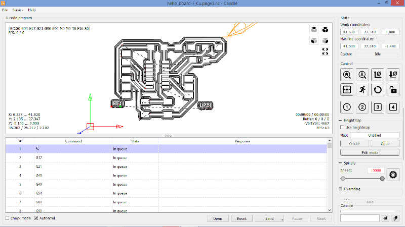
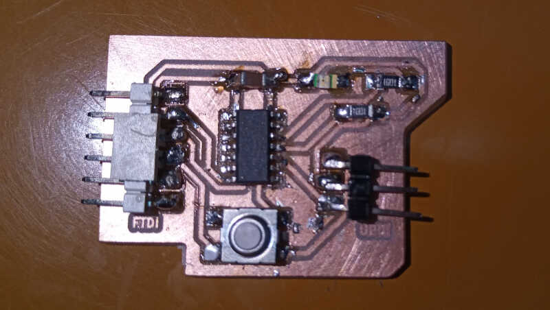
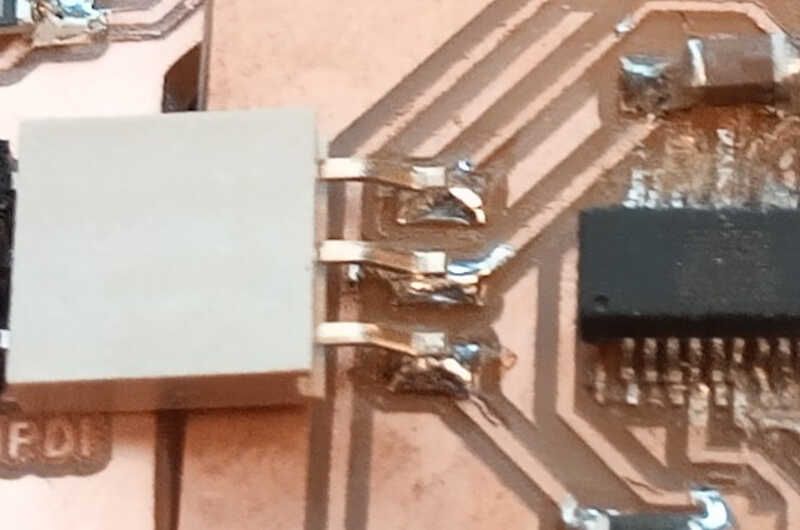
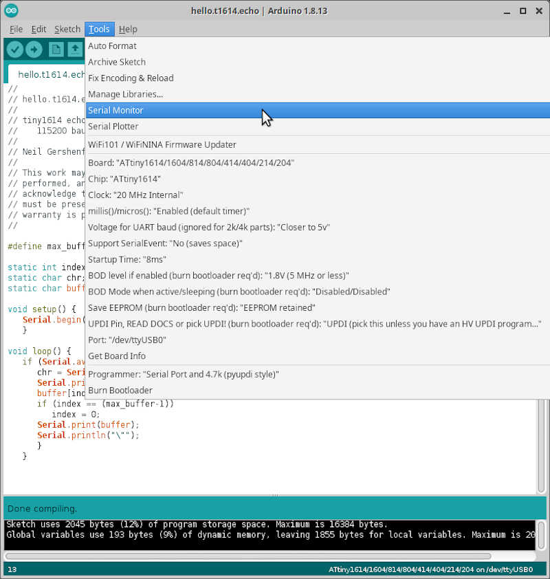

# 6. Electronics design

Week06 will be about Electronics Design. I continue under lockdown (sigh...) and hopeful I can start my run in the Lab early April.

As I'm at home, I'll invert the assignments again and redraw an hello-world board first and then analyze it with the tools at hand, in this case a multimeter.

## Assignments

* *Group project:*
      * *use the test equipment in your lab to observe the operation of a microcontroller circuit board*
* *Individual project:*
      * *redraw an echo hello-world board*
      * *add (at least) a button and LED (with current-limiting resistor)*
      * *check the design rules, make it, and test it*
      * *extra credit: simulate its operation*

## 6.1 (Re) Designing an hello-world board

My first assignment this week was the redesign of an hello-world board, such as this one :)

<!-- neil_pic -->

**...and no...I'm not going to do anything fancy or artistic sorry :)**

To do this I received from my local instructor André the following components:

* 4 ATTINY1614-SSFR micro controllers
* 2 Tactile push buttons
* 5 SMD Green LEDs
* 5 SMD Blue LEDs
* 5 SMD $1K \Omega$ Resistors
* 5 SMD $0 \Omega$ Jumpers (to bridge some traces if needed)
* 2 5x0 Pin Right Angle (for the FTDI connector)
* A few pin connectors to play with
* and some v-bits **to be destroyed :P** (no, I didn't scratch the MDF of the milling machine yet!)

<!-- ed1 -->

My first step into the world of electronic design was to inspect the mysterious hello world boards everyone talked about during class. I have chosen the [ATTINY1614](https://www.microchip.com/wwwproducts/en/ATTINY1614#datasheet-toggle) [MC](https://en.wikipedia.org/wiki/Microcontroller) mostly due to their versatility and available arduino libraries.

I quickly went through the [ATtinies MC datasheet](http://ww1.microchip.com/downloads/en/DeviceDoc/ATtiny1614-16-17-DataSheet-DS40002204A.pdf) and no...i didn't read the 598 pages :)

<!-- ATtiny1614 chip pic ed2 -->
{: style="width:50%"}

For a $1 chip it has loads of features. I'll name here a few that caught my eye. The rest are in the first two pages of the datasheet.

* 20 MhZ AVR CPU (faster than my first PC, a 386SX @ 16 MHZ :O )
* Memories
    * 16 KB In-system self-programmable Flash memory
    * 256 bytes EEPROM
    * 2 KB SRAM
    * Write/erase endurance:
        * Flash 10,000 cycles
        * EEPROM 100,000 cycles
* System
    * *(excellent)* Clock options:
        * 16/20 MHz low-power internal RC oscillator
        * 32.768 kHz Ultra Low-Power (ULP) internal RC oscillator
        * 32.768 kHz external crystal oscillator
        * External clock input
    * Single-pin Unified Program and Debug Interface (UPDI) - **I hope I can use my ftdi board from week04 to program this one through UPDI :)**
* *(loads and loads of)* Peripherals
    * One 16-bit Timer/Counter type A (TCA) with a dedicated period register and three compare channels
    * Two 16-bit Timer/Counter type B (TCB) with input capture
    * One 12-bit Timer/Counter type D (TCD) optimized for control applications
    * One 16-bit Real-Time Counter (RTC) running from an external crystal, external clock, or internal RC oscillator
    * Watchdog Timer (WDT) with Window mode, with a separate on-chip oscillator
    * One USART with fractional baud rate generator, auto-baud, and start-of-frame detection
    * One master/slave Serial Peripheral Interface (SPI)
    * One Two-Wire Interface (TWI) with dual address match
        * Philips I2C compatible
        * Standard mode (Sm, 100 kHz)
        * Fast mode (Fm, 400 kHz)
        * Fast mode plus (Fm+, 1 MHz)
    * Three Analog Comparators (AC) with a low propagation delay
    * Two 10-bit 115 ksps Analog-to-Digital Converters (ADCs)
    * Three 8-bit Digital-to-Analog Converters (DACs) with one external channel

**An embedded MC is an impressive device packing lots of powerful stuff.** It has many elements of a normal computer packed into a very small package: CPU, volatile/non volatile memory, I/O ports, clock generation...as well as other features, such as signal detectors with references, [ADC](https://en.wikipedia.org/wiki/Analog-to-digital_converter) and [DAC](https://en.wikipedia.org/wiki/Digital-to-analog_converter)...and so on. This can be observed in the Block Diagram of the tinyAVR-1 series.

<!-- ed3 p13 -->

It is very important to check the pinout to know where to plug things. In my case, I have a 14-pin [SOIC](https://en.wikipedia.org/wiki/Small_outline_integrated_circuit) as shown below.

<!-- ed4 p14 -->
{: style="width:50%"}

For now, I'll leave it at that. **I will need to crunch through this datasheet soon enough!**

### Designing Neil's ATTiny 1614 Board

The starting point will be Neil's ATtiny1614 board design. The info is on the [*Embedded Programming*](http://academy.cba.mit.edu/classes/embedded_programming/index.html#echo) page. Search for ATtiny1614 and you'll get there. It's the second reference.

From here I took the Neil's schematic, shown below, and replicated it in [Kicad](https://kicad.org/). Kicad will be the program of choice for electronics design.

<!-- ed5 -->
{: style="width:50%"}

Doing some very straightforward ***reverse engineering***, I could replicate the circuit easily. But the idea here is to **redraw** the board! What will be the best approach? Let me think for a while...

<!-- ed6 - kicad board -->

First I created a new project on Kicad and called it **hello_board**. After creating it, I had two choices: i) to check out the PCB Layout or ii) the PCB schematics. I'll start by drawing the circuit on the schematics, using the available FAB Footprint and Symbol Libraries.

The [Symbols](https://gitlab.com/kicad/libraries/kicad-symbols) on the one hand are the schematic functional representation of the component, giving important information related to I/O ports and their functions. It is possible to connect symbols with wires in the Schematic Layout Editor. The [Footprints](https://gitlab.com/kicad/libraries/kicad-footprints) on the other hand are the outline of a component that is mounted on a circuit board. It contains the pins, the device and sometimes text markings and values related to the component.

The FAB Libraries were previously cloned from their [gitlab repository](https://gitlab.fabcloud.org/pub/libraries/electronics/kicad) and installed in a convenient directory. **Is it important to regularly update the git using `git pull` at the lib location.**

To install the libraries I needed to go to `Preferences/Manage Symbol Libraries and Manage Footprint Libraries`. 
<!-- ed7 -->
{: style="width:100%"}

Then,

* in `Symbol Libraries/Global Libraries` I clicked on the plus signal on the bottom left corner of the window and added `fab` as the nickname of the new library, adding the following Library path: `homedir/kicad_lib/kicad/fab.lib`.
<!-- ed8 -->

* in `Footprint Libraries` I did the same thing, also calling `fab` to the new library and the following path: `/homedir/kicad_lib/kicad/fab.pretty`.

* In the `Preferences/Configure Paths` menu, I added capital `FAB` for the environment variables and added the path of the Fab Kicad Libraries: `/homedir/kicad_lib/kicad`. This way kicad will know where the FAB libraries are located.
<!-- ed9 -->
{: style="width:70%"}

After this initial setup I laid out the components from Neil's hello-board:

* 2x01 Pin array for the UPDI connector - **I saw immediately I was going to replace the original 2x01 pin for a three pin version, so that I could feed 5V from my USB to UPDI programmer, done in Week04, to this board. The UPDI will be used to program the 1614.**
* 6x01 Pin array for the FTDI connector - I'll need the FTDI connector to communicate through the serial port with the 1614.
* ATTiny 1614 IC.
* 1 $\mu F$ Capacitor.

The first thing to place in the Schematic Layout Editor `(Tools/Edit Schematic)` is the 1614 IC. To do that I clicked on `Place Symbol`, the third icon on the right

<!-- ed10 -->
{: style="width:100%"}

Then, I clicked on the empty schematic and the Choose Symbol window appeared. I wrote fab, to go directly to the fab symbols and chose the ATtiny1614 as shown in the picture.

<!-- ed11 -->
{: style="width:60%"}

I placed it at the center of the schematic, deselected the `Place Symbol` tool with the `ESC` key, clicked on the label `U?` and changed it to `IC1`. **You can change the names of other labels in a similar way.**

<!-- ed12 -->

Next, I placed a global label named `GND` on pin 14 (GND) of IC1. To do this, I clicked on the global label icon (9th icon on the right, from the bottom up), chose a place near pin 14 and wrote `GND` on the Global Label Properties and with `Down` orientation.

<!-- ed13 -->
<!-- ed14 -->

{: style="width:50%"}

Finally I placed a wire between the GND Label and pin 14 of IC1 by clicking on the wire icon first (5th icon on the right) and clicking on the terminals of both symbols. **In fact you don't need to place wires here. Just add the label directly to the pin ;)**

<!-- ed15 -->

Then, I added two male connectors: a 1x06 male FTDI connector (J1) and a male UPDI 1x02 connector (J2). This way we can communicate with the IC with both FTDI and UPDI communication protocols. **Take care to choose only fab components**. **You can rotate your components with the `R` key.** I also added a 1 $\mu F$ capacitor that will be used as a [decoupling capacitor](https://en.wikipedia.org/wiki/Decoupling_capacitor) to stabilize the voltage provided to the IC. I'll call it `C1` and add a value of `1uF`. To add this value, I clicked on the `C` character below to the `C1` one and edited it.

<!-- ed16 -->
[{: style="width:100%"}](../images/week06/design/ed16.jpg)

Now I will connect everything, closely following Neil's board shown above. First I added another global label named `VCC` so that I could place all VCCs together.

<!-- ed17 -->
[{: style="width:100%"}](../images/week06/design/ed17.jpg)

Then I connected everything else. **I also replaced the 2-pin connector with a 3-pin one. Note that you can also flag non connected pins using the `Place no Connection Flag` tool. It is the 9th symbol on the right, the blue cross.** I will not place this flag on the IC because I want to add some stuff on it yet. I'll leave that to the end.

<!-- ed18 -->
[{: style="width:100%"}](../images/week06/design/ed18.jpg)

**Another very useful command is drag. Instead of moving you can right click on the component and choose `Drag` or by left clicking on the component and using the shortcut `G`. Differently from moving, the drag preserves the connections.**

<!-- ed19 -->

### Redesigning the 1614 board

It is time to redesign the board! **I'll add a press button and a LED**. Both components will have a 1 $k \Omega$ resistor in series to limit the current that goes through them. I picked the components from the fab library and added them to the board in the following way:

* The press button will be connected to PA1 with a 1 $k \Omega$ [pull down resistor](https://eepower.com/resistor-guide/resistor-applications/pull-up-resistor-pull-down-resistor/#). This means that when the button is pressed the signal will be the VCC signal and when the button is released the signal will be zero, as the resistor *pulls down* the input voltage to zero. The following [picture](https://circuitdigest.com/tutorial/pull-up-and-pull-down-resistor) shows the diagram that will be implemented.

<!-- ed20 pull down resistor -->
{: style="width:30%"}

* The LED diode will be connected to PA2 with a 1 $k \Omega$ resistor in series. The resistor is here to limit the current provided to the diode, thus preventing its burnout.

I chose these two pins to place the components on different sides of the board. The final diagram is shown in the following picture.

<!-- ed21 -->
[{: style="width:100%"}](../images/week06/design/ed21b.jpg)

From here, I generated a netlist to export the components and its connections to the **PCB Layout Editor**.

Now I need to set up the **design rules**. To do that I ran the **PCB Layout Editor** and clicked on `File/Board Setup`. From here, I changed both **Clearance** and **Track width** to 0.4 mm.

<!-- ed22 -->
{: style="width:100%"}

Then, I loaded the **Netlist** and clicked on `Update PCB`.

<!-- ed23 -->
{: style="width:60%"}

All the components and their connections appeared on the PCB board layout.

<!-- ed24 -->
{: style="width:100%"}

Now I need to arrange the components according to the **design rules**. After a while I ended up with the following design. **I also added the words *FTDI* and *UPDI* near their respective connectors by using the *Text Tool* (the 7th icon with a big *T* from the bottom on the right).** This design was inspired by the very helpful pages of [Adrian's *Adrianino* page](http://fabacademy.org/2020/labs/leon/students/adrian-torres/adrianino.html) and [Fablab Kali **Electronics** designs](http://wiki.fablab-kali.de/doku.php?id=documentation:documentation).

<!-- ed25 -->
{: style="width:100%"}

**Unfortunately I noticed that my 1x03 connector that I did on [week04](http://fabacademy.org/2021/labs/benfica/students/vasco-neves/assignments/week04/#42-programmer-fabrication) and this one have their pins switched. :O**. When I changed the VCC pin to 1 and the UPDI data pin to 3 I could not make all the connections anymore **so I had to reconfigure the design of the board.**

<!-- ed26 -->
{: style="width:100%"}

**Now pin 1 is VCC and pin 3 is the UPDI comms pin**. This change would bring other problems as we will see later on. :\

The final board in 3d looks like this. **The button and the led are missing**, I guess there are no 3D representation of them at this time. I am now ready for the board production!

<!-- ed27 -->

## 6.2 Hello Board Production

Before producing the board I needed to export the necessary *traces* and *interior* .svg files to feed in MODS in order to obtain the GCODE files for milling.

In the Kicad *PCB Layout Editor* I clicked on `File/Export/SVG`.
<!-- f1 -->
{: style="width:100%"}

Then I exported two files:

* The first one with the traces, using the options shown in the following picture
<!-- f2 -->
{: style="width:50%"}

* The second one with the interior, choosing only the `Edge.Cuts` *Technical layer*.
<!-- f3 -->
{: style="width:50%"}

Before importing the files to MODS I needed to change the interior file, because the edges in the limit of the image will not be recognized by MODS. I also need to fill the interior with the black color. I opened the file in Inkscape and clicked on `File/Document Properties`.
<!-- f4 -->
{: style="width:100%"}

Here, I added one mm on `Width` and `Height` of the page.
<!-- f5 -->
{: style="width:50%"}

This action enlarged the canvas by 1 mm.
<!-- f6 -->
{: style="width:100%"}

Then, I centered the figure using `Align and Distribute` (shortcut: `CTRL+SHIFT+a`) and clicking on `Center on vertical axis` and `Center on horizontal axis`. This is always done `Relative to: Page`.<!-- f7 -->
{: style="width:100%"}

This action was needed to separate the board edges from the canvas borders. **When doing the milling I need to bear in mind that I may need some adjustment not to mill diretly into the traces due to this 1 mm change.**

Finally, I had to fill the interior of the board with ink (`Fill bounded areas tool - shortcut *U*`). I chose black, so I will need to invert the colors within MODS later, because it recognizes the edges **within** the white borders.
<!-- f7b -->
{: style="width:100%"}

From here, I went to MODS, and chose with the RMB `programs/open server program/G-code: mill 2D PCB svg`.
<!-- f8 -->
{: style="width:100%"}

Then I opened the traces .svg file, inverted it on the `convert SVG image` box, and chose `mill traces 1/64` on the `set PCB defaults` box.
<!-- f9 -->
{: style="width:100%"}

The chosen parameters for `mill raster 2D` and `path to G-code` boxes are shown in the following picture.
<!-- f10 -->
{: style="width:100%"}

**Note: Here I used `offset stepover: 0.7` because I wanted to observe if having a greater offset would improve the milling (it didn't!).**

Finally I clicked on `calculate` on the `mill raster 2D` box to obtain the .nc GCODE file.
<!-- f11 -->

For the interior file I followed a similar workflow. I chose the modified interior .svg file, inverted it, and chose `mill outline 1/32` on the `set PCB defaults` box.
<!-- f12 -->
{: style="width:100%"}

Then I chose the parameters as shown in the following picture...
<!--f13 -->
{: style="width:100%"}

...and clicked on `calculate` to obtain the .nc GCODE file.
<!-- f14 -->

From here I went down to the workshop to mill the board.

I followed the [electronics production workflow of week04](http://fabacademy.org/2021/labs/benfica/students/vasco-neves/assignments/week04/#setting-up-the-auto-leveling-feature). I opened Candle and first loaded the traces file...
<!-- f15 -->
{: style="width:100%"}

...did the auto-leveling routine and applied it to the board...
<!-- f16 -->
{: style="width:100%"}

...and obtained the following board.
<!-- f17 -->

I observed that there were a lot of unmilled areas, as shown in the following picture, and my hypothesis is that the 0.7 threshold for the offsets was too high.
<!-- f18 -->

To fix this, I repeated the process, but this time with the usual 0.5 value for the `offset stepover` parameter. This time the milling came out much better. :)
<!-- f19 -->

After cleaning up with the inox wool, I could compare both boards. I chose the latest (on the right hand side) to place the components.
<!-- f20 -->

First, I lined up the components I would use. Ok, **I didn't use a 3 pin female connector but a male one and I already had soldered the MC when I noticed it :) I had to bent the 1x03 pins a little so that they could sit on the board.**
<!-- f21 -->

This time I tried a different technique to solder the MC. First, I placed solder in all pads...
<!-- f22 -->

...then I soldered pin 1 (top left), then pin 8 (bottom right) to fix it and finally everything else. In general I just placed the solder iron for 5 seconds on each pin to let the solder make the connection to the pins. It worked quite well! 
<!-- f23 -->

I checked for continuity above and below the pins and between the pins and on the traces they are supposed to make contact with. I also checked the continuity of VCC and Ground tracks/pads. 
<!-- f24 -->

When everything checked out ok, I went on to place the other components. **Yes I know, it doesn't look so good...I need to practice soldering more!**
<!-- f25 -->

## 6.3 Programming...no...debugging! :O

With the two boards produced I could now try and program the 1614!

To program the board I just needed to plug in to the USB of my computer and then connect both boards via the UPDI pins, as shown in the picture. **And yes...collision alert! They are overlapped and don't fit well! This is what I was talking about! When I changed the design I forgot to take into account the connection between the two boards! :O**
<!-- p1 -->

To check the presence of the FTDI board, I typed 

    dmesg -w | grep 'FT'

and obtained the FTDI data I was looking for. I used `grep` to obtain only the output related to FTDI.
<!-- p2 -->

Let's try to program then! After doing some research I found some fablab students pages, namely [Nadieh's](http://fabacademy.org/2021/labs/waag/students/nadieh-bremer/blog/week-6/) and [Adrian's](http://fabacademy.org/2020/labs/leon/students/adrian-torres/week06.html) and I obtained the instructions and details I needed to try it out! I also used the information contained in the [week08 embedded programming page regarding the attiny 1614](http://academy.cba.mit.edu/classes/embedded_programming/index.html#echo).

The first step was compiling the [hello world program](http://academy.cba.mit.edu/classes/embedded_programming/t1614/hello.t1614.echo.ino) provided by Neil as a test. I copied the .ino file to my computer and installed the latest version of [Arduino IDE](https://www.arduino.cc/en/software).

In order to program my ATTiny 1614 later on with this IDE and to use its **serial monitor** I also installed in it the [megaTinyCore](https://github.com/SpenceKonde/megaTinyCore) libraries. To do this I went to `File/Preferences` and added the `Additional Boards Manager URLs` as 

    http://drazzy.com/package_drazzy.com_index.json

<!-- p3 -->

Next, I went to `Tools/Boards/Board Manager`...

<!-- p4 -->

...searched for `megatinycore` and installed it. 

<!-- p5 -->

Let's leave it at that for now. I compiled the program by clicking on the `verify icon`, the green tick icon on the top left. 

<!-- p6 -->

Then I exported the compiled files with `Sketch/Export compiled binary` to a convenient directory. Here I found the sought over .hex file! 

I chose to compile with [pyupdi](https://github.com/mraardvark/pyupdi), a python UPDI driver for the tinyAVR and megaAVR devices. To install it I just typed 

    pip install https://github.com/mraardvark/pyupdi/archive/master.zip

at the command line. I had python 3 and all needed dependencies previously installed on my computer. 

With this file in hand and with the information of the USB port (ttyUSB0) given by the `dmesg` command as well as the name of my MC, I typed in the command line

    pyupdi -d attiny1614 -c /dev/ttyUSB0 -b 57600 -f hello.t1614.echo.ino.t1614.20c0.u5V.mD0.hex -v

where *c* is the COM port, *b* is the baud rate, *f* is the hex file you want to program and *v* is a verbose flag for pyupdi.

Unfortunately it failed...and I couldn't fix it...this day! The output shows a

    link UPDI not OK

and

    UDPI initialisation failed

at the end.

<!--p7  -->

To fix this at the time, I tried to upload it with Arduino IDE (failed, outputting a similar error) and then I tried to debug both boards.

In the FTDI board I found there were three pins making contact. They are so close together! I drove them apart (again!) and tried to insure they would ever never touch again by driving a wedge with the cutter between them (I know...horrible and cruel stuff!).
<!--p8  -->
{: style="width:50%"}

After triple checking everything was ok, I move to the other board and everything checked out ok. So both boards were behaving in terms of continuity. 

Then I checked the voltage of my ATTiny board...and it was irregular giving values at the 5V input pit and at pin 1 of the MC of 0.5 to 3.5 volts. So something was off!

After a while I *concluded* (?) the problem was in a cold solder in the 1x03 female connector. The picture shows a close up view of the pins and they really are just *on top* of the solder. 
<!--p9  -->

Soon, **the connectors went loose and detached from the board**, so I need to re-solder them once I finish this diatribe! ;)

To test my "conclusion" (I should politely say *hypothesis!*) I went on to mill a [three pin *hello.serial-UPDI.3* board](http://academy.cba.mit.edu/classes/embedded_programming/index.html#echo) as shown in the week06 Fab Academy page. This way I could connect this board to the provided FTDI cable I have here and to the hello board. I downloaded the **board, traces, and interior** .png files so I could use them directly with MODS.

I quickly went through the usual workflow with MODS and Candle. The final result was this very tiny board that I show here:

* After the milling

<!-- p10 -->

* After sanding the sides and removing some leftover lines with the hand cutter

<!-- p11 -->

* After soldering everything

<!-- p12 -->

Finally I connected the USB FTDI cable to the serial-UPDI board and this one to my ATTiny 1614 hello board. I checked the 5V lines with the multimeter and everything was checking fine! **Note that I had to use the three male-female jumper cables here because the connections between the VCC pin and the UPDI pin on both boards are switched! This was just for test and I can easily do another FTDI-UPDI board with the switched pins**.

<!-- p13 -->

I went back to pyupdi and typed the command I mentioned before in the command line...

<!--p14  -->

**...and IT WORKED! :D** The UPDI link was established, the compiled .hex file was transferred to the board in a few seconds and the the Programming was successful! **Did it work?**

 To test it, I opened Arduino IDE and went to `Tools/Serial Monitor`.
 
 <!-- p15 -->
 
 
 Here, I chose the `No line ending` option at the lower right corner of the image and typed sequentially 

    hello world! :)

and the board showed it is alive. Great! 

<!-- p16 -->

I leave it here for now. More programming on week08 coming up! ;) And I have a FPDI board to debug! :D And also need to learn to solder properly... :P

## Files

* [Hello Board PCB Design files](../files/week06/hello_board_PCB_design.zip)
* [Hello Board Milling files](../files/week06/hello_board_milling_files.zip)
* [Hello.Serial-UPDI Milling files](../files/week06/hello.serial-UPDI_milling_files.zip)

