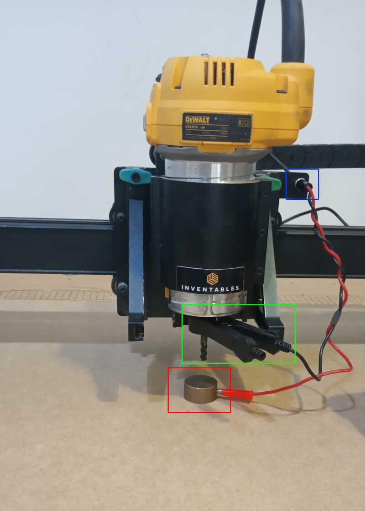

# 7. Computer controlled machining

I left this week towards the end of my time at Fab Academy so I did something very simple at [Vivalab](https://www.vivalabporto.com/): **a bench.**

## Assignments

* ***group assignment***
      * *do your lab's safety training*
      * *test runout, alignment, speeds, feeds, materials, and toolpaths for your machine*
* ***individual assignment***
      * *make (design+mill+assemble) something big (~meter-scale)*

## Inspiration

I took my inspiration from [Twistab](http://www.twistab.org/). I wanted to do something like **this** as shown, with a twist fit to secure the upper part of the bench onto the lower part.
<!-- tab1 -->

## Machine

During this week I am going to use the [inventables](https://www.inventables.com/) [X-Carve](https://www.inventables.com/technologies/x-carve-xa).
<!-- x-carve1 -->

As shown on the website this machine has the following characteristics:

- Work area: 750x750x65mm

- Machine footprint: 1250x1000x350 with 1000 mm rails

- Accuracy: 0.075 to 0.13 mm. **We will use a value of 0.2 for the kerf**

- Spindle: DeWalt 611 @ 1.25 HP.

<!-- x-carve2 -->

## Safety training

The safety training of the lab concerning the use of the CNC machine can be described in the following procedures:

- Use protection glasses when the machine is working.

- Use protective earmuffs when the machine is working.

- Don't be too close to the machine's head when its working. Keep your hands away but be present and with the eyes in the machine at ALL TIMES.

## The bench

### Design

First I designed the bench with Fusion 360. This is a 500x400 bench plus the kerf. There are two versions of the bench top: a press fit and a *twist-fit* one.
<!-- design1 -->
{: style="width:100%"}

The two feet cross at a 90º angle and allow the bench top to fit as shown in the figure below.
<!-- design2 -->
{: style="width:100%"}

The base sketch is shown below. The hole in the middle measures 16mm which is the thickness of the MDF, the material I'm going to use. **Four dogbones were added to the end of each hole.**
<!-- design3 -->
{: style="width:100%"}

The following picture shows the press fit bench. **Note that the width of the holes is 15.60mm.** This is to allow the use of the press fit.
<!-- design4 -->
{: style="width:100%"}

The alternative *twist-fit* design is shown below.
<!-- design5 -->
{: style="width:100%"}

The parameters I used are shown in the following picture.
<!-- design6 -->
{: style="width:100%"}

I also did a sketch of the 3d projections (`create/project`) on the 4 components so I could have the .dxf file to use in the CNC cutting.
<!-- design7 -->
{: style="width:100%"}

### Prototype on the laser cut machine

Before doing the actual CNC cutting, I did a small scale (1:5) prototype on the laser cutter. I transferred the .dxf file to the laser cutter program...
<!-- proto1 -->

...which resulted in the following cut.
<!-- proto2 -->

I also cut two circumferences with the same diameter so that I could glue to the two bench tops. On the right we observe that the two parts of the prototype cross well and have the desired height of 100 mm.
<!-- proto3 -->

As shown in the following picture, the press fit bench top fits very well. The *twist-fit* top was not well designed: it is touching the upper part of the bottom parts of the bench. It needs to: i) have a hollow part inside so that the other parts can move there or ii) the first two parts have a lower height so that this top part can go inside.
<!-- proto4 -->

**Due to a shortage of time we will move on and do the press fit version of the bench in the CNC.**

### CNC cutting

I took the same .dxf used in the laser cutting and brought it over the CNC machine computer. I am going to work with [Easel](https://easel.inventables.com/users/sign_in), an online software that comes together with the CNC machine.

First, we need to login on the Easel platform.
<!-- easel1 -->

On `Projects` we click on `New project`
<!-- easel2 -->

On this new window we have the following sections:

* Project window - red box - **here we should change inches to mm** (button located on the bottom left - the pink box). We will import the .dxf file here

* Simulation window - blue box - Here the program will simulate what happens when you change something on the project window. **It also simulates the carving itself and its timing.** On the top right corner it is possible to change the materials, the bits, and the cut settings.

* Top menus - green box - in these menus we can change almost anything in the program, from the project itself to machine and driver configurations to bits, materials and cut settings **(but we will change the main settings from the simulation window instead)**

* Carve and jog buttons - orange box - Here we can start the carve dialog, when everything is ready, and also accessing the jog menu by clicking on the jog button, where you can move the machine around and up and down.

* The workpieces window - yellow box - where you can add more pages to your project.

<!-- easel3 -->

Here we changed the name of the project to **benchy** (top left corner) and change from inches to mm. Now I will click on the import icon as indicated by the mouse arrow.
<!-- easel4 -->

We will choose the .dxf import 2.0.
<!-- easel5 -->

After importing the .dxf we choose **Joined line modes** and **Outside cut path**. It is important to cut outside the path if we want to preserve the size of the parts.
<!-- easel6 -->

As we can see the area of the parts is very large. We have two 600x600x16mm MDF boards. Now, we need to change the material and its size, by clicking where the mouse is pointing.
<!-- easel7  -->

In the material type menu, we choose **MDF** and width = 600 mm, length = 600 mm and thickness = 16.3 mm which is the average of the measurements made by the caliper around the edges of the MDF board.
<!-- easel8 -->

As we can see one board does not have enough space to cut everything. So we add another workpiece at the bottom and move the third piece there. **We should note that we should give a tolerance around the corners of 20mm so that we can add the CNC clamps in place to immobilize the MDF.**
<!-- easel9 -->

On the first workpiece we place the first bottom part and the top part. **Note that you need to be careful when placing the top clamp**. You should place at least one clamp on each side of the board. The following image shows how I have placed my clamps, four in total with the screws and the supports shown at the center of the board.
<!-- board_clamps -->

To choose the 6mm bit we're going to click on the bit button located at the top of the simulation window, as indicated by the mouse button.
<!-- easel10 -->

To attach and detach the bit we should rotate the collet anti-clockwise/clockwise while pressing the yellow button of the image.
<!-- bit_attach -->

As we're using and *unknown* 6mm bit to the program, we need to manually set the cut settings to to this we click on **Cut Settings** (top right corner)
<!-- easel10b -->

And choose a Feed rate of 1200 mm/min, a plunge rate of 300 mm/min, and a depth per pass of 3mm (half the diameter of the bit).
<!-- easel10c -->

Here we want to cut all the way to the end of the board around the two parts. **When clicking on both parts we need to make sure that the outer part cuts @ 16.3 mm.** We also need to add tabs. Tabs are pieces of material that are not completely cut so that they can avoid any unwanted movement by the part before finishing. **In this case I added 7 tabs on the bottom part, depicted as yellow strips. Don't place the taps where you can't cut them in the end!** I added tabs on the other parts as well.
<!-- easel 11 -->

Here. in the following example we can observe the tabs in place holding the part.
<!-- tabs -->
{: style="width:40%"}

On the inside of the bench top (the cross) I don't want to cut outside the lines, I want to make a hole. To do that, I choose a depth of 10 mm and in cut path choose **Clear out a pocket**.
<!-- easel12 -->

Before carving we can actually simulate to check how much time the cut is going to last. To do this we click on **Simulate** button at the bottom right corner of the window. With the present settings our cut will last 25 minutes. Not bad!
<!-- easel13 -->

The pre-carving process is straightforward. The program will indicate all steps. So to start this process I clicked on **Carve** (top right corner).

1) The program will ask if I measured the material and input the exact thickness of it, and confirm the material I'm using.
<!-- carve1 -->

2) Then the program will ask if I clamped down the material well
<!-- carve2 -->

3) The following step is the confirmation of the bit size
<!-- carve3 -->

4) To to the leveling I chose the probe option.
<!-- carve4 -->

5) Then there is an interactive process the reach this goal:
<!-- carve5 -->
{: style="width:100%"}

1. You should place the machine on the middle of the material by using the Jog machine on the right. When in position you click on **Confirm position**.
2. Then you plug the lead of the probe into the carriage. There is an interface for that there. When you plug it will automatically moves to the next part.
3. The program ask you to attach the clip to the collet. You click when it's done.
4. Now you touch the plate to the bit to check connectivity. When it's done you just leave the sensor plate at the board, centered on the bit.
5. You click on **Start probing**. The process takes a few seconds and you're done!

Here we can see the sensor array fully connected to the machine. The calibrated plate is centered on the bit (red box) and the lead is connected in the motor head (blue box). The clamp is attached to the collet (green box).
<!-- probe -->
{: style="width:50%"}

6) Of course you need to disconnect the Z-probe as shown in the following picture!
<!-- carve6 -->

7) **Very important**. Before starting the carving process you need to manually set the XY zero. To do this you jog the machine head to the bottom left edge of the board, so that it starts there when the carving process begins. The following picture shows the position for our xy zero.
<!-- xyzero -->
{: style="width:50%"}

8) Finally we're at the carving window. The program asks you if you want to attach the dust shoe (you can not to) and confirm if the spindle is on. If you turn on the spindle you can start carving by clicking on the **Carve!** button.. **Make sure you're at the XY zero before commiting!**.
<!-- carve7 -->

The following pictures show the carving in progress...
<!-- carving1 -->

<!-- carving2 -->

...and the finished result.
<!-- carving3 -->

The last part was cut in the same fashion. Here we can see the last part done with the tabs still in place.
<!-- tabs -->
{: style="width:40%"}

After cutting the tabs with a handsaw, I sanded the three parts, first with a hard sand (nºXX), then with a fine grain sand (nºXX) to give the finish touch. 

## Files

- bench f3d file and dxf files

## References

