# 8. Embedded programming

The lockdown continues here in Portugal but we're slowly deconfining :). I may be in the lab on the 1st of April (yay!) or, in the worst case scenario on the 19th of April, the opening date for the Universities.

## Assignments

  * *Individual assignment:*
      * *read a microcontroller data sheet*
      * *program your board to do something, with as many different programming languages and programming environments as possible*
   * *Group assignment:*
      * *compare the performance and development workflows for other architectures*

## ATTiny 1614 Data sheet

The first assignment involves going through a microcontroller data sheet. In my case that means the one for [ATTiny 1614 MC](https://ww1.microchip.com/downloads/en/DeviceDoc/ATtiny1614-16-17-DataSheet-DS40002204A.pdf) that I've begun devouring on [week06](http://fabacademy.org/2021/labs/benfica/students/vasco-neves/assignments/week06/).

During week06, I mentioned:

* The main features of the 1614 chip (page 1 and 2)

    * 16 KB Flash Memory. **This ss the size I will have for my compiled programs to run on the MC.**
    * 2KB SRAM. **This will be the memory available for the working variables and stuff I want to store in the volatile memory as I run the program**
    * 20 MHz internal [RC oscillator](https://en.wikipedia.org/wiki/RC_oscillator). **This will be maximum speed (20 MhZ means (theoretically) 20 million useful operations per second) of the chip but it can be brought up (overclocking) or down (underclocking) for performance or energy saving reasons respectively.** There are also other clock options, such the ultra low power 32.768 KHz clock.
    * Lots of I/O options, such as analog/digital input/output ports, several timer counters, serial interface, I²C interface, ADCs, DACs, and a [Peripheral Touch Controller (PTC)](http://ww1.microchip.com/downloads/en/DeviceDoc/QTouch-Modular-Library-Peripheral-Touch-Controller-40001986C.pdf). **Check out the full Peripheral Summary at page 11 and 12**.

* The Block diagram of the 1614 chip (page 13)
* The pinout (page 14). I'll mention it again here. I am using the 14-pin [SOIC](https://en.wikipedia.org/wiki/Small_outline_integrated_circuit) as shown in the following picture. The next picture and diagram[^1] shows a great summary of the pins and their features, as well as the general features of the ATTiny family. **Note that most pins do [multiplexing](https://en.wikipedia.org/wiki/Multiplexing), meaning that the pin is capable of supporting more than one function.**

[^1]: Taken both from [https://github.com/SpenceKonde/megaTinyCore/blob/master/megaavr/extras/ATtiny_x14.md](https://github.com/SpenceKonde/megaTinyCore/blob/master/megaavr/extras/ATtiny_x14.md)

<!-- ep0 -->
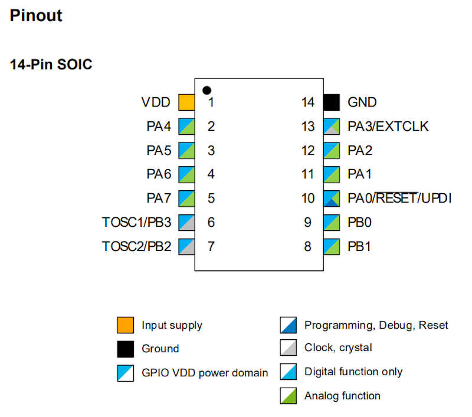{: style="width:60%"}

<!-- ep1 -->
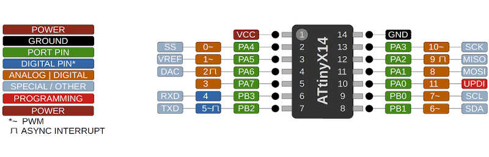
<!-- ep2 -->
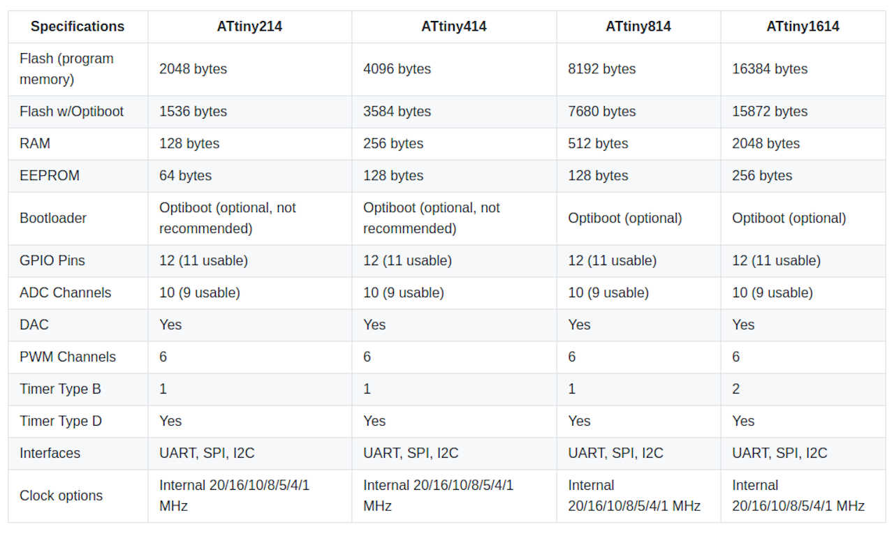

I'd also like to mention the following information contained in the Data sheet that may be useful:

* Multiplexing table (page 18). Here you can check the details of each port function.

<!-- ep3 -->
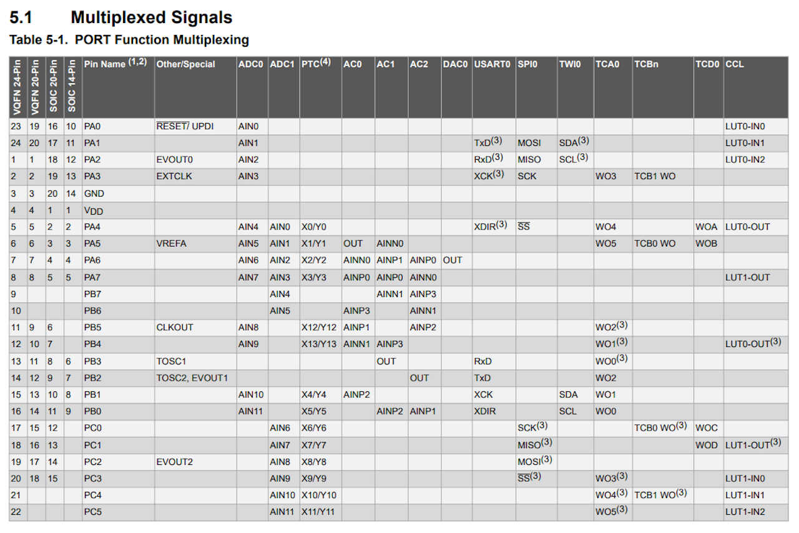{: style="width:100%"}

* The I/O Pin Characteristics table on page 513. This can be useful for debugging and calculating the resistors and capacitors you should place on the circuit board.

Most of the Datasheet is very technical and I'll leave this overview here, and consult it when I need to know something specific.

## Programming the board

During week06 I directly used Neil's echo program to test if the board was alive. This time I'll do a different workflow.

On wednesday and thursday I attended [Neil's](https://vimeo.com/398805212) and [Daniele's](https://youtu.be/VHcYsJ47G2s) classes respectively where I have obtained a lot of knowledge I'm going to apply here. The [week08 embedded programming page](http://academy.cba.mit.edu/classes/embedded_programming/index.html) also has a lot of information I will use here, as well as Fablab Kali wiki[http://wiki.fablab-kali.de/doku.php].

## The Arduino programming language

I will use [Arduino Integrated Development Environment (IDE)](https://www.arduino.cc/en/Guide/Environment) to program with the [Arduino programming language](https://www.arduino.cc/reference/en/), which is based on the open source software [wiring](http://wiring.org.co/). All references I mentioned have lots of useful information.

The Arduino IDE interface[^2] is comprised of the following parts

[^2]: Taken from [http://stemify.weebly.com/programming-structure.html](http://stemify.weebly.com/programming-structure.html).

<!-- ar1 -->
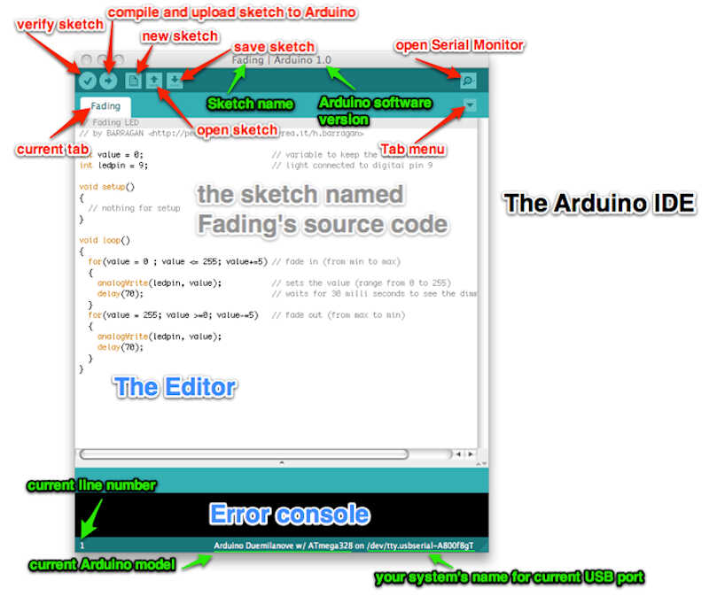

* **The toolbar**, where the drop down menus and the **verify** and **upload** commands are located
* **The sketch editor window**. The code goes here.
* **The console** where it's possible to see the executed line commands. Very useful for debugging.
* The *Board and Serial Port Selections can be seen on the bottom left corner of the window.

The sketch itself has three main parts[^2].

<!-- ar2 -->
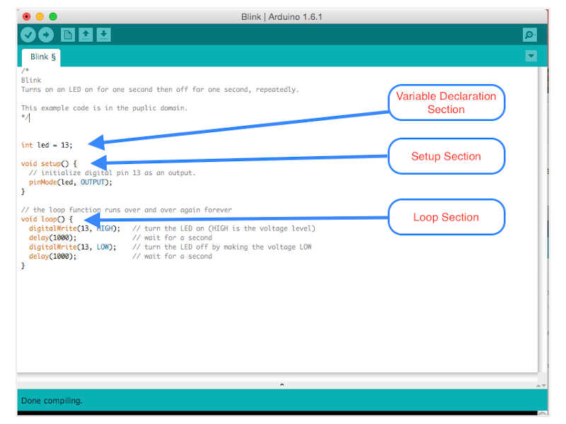

* The **variable declaration section**.
* The **setup section**, where you have a function to define the actions that will run only once, at the beginning of the program. It is useful for defining variables (e.g. as input, output, other).
* The **loop section**, where an infinite function will run your code..*forever* :).

The basic parts of a function are described in the following picture[^3]

[^3]: Taken from: [https://startingelectronics.org/software/arduino/learn-to-program-course/01-program-structure-flow/](https://startingelectronics.org/software/arduino/learn-to-program-course/01-program-structure-flow/).

<!-- ar3 -->
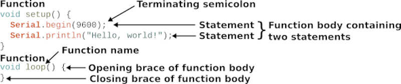

* Each function has several **statements**. The two functions shown above start with **void**. This means that they will not return a value at their end.
* Each function is enclosed by **braces**. Within these braces we have the **function body** with a **programming block**.
* Each statement ends with a **semicolon**. Otherwise, the verification will fail and point to the mistake.

The Arduino programming language (APL) has a [reference page](https://www.arduino.cc/reference/en/), where **all functions, variables and structures** are referenced. This will be my main reference for coding.

From here on, I will explain more in depth using examples.

### Pre-programming the Bootloader

When I tested the board I didn't ***burn the bootloader***. But what is it? The [bootloader](https://www.arduino.cc/en/Hacking/Bootloader?from=Tutorial.Bootloader) is a piece of code, a [firmware](https://en.wikipedia.org/wiki/Firmware), that you can upload to your controller that allows installing new programs without the need of an external programmer. This has the disadvantage of slightly delaying the programming of the MC at the start, but has the following advantages:

* It sets the *fuses*. As stated in the data sheet, page 25, *fuses are part of the nonvolatile memory and hold the device configuration*. **It is important to set this up so that you can control the MC settings. I will detail this part in the <mark>XXX</mark> section. Note that you can continue program with UPDI and retain the fuses. However, the bootloader will be erased
* Allows programming via FTDI serial port (with the Optiboot ).

I burned my bootloader with Arduino IDE. I went to `Tools/Burn Bootloader` with the options shown in the picture below, which were the recommended ones as shown in the **Upload bootloader and code section of the [FAblab Kali HelloD1614 page](http://wiki.fablab-kali.de/doku.php?id=documentation:electronics:hellod1614).**

<!-- ep4 -->
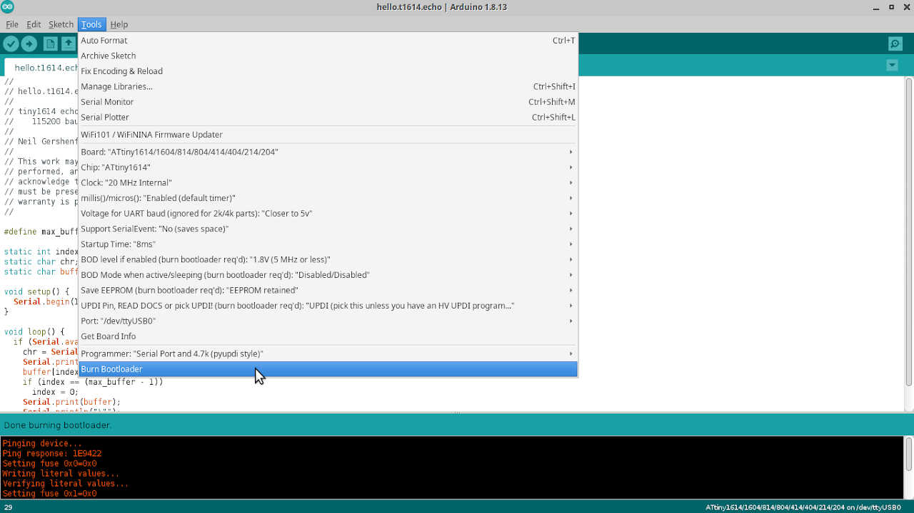{: style="width:100%"}

The console in the next pictures shows the bootloader burning process.

<!-- ep5 -->
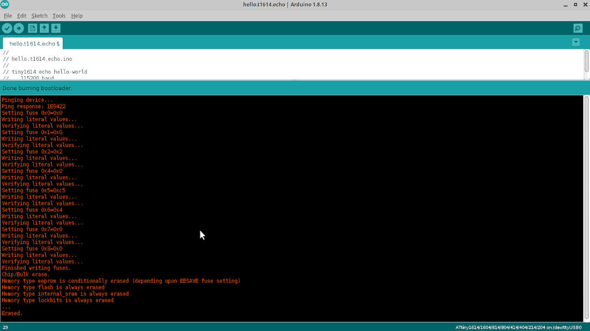{: style="width:100%"}

### Two simple programs: blink and hello button

I will test my board with two simple programs (for now): **blink** and **hello button**. I will explain each line in detail.

#### Blink

The blink program is very simple. I took the original code from the examples in the [Arduino tutorials page](https://www.arduino.cc/en/Tutorial/BuiltInExamples/Blink) and modify it. This program

>   Turns an LED on for one second, then off for one second, repeatedly. *Forever. :)*

**Note: here I had to check which port was the correct one, from the [image of the pinout](../images/week08/ep1.jpg) above. **Note that Arduino will **assign the ports with the numbers assigned in orange**, in this case the LED is connected to pin 12 which corresponds to Arduino orange pin 9. Therefore I will write on the setup function,

    pinMode(9,OUTPUT);

**as an OUTPUT.**

The code I used is shown here

    /*
    Blink

    Turns an LED on for one second, then off for one second, repeatedly.

    Most Arduinos have an on-board LED you can control. On the UNO, MEGA and ZERO
    it is attached to digital pin 13, on MKR1000 on pin 6. LED_BUILTIN is set to
    the correct LED pin independent of which board is used.
    If you want to know what pin the on-board LED is connected to on your Arduino
    model, check the Technical Specs of your board at:
    https://www.arduino.cc/en/Main/Products

    modified 8 May 2014
    by Scott Fitzgerald
    modified 2 Sep 2016
    by Arturo Guadalupi
    modified 8 Sep 2016
    by Colby Newman

    This example code is in the public domain.

    http://www.arduino.cc/en/Tutorial/Blink
    */

    // here I will initialize the variables
    const int ledpin = 9; // the led output pin is assigned to 9

    // the setup function runs once when you press reset or power the board
    void setup() {
    // initialize digital pin 9 as an output.
    pinMode(ledpin, OUTPUT);
    }

    // the loop function runs over and over again forever
    void loop() {
    digitalWrite(ledpin, HIGH);   // turn the LED on (HIGH is the voltage level)
    delay(1000);                       // wait for a second
    digitalWrite(ledpin, LOW);    // turn the LED off by making the voltage LOW
    delay(1000);                       // wait for a second
    }

To wrap it up:

* The `/*` and `*/` signal a comment block. This block will not be used as code, just for comments.
* I initialize the variable that contains the LED output pin number as a constant (`cons`) meaning it cannot be changed afterwards (just a detail). Otherwise it would be `int ledpin = 9;`. The int **data type** means that the variable is an integer.
* The `void setup` function initializes pin 9 as digital output, with the command `pinMode`.
* The `loop function` uses the `digitalWrite` command to raise or lower the voltage (HIGH and LOW respectively) so that the LED turns on and off.
* The `delay` function sets the time delay between each command, in milliseconds.
* To do an inline comment just write `//` followed by the comment.

The following short video shows the full workflow.

<!-- blink_video -->
<video class="center" width="600" controls>
  <source src="../../files/week08/blink.m4v" type="video/mp4">
Your browser does not support the video tag.
</video>

#### Hello Button

In the **hello button** program I will use the button of the board to turn the LED on. This time we will have one digital INPUT (the button) and one digital OUTPUT (the LED). Once I press the button, the LED will light up.

In this program I need to initialize three variables:

    const int ledpin = 9 ( the LED pin number as before).
    const int bpin = 8 (the button pin number).
    bool state = 0; (the initial state of the button. This variable needs to change).

**I didn't use const in the third variable, because this number will change between 0 and 1 during the loop function.** It is also initialized as a [boolean](https://pt.wikipedia.org/wiki/Boolean) because I only need a zero or a one.

I also need to introduce the [**if statement**](https://www.arduino.cc/reference/en/language/structure/control-structure/if/), which is part the **control structure** commands.

> The if statement checks for a condition and executes the following statement or set of statements if the condition is 'true'.

The general syntax of the **if/else if/else statements** are written in the following way

    if (condition) {
        //do thing A
    }
    else if (condition) {
        //do thing B
    }
    else (condition) {
        //do thing C
    }

**We can use as many `else if` statements as we need, but not `if` nor `else`. This sequence will run only once on each cycle**.

The full program is shown below. I took the original code from [Adrianito page](http://fabacademy.org/2020/labs/leon/students/adrian-torres/adrianino.html) which in turn took it from Niel's. ;). I modified it a bit. **I'm feeling like a scavenger :P.**

    /*
    * Hello Button
    *
    * This program turns on the LED of the board once the button is pressed.
    *
    * Fab Academy 2020 - Fab Lab León
    Button + LED
    Adrianino
    ATtiny1614
    *
    Original code:Neil Gershenfeld 12/8/19
    This work may be reproduced, modified, distributed,
    performed, and displayed for any purpose, but must
    acknowledge this project. Copyright is retained and
    must be preserved. The work is provided as is; no
    warranty is provided, and users accept all liability.
    *
    *
    */
    //inicialization

    const int bpin = 8; // the button pin is assigned to 8
    const int ledpin = 9; // the led output pin is assigned to 9
    bool bstate = 0; // initial state of the button (OFF)

    void setup() {
    // put your setup code here, to run once:
    pinMode(bpin,INPUT);
    pinMode(ledpin,OUTPUT);
    }

    void loop() {
    // put your main code here, to run repeatedly:
    bstate = digitalRead(bpin); //first we read the button. Is it on or off?
    if (bstate == HIGH) { // if we press the button...
        digitalWrite(ledpin, HIGH); //Led turns on for one second...
        delay(1000);
        digitalWrite(ledpin, LOW); //Led turns off for one second...
        delay(1000);
        digitalWrite(ledpin, HIGH); //Led turns on for one second...
        delay(1000);
        digitalWrite(ledpin, LOW); //Led turns off for one second...
    }

    }

**Note: for completeness I should add an `else` statement at the end of the if, e.g.**

    else (bstate == LOW) {
        digitalWrite(ledpin,LOW);
    }

**However, we don't need that because the last line of the if statement sets the LED to LOW making the ELSE statement redundant.**

I will make here some comments on the code:

* In the `setup function` I wrote the button pin (=8) as input and the LED pin (=9) as output.
* In the `loop function` I first read the state of the button. Then, IF the button is pressed (HIGH) the LED will blink two times for one second and with a one second interval between blinks.

The following short video shows the full procedure.

<!-- button_led_video -->
<video class="center" width="600" controls>
  <source src="../../files/week08/button.m4v" type="video/mp4">
Your browser does not support the video tag.
</video>

## Programming the board in C

Now I will program the same programs in C with slight differences. **I will change the time and the pattern of the LED blinking**.

C is the language in which the Arduino Programming Language is based on. [**In fact, some people even state that APL is not even a language! :)**](https://hackaday.com/2015/07/28/embed-with-elliot-there-is-no-arduino-language/). 

The following picture[^4] illustrates how the APL is structured. 

[^4]: Taken from: [https://albertomatus.com/wp-content/uploads/2017/09/alberto-matus-arduino-language.jpg](https://albertomatus.com/wp-content/uploads/2017/09/alberto-matus-arduino-language.jpg).

<!-- ep6 -->
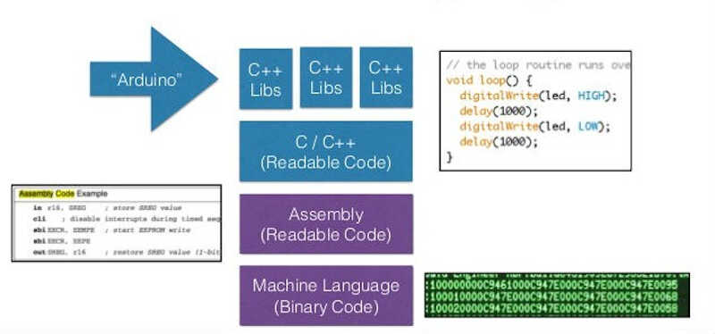

Therefore, it is no surprise that the C language has a similar structure to APL, as shown below[^5]. I will show all the differences in detail.

[^5]: Taken from: [https://cybowap.blogspot.com/2018/05/basic-structure-of-c-program.html](https://cybowap.blogspot.com/2018/05/basic-structure-of-c-program.html)

<!-- ep7 -->
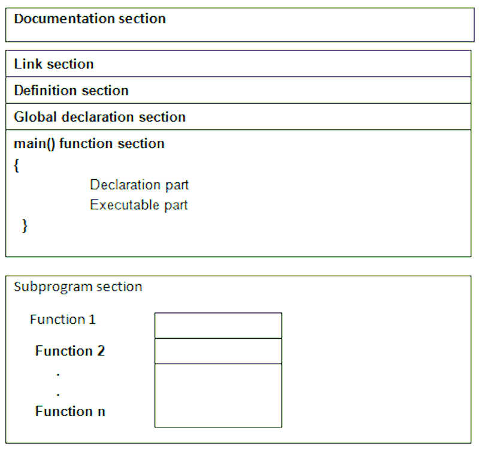{: style="width:50%"}

* The **documentation section** is the place where you place comments about your program: what is its name, what does it do, version dates, etc. As in the APL, the comment blocks are delimited by `/*` and `*/` and line/inline comments by `//`.

* The **link section**  *provides instructions to the compiler to link functions from the system library such as using the #include directive.*

* The **definition section** contains all symbolic constants, such as $\pi$ on the example below. 

* The **global declaration section** contains the global (i.e. program wide) declaration of user-defined functions and variables.

* The **main() function section** is the program itself and exists in all C programs. It has two parts the **function declaration part**, where you declare the local variables, and the **executable part** where you lay out the instructions and commands.

* The **subprogram section** contains all user-defined function that perform specific tasks when called from the main or other functions. 

A simple example of this structure follows bellow.

<!-- ep8 -->
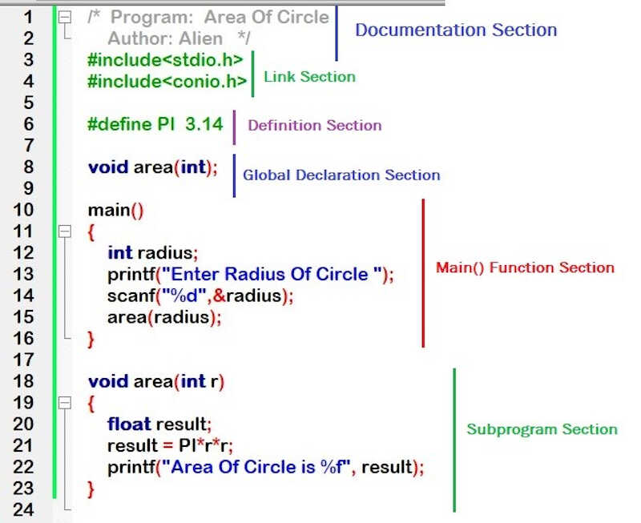{: style="width:60%"}

Before beginning I need to reference the data sheet, **chapter 16 PORT - I/O Pin Configuration, page 131.**. On 16.3.2.1 Basic Functions I read that 

> Each pin group x has its own set of PORT registers. I/O pin Pxn can be controlled by the registers in PORTx.
To use pin number n as an output, write bit n of the PORTx.DIR register to ‘1’.

and

> To use pin n as an input, bit n in the PORTx.DIR register must be written to ‘0’ to disable the output driver. 

Each PORTx corresponds to a PIN*n* as can be observed in the following picture taken from section 16.5.1, page 135 and checked in the [Pinout Illustration](http://fabacademy.org/2021/labs/benfica/students/vasco-neves/assignments/week08/#attiny-1614-data-sheet) at the beginning of the document.

<!--ep9  -->
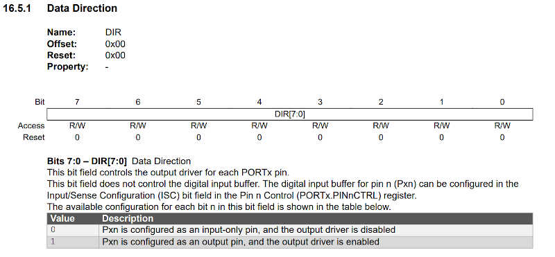

This will be clearer with an example.

### Programming in C 

Here I will replicate the Blink program in C. I will use PORTA which correponds to PA0 (pin 11) to PA7 (pin 5). PORTA can be represented in C by

    PORTA.DIR = 0b00000000; // all ports as input

where the
    //port position is 76543210.

This does not need to be declared, as PORTA.DIR default to input (zeros). If, for instance you want to change PA1 to output you can write

    PORTA.DIR = 0b00000010; //PA1 as output

You count **from right to left** PA0 to PA7. In this example, PA1 is marked as output and the other PAx are inputs. There are many ways to assign the output/input value, this is just one of them. Using another very useful reference from Microchip, the [tutorial *Getting Started with GPIO*](http://ww1.microchip.com/downloads/en/Appnotes/90003229A.pdf), we learn that another way to set the input and output are, respectively,

    PORTn.DIR = PORTn.DIR | PINx_bm;
and
    PORTn.DIR = PORTn.DIR & ~PINx_bm;

where the **OR operator** `|` and the **AND operator** are used. Using the operators prevents that the other pins are changed. In detail

    OR operator -->  1|1 = 1, 1|0 = 1, 0|0 = 0
and
    AND operator --> 1&1 = 1, 1&0 = 0, 0&0 = 0.

PINx_bm just defines the **x** pin as an Output and the negation (operator `~`) of PINx_bm defines the pin as input.

#### Blink C

The following program is similar to the arduino blink. The only difference is that the delay between blinks is now 0.5 seconds.

    /*
    Blink C

    Turns a LED on for 0.5 second, then off for 0.5 second. Forever.

    //PINx_bm is a flag for 1
    //~PINx_bm is a flag for 0
    //you can also use directly (check if it is ok)
    //PORTA.DIR = 0b00000010; //PA1 as output
    */

    //link section
    #define F_CPU 3333333 // -> equals the frequency divided by 6 20Mhz/6=3333333.333
    #include <avr/io.h> // includes input/output library from AVR
    #include <util/delay.h> // includes a delay function

    // global declaration section

    //main function

    int main(void)
    {
    PORTA.DIR = PORTA.DIR | PIN2_bm; // sets PIN PA2 as output
    while (1) // infinite loop
    {
        PORTA.OUT = PORTA.OUT | PIN2_bm; // turns on LED
        _delay_ms(500);
        PORTA.OUT = PORTA.OUT & ~PIN2_bm; // turns off LED
        _delay_ms(500);
    }
    }

A few comments regarding the code:

* main(void) sets no output for the main function
* while(1) is a function that sets an infinite cycle. To break the loop you need to explicitly declare a break statement inside the loop.
* PORTA.OUT sets the HIGH or LOW voltage condition of the designated PORTA, in this case PA2.
* the delay function _delay_ms delays the code for a certain time in milliseconds. 

The following video shows the function loading and the board running with the code. **The code is much smaller (158 to 774 bytes) and uploads much faster than the one done in APL**.

<!-- C blink video  -->
<video class="center" width="800" controls>
  <source src="../../files/week08/blink_c.m4v" type="video/mp4">
Your browser does not support the video tag.
</video>

#### C Hello button

The C hello button program is also similar to the one mentioned before. The only difference is that the blinks will have a difference of 250 milliseconds between them.

    /*
    C hello button

    Turns a LED on for 0.25 second 2 times if the button is pressed.

    //PINx_bm is a flag for 1
    //~PINx_bm is a flag for 0
    */

    #define F_CPU 3333333
    #include <avr/io.h>
    #include <avr/delay.h>

    //link section

    //main function

    int main(void) {
    PORTA.DIR = PORTA.DIR | PIN2_bm; //sets PA2 as output
    //PORTA.DIR = PORTA.DIR & ~PIN1_bm; //sets PA1 as input
    // the button is connected to PA1 is set as input by default so no need to declare it ;)
    while(1) {
        if (PORTA.IN & PIN1_bm) { //PA1 is HIGH or LOW? IF IT IS HIGH THEN
        PORTA.OUT = PORTA.OUT | PIN2_bm; // turns on LED
        _delay_ms(250);
        PORTA.OUT = PORTA.OUT & ~PIN2_bm; // turns off LED
        _delay_ms(250);
        PORTA.OUT = PORTA.OUT | PIN2_bm; // turns on LED
        _delay_ms(250);
        PORTA.OUT = PORTA.OUT & ~PIN2_bm; // turns off LED
        _delay_ms(250);
        
        }
        else {} // else stays the same
        
    }

    
    }

Some notes:

* In this case we set PA2 as output (the led) and PA1 as input (the button).
* The if statement checks if the voltage in PIN1 (=PA1) is high or low. If it is high it executes the two blinks. Else, it does nothing.

The video shows how the program executes. When I press the button it blinks twice. **Again the program in C loads faster and takes much less space: 276 bytes versus 824 bytes!**

<!-- c hello video -->
<video class="center" width="800" controls>
  <source src="../../files/week08/c_hello_button.m4v" type="video/mp4">
Your browser does not support the video tag.
</video>

## Morse Code in APL and in C

***TBD***

## Benchmarking the board

***TBD***

### The soldering saga continues...

During this week I did another serial-UPDI board with the VCC and the UDPI communication pin switched so that I could connect it directly to my board.

Here are the schematic and the layout...

<!-- fab1 -->
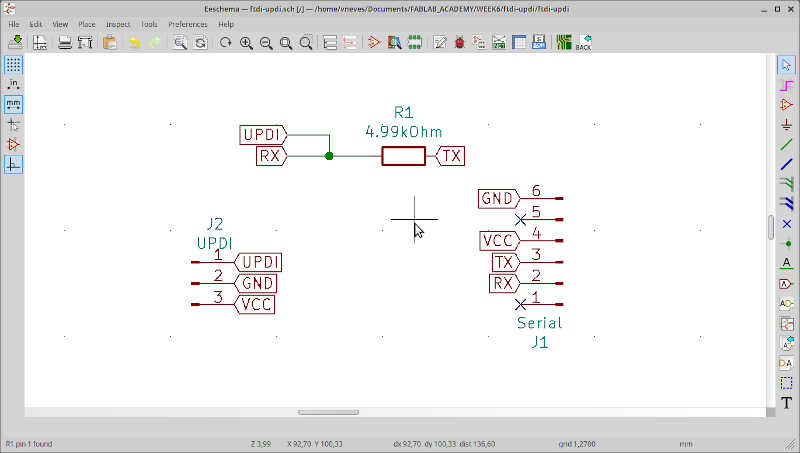

<!-- fab2 -->
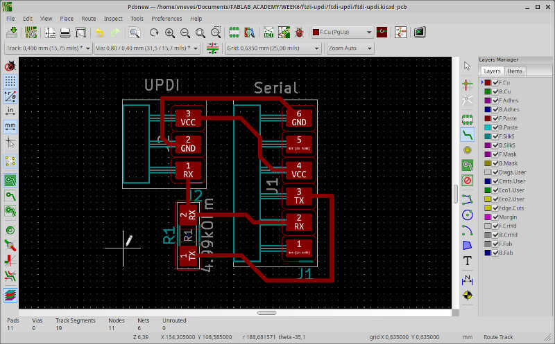

...as well as the soldered board.

<!-- fab3 -->
{: style="width:50%"}

It went out much better than the others! :) **But...I soldered a 1x03 male instead of a 1x03 female! :O So I had to connect to my board again with three jumper cables (sigh!)**

On Saturday I tried to remove the 1x03 male connector from my new FTDI-UPDI board I made on Tuesday and I destroyed the board :(. I don't have any more pins left so I'll need to buy more and do it on Monday or Tuesday. ;) ***The soldering saga continues...***

<!-- NOTES: -->
<!-- do the benchmark of timings on this week -->
<!-- delay function locks EVERYTHING! check the micro delay function-->
<!-- show the .hex code -->
<!-- scratch? -->
<!-- MC datasheet -->
<!-- EEPROM?  -->
<!-- multiplexing. add the pinout picture from megatinycore page -->
<!-- https://github.com/SpenceKonde/megaTinyCore/blob/master/megaavr/extras/ATtiny_x14.md -->

<!-- C++ Language -->
<!-- getting started with GPIO from Microchip TB3229
port.dir eq to pinmode

<!-- CAREFUL ITH THE TIMINGS OF THE DELAY IN C IT DEPENDS ON THE CPU FREQUENCY -->
<!-- FUSE information - page 25 -->
<!-- Bootloader details for this week > http://wiki.fablab-kali.de/lib/exe/detail.php?id=documentation%3Aelectronics%3Ahellod1614&media=documentation:electronics:d1614-settings.png -->

## References

* [Adrianito](http://fabacademy.org/2020/labs/leon/students/adrian-torres/adrianino.html)
* [Arduino IDE page](https://www.arduino.cc/en/software)
* [ATTiny 1614 page](https://www.microchip.com/wwwproducts/en/ATTINY1614)
* [Fablab Kali wiki](http://wiki.fablab-kali.de/doku.php)
* [Hackaday](https://hackaday.com/)
* [Wikipedia](https://en.wikipedia.org/wiki/Main_Page)

## Files

[Programs](../../files/week08/week08_programs.zip)

[Serial-UPDIv2](../../files/week08/ftdi-updiv2.zip)

