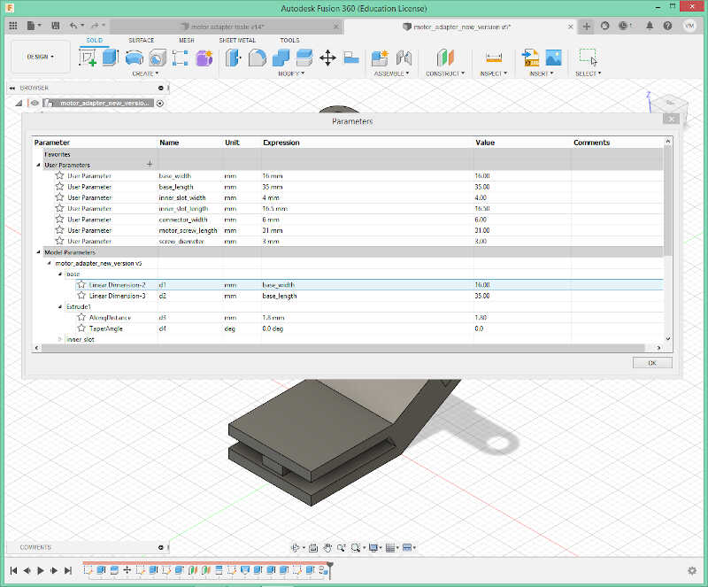
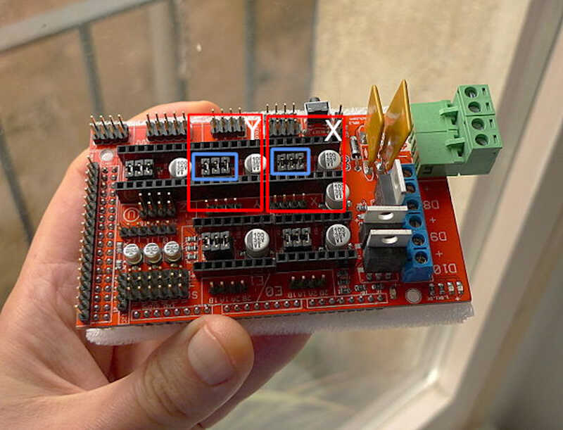
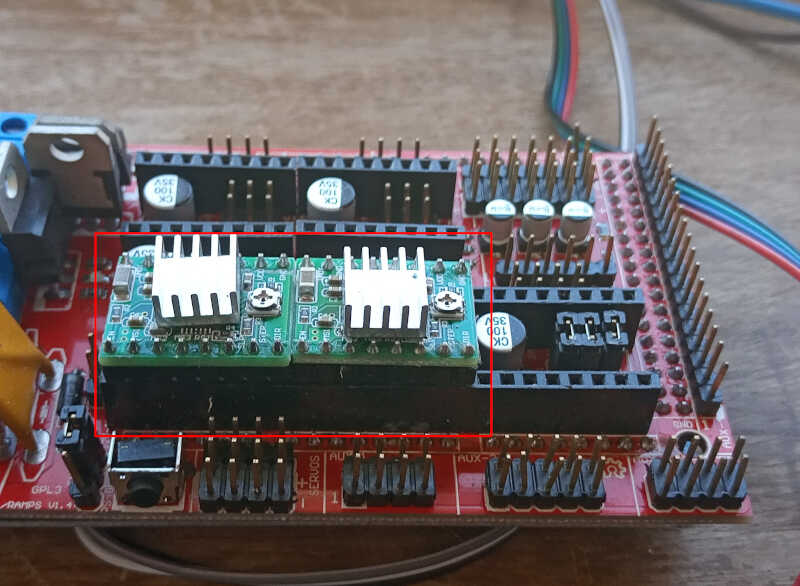

# 09. Machine Design

This week **I'm still at home**, waiting for a *sign from the heavens* to move to the lab! :) André will send me all the components I need to build and hopefully operate the machine I chose.

I will do this project mostly by myself, with some help of my local supervisor. Taking that into consideration, I chose a simple machine to build and bring to life: **a polargraph**.

The [polargraph or polar plotter](https://en.wikipedia.org/wiki/Polar_plotter)

>  is a plotter which uses bipolar coordinates to produce vector drawings using a pen suspended from strings connected to two pulleys at the top of the plotting surface. This gives it two degrees of freedom and allows it to scale to fairly large drawings simply by moving the motors further apart and using longer strings.

I will be doing a small machine to draw pictures in an A4 paper (for now). The original project that inspired this build was the [polargraph]() made by [Sandy Noble](http://www.polargraph.co.uk/who/), a programmer, designer and maker. The following picture[^1] shows one version of those machines

[^1]: Taken from Sandy Noble's flickr page: [https://www.flickr.com/photos/euphy/5763180360/in/album-72157626497662024/](https://www.flickr.com/photos/euphy/5763180360/in/album-72157626497662024/)

<!-- picture of the polargraph - pol1 -->
{: style="width:50%"}

His page is not exactly easy to follow and doesn't have any tutorial or clear building instructions. So I researched a bit on the internet and found several people that did a build out of his polargraph, such as this [XY plotter Drawing Robot Instructable](https://www.instructables.com/XY-Plotter-Drawing-Robot-Arduino-Polargraph/) created by [MertArduino](https://www.instructables.com/member/MertArduino/). The following picture shows the XY plotter at work.

<!--xy plotter pic  -->

Mine will be similar to this one but without the frame ;)

I also found Ferdi's (my remote instructor) [build of a polargraph](https://wikifactory.com/@ferdinand/polargraph) but this one uses a different software from the one I'm building. In the end I may mix everything up if something doesn't work! ;)

## Intermission

I took some weeks off the machine building week to work on my final project. When I resumed and tested the machine I realized the software of Sandy Noble wouldn't work well with the RAMPS 1.4 Shield of the Arduino MEGA. So I went back I adopted what Ferdi had suggested in the first place.

## The new polargraph - Makelangelo!

[Makelangelo](http://www.makelangelo.com/) is another polargraph which fortunately is still being updated for all controllers, contrary to the other polargraph. It is mostly used as

> an art robot to draw posters and murals.

<!-- pol3 -->

## Parts

Our version of the polargraph is comprised of a few parts:

* **Off the shelf parts**

    * [Arduino Mega 2560](https://store.arduino.cc/products/arduino-mega-2560-rev3) compatible board. We chose the Mega only because it was available to use.
    * [RAMPS 1.4 Shield](https://reprap.org/wiki/RAMPS_1.4). The RAMPS shield was available here to use so we took it.
    * 2x Pololu [A4988 Stepper Motor Drivers](https://www.pololu.com/product/1182).
    * 2x standard NEMA23 stepper motors (1.8ª, 2.4V, 1.5A, 420mn.m). The two motors will move the gondola through the belt.
    * Servo motor [MG90S](https://www.filipeflop.com/produto/micro-servo-mg90s-towerpro/) + generic 3 wire jumper Male-Female extension cables
    * GT2 Pulley with 20 teeth.
    * 5m GT2 Rubber belt. The belt connects the Pulleys attached to the motors with the gondola and also to two weights that add tension to the belt.
    * Generic 12 V Power supply.
    * Marker Pen.
    * Two suction cups with attachment slots.
    * 2 weights. I will need a few hundred grams weight to tension the belt.
    * Small and medium sized plastic cable ties.

* **3D Printed Parts**
    * Gondola. The Gondola will be the central piece of the machine. It holds the pen and is moved by the two motors via the pulley and belt. The pen can be pulled from or to the paper through the servo motor. **I used the gongola from [https://www.thingiverse.com/thing:575487](https://www.thingiverse.com/thing:575487) which I had to slightly modify to accommodate the servo.**
    * 2x Stepper motor mounting brackets. **The brackets will be designed to fit into the slot of the two suction cups and attach to the motor with two screws.**

<!-- mo falta uma foto aqui das partes, faz-se no fim -->

## Parts design

### Suction cup-Motor connector

I designed the part that connects the suction cups to the motors. After several interactions...

<!-- interactions gallery -->

...I came up with the final design shown in the following picture.

<!-- param1 -->

The parameters I used are shown below. **The design is available through a fusion 360 file in the files section.**

<!-- param2 -->

I exported the file as a .stl and sliced it with [Ultimaker Cura](https://ultimaker.com/software/ultimaker-cura). **I had to lie the piece down and add supports because otherwise the printed layers would be parallel to the motor weight, exerting a downward strength and ultimately breaking the piece!**

<!-- cura1 -->

The following picture shows the piece attached to the suction cup...

<!-- part_suction -->

...and the full assembly, with two M3 screws.

<!-- full part -->
{: style="width:50%"}

### Gondola

As mentioned before, the original gondola was taken from [https://www.thingiverse.com/thing:575487](https://www.thingiverse.com/thing:575487). However, this version could not be used to attach our servo.

In Fusion 360, I clicked on `insert/insert mesh` menu...

<!-- gondola1 -->
{: style="width:100%"}

...and obtained the following object.

<!-- gondola2 -->
{: style="width:100%"}

From here, I needed to smoothe the top and bottom parts of the disc section of the gondola. To do that, I clicked on one of the triangles of the surface...

<!-- gondola3 -->
{: style="width:100%"}

...and clicked on delete.

<!-- gondola4 -->
{: style="width:100%"}

I did the same at the disk bottom.

On this surface, I added a rectangular sketch of 12x6 mm...

<!-- gondola5 -->
{: style="width:100%"}

...so that I could then extrude a hole through it, where the servo would be placed. I also extruded 3 mm extra thickness at the bottom of the gondola... 

<!--gondola6  -->
{: style="width:100%"}

...so that I could pierce a screw to fix the servo, as shown in the following two pictures.

<!-- gondola7 -->
{: style="width:100%"}

<!-- gondola8 -->
{: style="width:100%"}

The used parameters are shown below.

<!-- gondola9 -->
{: style="width:100%"}

From here I exported the gondola as a mesh (right click on the gongola component)...

<!-- gondola10 -->
{: style="width:100%"}

...sliced it in Cura...

<!-- gondola11 -->
{: style="width:100%"}

...and printed it with [Octoprint](https://octoprint.org/). The gondola here is already with the servo attached.

## Machine assembly

The machine assembly is quite straightforward.

1. Attach the RAMPS 1.4 board on top of the Arduino Mega board. The following pictures show (top[^2]) both boards, Arduino on top, RAMPS at the bottom. And both board attached (bottom[^3]). To attach just press the RAMPS board down along the arduino female pins. It should be a tight fit.

    <!-- ma1 -->
    <!-- ma2 -->
    {: style="width:50%"}
    {: style="width:50%"}

[^2]: Taken from [sakit.com](sakit.com)
[^3]: Taken from [http://alf3dpi.blogspot.com/](http://alf3dpi.blogspot.com/)

2. Attach two A4988 drivers to the RAMPS board into the corresponding X and Y slots. First add three jumpers into the pins enclosed in the blue rectangles of the following picture[^4]. **This will instruct the RAMPS driver to configure a microstepping of 1/16 per step.** It is the highest value we can achieve for the A4988 drivers. Attach the X and Y A4988 drivers in the slots marked in red in the pictures.
    <!-- ma3 -->
    <!-- ma4 -->
    {: style="width:70%"}
    {: style="width:70%"}

[^4]: Taken from [https://reprap.org/wiki/RepRap](https://reprap.org/wiki/RepRap) and adapted.

3. Attach the wires of the two motors to the pins depicted inside the red boxes in the picture. **Note that the Y motor must have an inverted connection**. Attach the three wire extension jumper cable to the servo three pin connection depicted by the blue box. **This must be long enough to reach the suspended gondola**. In this case, the black wire is connected to the **-**, the white cable to the **+**, and the grey wire to the signal.

    <!-- ma5 -->
    <!-- ma6 -->
    
    

4. Take the gondola and the servo and attach the servo to the gondola as shown in the following two pictures. The servo is put in place with an M2 piercing screw.

    <!-- ma7 -->
    <!-- ma8 -->
    {: style="width:70%"}
    {: style="width:70%"}

5. Make two small 70 cm rubber belts from the 5 m cable. Use the small cable tie to attach one of the rubber belts to the gondola as shown in the picture. **Add two M3 screws on the holes of the pen holder section. These screws will fix the pen in the right position relative to the servo's "foot".**

    <!-- ma9 -->
    {: style="width:50%"}

6. Take two similar sized heavy objects (in this case I used 4 AA batteries) and tie them together with a medium sized cable tie. Then take the other end of the rubber cable and tie everything together with a small size cable tie as shown in the picture.

    <!-- ma10 -->
    {: style="width:50%"}

7. Repeat steps 5. and 6. for the other side. This will be needed to have enough tension on the rubber cable.

8. Attach the two suction cups at a desired distance. **This will be the width of your machine**. In this case I attached the cups so that the center of the two motor's axis would be approximately 400 mm. Connect the motor cables. **The left motor connects to the X pins and the right motor connects to the Y pins**.

    <!-- ma11 -->
    

9. Now gently attach the rubber band to the motor's pulleys leaving the gondola hanging in the air! 

    <!-- ma12 -->
    

10. Finally, we need to make the electrical connections. With a convenient electrical cable connect the 12 V transformer to the mains power (red box) and to the RAMPS board (blue boxes). The USB connection to the computer is shown in the white box.
    <!-- ma13 -->
    {: style="width:100%"}

## Software 

The polargraph operates on a firmware that runs on multiple platforms. This firmware can be downloaded at [https://github.com/MarginallyClever/Makelangelo-firmware](https://github.com/MarginallyClever/Makelangelo-firmware).

The machine itself is operated with a java based software that can be downloaded at [https://github.com/MarginallyClever/Makelangelo-software/releases/tag/7.24.5](https://github.com/MarginallyClever/Makelangelo-software/releases/tag/7.24.5).

### Firmware

The firmware is composed of multiple files. One of the important files here to modify is `configure.h`. Inside this file we need to change the following lines:

    #define MACHINE_STYLE POLARGRAPH  // This line configures our machine as a polargraph
    #define MOTHERBOARD BOARD_RAMPS  // This line states that we are going to use RAMPS as our motherboard

We will also leave the `MOTOR DETAILS` part as default, because its configuration corresponds to our machine, meaning:

    #define DEGREES_PER_STEP     (1.8)
    #define MICROSTEPS           (16.0)
    #define PULLEY_PITCH         (40.0) //this is the GT2 timing belt multiplied by the length of each teeth (2mm)

**However I found a bug in the code.** From the old days, the polargraph had motors with 400 steps per turn, which corresponds to 0.9 degrees/step. This setting is still active in the file `robot_polargraph.h`. I just entered this file and changed the following to

    // choose one of the following
    #define NORMAL_MOTOR_STEPS   200  // 1.8 degrees per step //changed here to 1.8 degrees per step
    //#define NORMAL_MOTOR_STEPS   400  // 0.9 degrees per step //commented this line
    /// -------------- change here ----------------

That's it! Hopefully the machine will work normally once the firmware is uploaded. To do it, we just connected to the MEGA board via a USB Cable, verified the code and then uploaded it.

<!-- soft1 -->

**Meanwhile I upgraded my setup and installed it in a bigger window with 1m rubber belts, and with length and width of 500mm. The machine is now much better balanced!**

<!-- new1 -->

### Java controller software

After the firmware is loaded, I opened the java controller software as shown in the picture below.

<!--soft2  -->

From here I clicked on `connect` and then `settings`, and chose the following options for the machine.

<!-- soft3 -->

Our model is Makelangelo (custom) and our width and length is 500 mm.

#### Calibrating the machine

To check if the dimensions are the correct ones I used the `manual driving` menu, as shown in the picture, and drove the machine 3 times 10 mm right, 2 times 100 mm up, one time 100mm left, and then back to the home position as shown in the following video.

<!-- soft4 -->

<!-- calibration_video -->
<video class="center" width="400" controls>
  <source src="../../files/week09/calibration_video.m4v" type="video/mp4">
Your browser does not support the video tag.
</video>

I repeated this process, this time using a pen to mark the positions of the machine, as shown in the following two pictures. As observed, the machine is ***reasonably*** calibrated. Let's try it out!

<!-- new2 -->

<!-- new3 -->
{: style="width:25%"}

To make a drawing, I placed the gondola at the home coordinates, and within `creative control` I chose `generate art` and then `fibonacci spiral pattern of degree 12`. 

<!-- soft5 -->

Then I clicked on `start` in `animation control` and...**nothing!** The machine wouldn't start! After a lot of time tweaking without success, I decided to talk with Ferdi, and I obtained an older software of the polargraph used at [Fab Experience 2020](https://wikifactory.com/@lababertofablab/fabxperience). **After comparing the firmwares I noticed I was only missing the motor libraries!**

After adding the motor libraries `TMCStepper` and `TMC2130Stepper` to the firmware directory as separate directories, the machine suddenly awoke :) **I checked and there's nothing stated in the `dependencies` section of the [firmware page](https://github.com/MarginallyClever/Makelangelo-firmware)**...maybe I need to look better.

After adjusting the pen I could make a few drawings as shown in the next two pictures. On both cases, the pen drew when it shouldn't and didn't drew when it should at some places. This was due to the pen misplacement relative to the servo "finger" controlling the pen's distance.

<!-- new4 -->
{: style="width:30%"}
<!-- new5 -->
{: style="width:30%"}

After some tweaking on the position of the rubber bands relative to the window, I could draw a reasonable picture!

<!--new6 -->
{: style="width:30%"}

The movie of this operation is shown below. Yay!

<!-- final_video -->
<video class="center" width="400" controls>
  <source src="../../files/week09/final_video.m4v" type="video/mp4">
Your browser does not support the video tag.
</video>

<!-- maX -->

<!-- ## Machine testing

After connecting the 12V power supply to the ramps board to power the two motors, I tried to use the software from the [github of Sandy Noble](https://github.com/euphy). I cloned the polargraph_server_polarshield to use as the firmware of the mega and the `polargraphcontroller` to control the machine with [processing](https://processing.org/).

The firmware was uploaded with no problem to the ramps. However, I had a very hard time with the processing controller, which only moved one motor. After a lot of time spent trying to fix the problem I decided to move to [makeangelo](http://www.makelangelo.com/) wich in fact seems it has much more recent upgrades that the deprecated version of **polargraphcontroller** I was trying to use.

## Machine testing v2

This time it was much more straighforward. I downloaded the latest firmware from their github [page](https://github.com/MarginallyClever/Makelangelo-firmware/releases/tag/9.2.0) to a convenient directory.

You can use a lot of machines with this firmware. To choose mine, a ramps1.4, I opened configure.h and changed `#DEFINE MOTHERBOARD BOARD_RUMBA` to `#DEFINE MOTHERBOARD BOARD_RAMPS` as shown in the picture. -->

## References

* [Arduino](https://www.arduino.cc/)

* [Polargraph.co.uk](http://www.polargraph.co.uk/)

* [Instructables](https://www.instructables.com/)

* [Makelangelo](http://www.makelangelo.com/)

* [Octoprint](https://octoprint.org/)

* [Pololu electronics](https://www.pololu.com/)

* [Reprap](https://reprap.org/wiki/RepRap)

* [Thingiverse](https://www.thingiverse.com/)

* [Ultimaker Cura](https://ultimaker.com/software/ultimaker-cura)

* [Wikipedia](https://en.wikipedia.org/wiki/Main_Page)

* [Wikifactory](https://wikifactory.com/)

## Files

* [Motor adapter files](../../files/week09/motor_adapter_support.zip)
* [Gondola Files](../../files/week09/gondola.zip)

