# 10. Input devices

For the input devices week I chose the MC I'm going to use to my final project: the ESP32. At this time I will use the [ESP32-WROOM])(https://www.espressif.com/en/products/modules/esp32) version. 

And yes, you guessed it! Still at home. **:(**

## Assignments

* *Group assignment:*
    * *Probe an input device(s)'s analog and digital signals*
    * *Document your work (in a group or individually)*
* *Individual assignment:*
    * *Measure something: add a sensor to a microcontroller board that you have designed and read it*

## Board Fabrication

The first step was to fabricate the big board I intend to use to test the input and output devices, which was designed during break week. The design is shown here and was based on [Neil's ESP32 Hello board](http://academy.cba.mit.edu/classes/networking_communications/ESP32/hello.ESP32-WROOM.png).

<!--protob1  -->
{: style="width:100%"}

As usual, first I exported the .svg files with inkscape and then I used mods to prepare the .nc files and candle to map the surface and cut the board. The final result is shown here

<!--fab1  -->
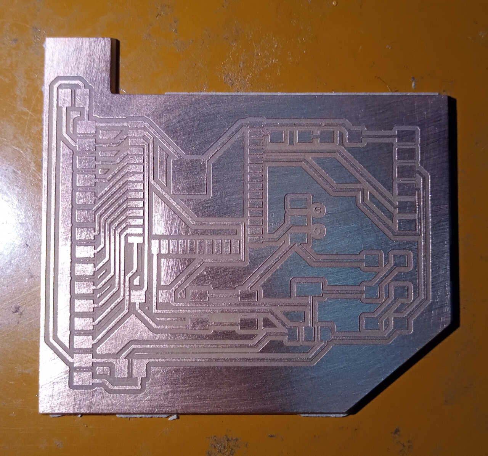

## Input sensors

To test the board I will add a [MQ-7 sensor from Sparkfun](https://www.sparkfun.com/products/9403), a BME280 temperature, humidity and pressure sensor, and a GPS sensor (and maybe a PM sensor as well, we will see).

### MQ-7 CO Sensor

The [MQ-7 CO Sensor Datasheet](https://cdn.sparkfun.com/datasheets/Sensors/Biometric/MQ-7%20Ver1.3%20-%20Manual.pdf) shows all the details about this device. As the name suggests, it measures Carbon Monoxide concentrations in parts per million. The implementation of this sensor is not trivial because it requires a heating cycle and a measurement cycle that repeat themselves over time, with different voltages. Here, I opted to add a power distribution switch connected with a 5V to 1.5V voltage regulator. The diode after the regulator is there just to protect it from the 5V inverse voltage from the switch.

The MQ-7 CO sensor Kicad symbols and footprints were taken from [SnapEDA](https://www.snapeda.com/parts/MQ-7/Hanwei%20Electronics%20Co.,%20Ltd/view-part/?t=pololu+mq2+gas+sensor&amp;welcome=home&amp;company=INC&amp;ref=search)

The STMPS2171STR power distribution switch and BAT46ZFILM diode were taken from Octopart ([here](https://octopart.com/stmps2171str-stmicroelectronics-7145064?r=spc#CadModels) and [here](https://octopart.com/bat46zfilm-stmicroelectronics-658190?r=sp) respectively.

From here I designed a small board for the MQ-7 sensor, **but this still needs to be tested before being fabricated**. The following picture show the schematics

<!-- ed1  -->
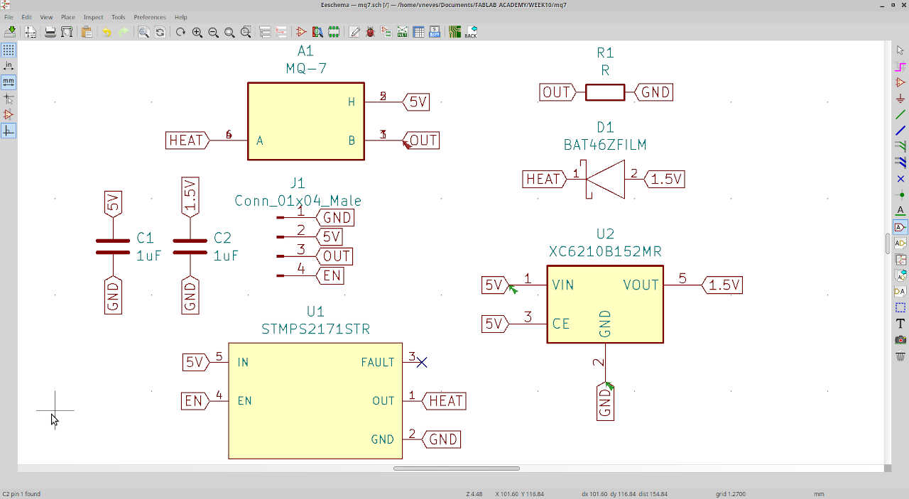{: style="width:100%"}

and the PCB layout.

<!--ed2  -->
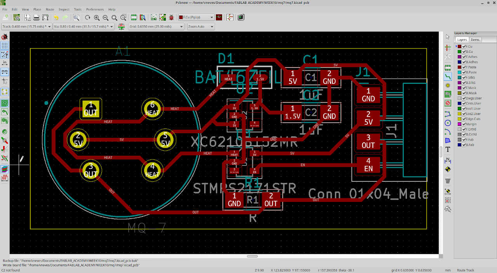{: style="width:100%"}

***In the end I didn't finish the MQ-6 due to lack of a component. Instead I finished doing this part with BME280 (temperature/humidity/pressure sensor) and a HM3301 (particulate matter sensor) devices.***

## HM3301 and BME280 input devices

***From here onwards I used Week 12 board I have fabricated and came back here to finish the assignment.***

***We will use some of the GPIOs shown in the following picture, again from [Random Nerds Tutorials](https://randomnerdtutorials.com/esp32-pinout-reference-gpios/)***  

<!-- esp32 pinout -->
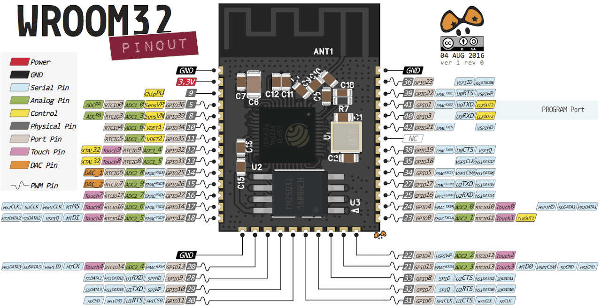{: style="width:100%"}


In our case, we will use GPIO 14,27 for the BME280 and GPIO 26,25 for the HM3301. The materials I'm going to use are depicted in the following picture.

<!-- materials -->
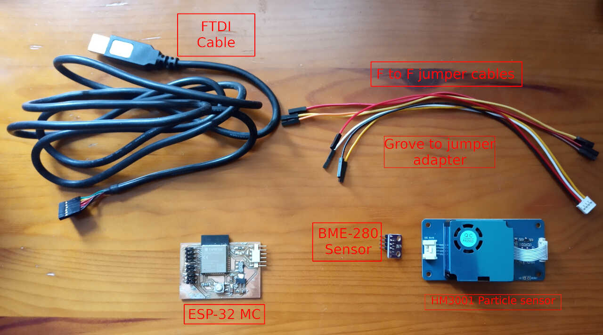{: style="width:100%"}


### HM3301 device

The HM3301 device ([check its datasheet here](https://files.seeedstudio.com/wiki/Grove-Laser_PM2.5_Sensor-HM3301/res/HM-3300%263600_V2.1.pdf)) is a Particulate matter laser dispersion detector capable of detecting PM1, PM2.5, and PM10 particles. I bought in a module format from [SEEED](https://www.seeedstudio.com/Grove-Laser-PM2-5-Sensor-HM3301.html) which uses a I2C communication protocol. **I chose this model as it is very similar to the one of the final project, the [Plantower PMS7003 device](http://www.plantower.com/en/content/?110.html).**

<!-- HM3301 -->
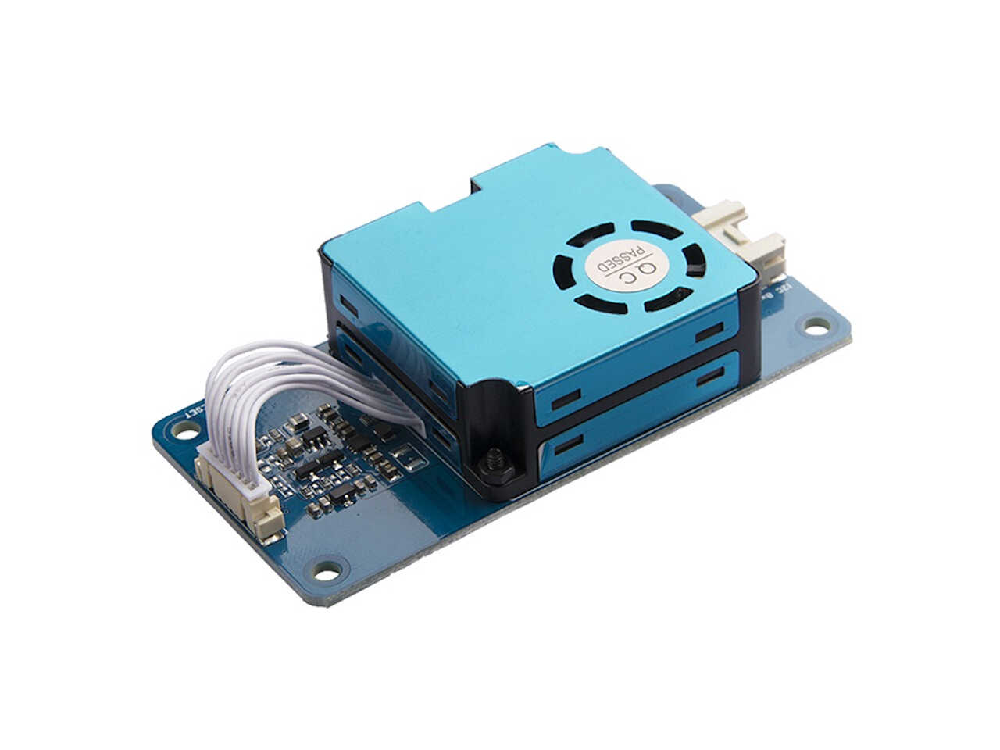{: style="width:40%"}


### BME280 device
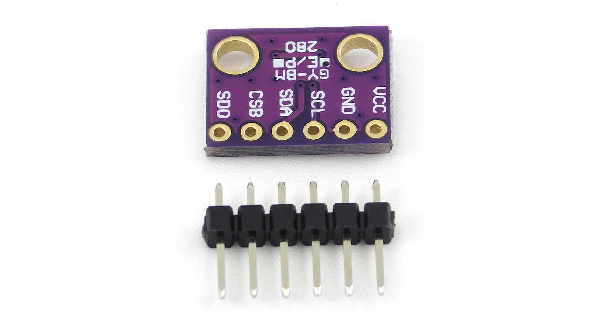{: style="width:40%"}

The BME280 also comes in an easy-to-use format and can measure pressure, temperature and humidity. It also communicates via I2C. 

<!-- BME280 -->

For this task I took inspiration in [another RandomNerd Tutorial](https://randomnerdtutorials.com/esp32-i2c-communication-arduino-ide/), that dabbles about connecting multiple devices via I2C, which is exactly what I need. 

According to the [wikipedia](https://en.wikipedia.org/wiki/I%C2%B2C),

>I²C (Inter-Integrated Circuit), pronounced I-squared-C, is a synchronous, multi-master, multi-slave, packet switched, single-ended, serial communication bus >invented in 1982 by Philips Semiconductor (now NXP Semiconductors). It is widely used for attaching lower-speed peripheral ICs to processors and microcontrollers >in short-distance, intra-board communication.

There are two ways to connect the two devices to I²C:

* Connecting both to the same I²C bus, as shown in the example[^1] below;
<!-- bus1 -->
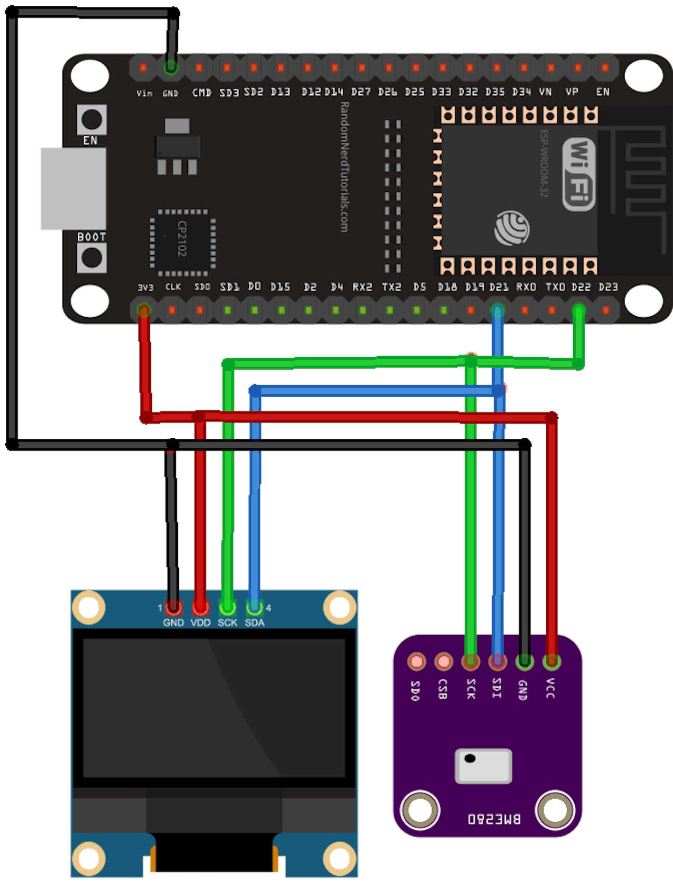{: style="width:40%"}

* Connecting the two devices in two different buses as shown in the example[^1] below;
<!-- bus2 -->
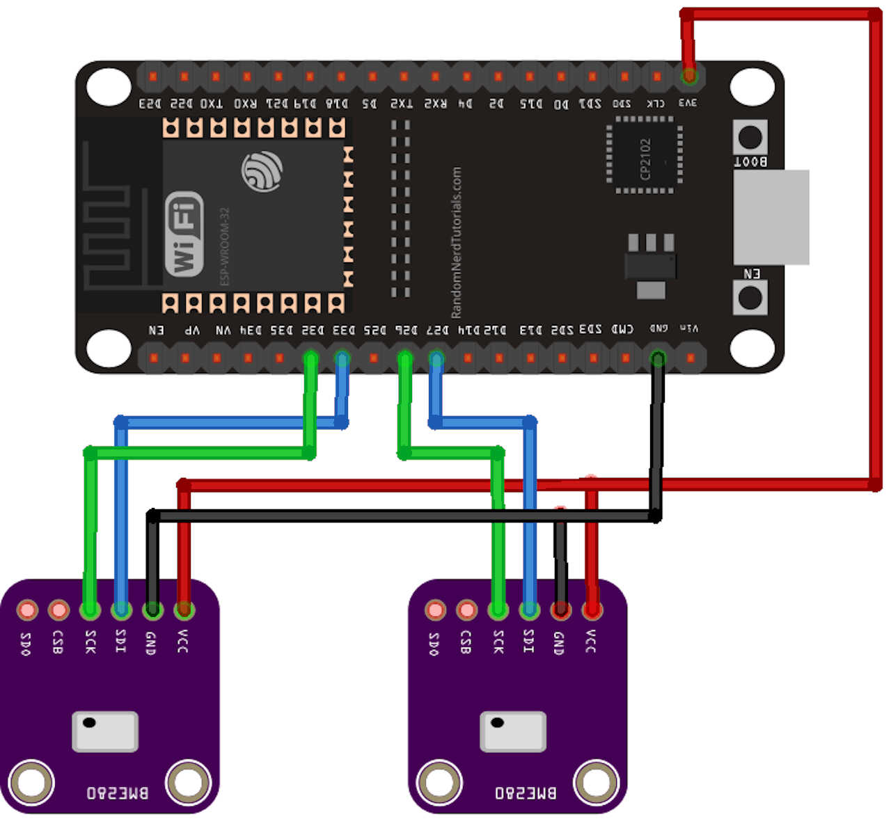{: style="width:40%"}

[^1]: Taken from [https://randomnerdtutorials.com/esp32-i2c-communication-arduino-ide/](https://randomnerdtutorials.com/esp32-i2c-communication-arduino-ide/)


To connect the devices I will use two independent I²C channels which the ESP-32 chip provides. **Note that I just need to connect the two ground wires to any ground. You don't need to connect the wires directly.**

The following pictures show how my circuit was laid out.

<!-- circuit_1 and circuit_2 -->
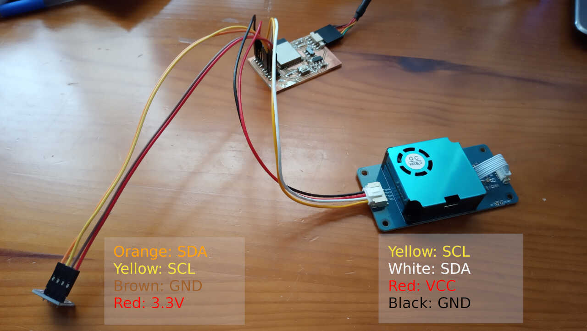
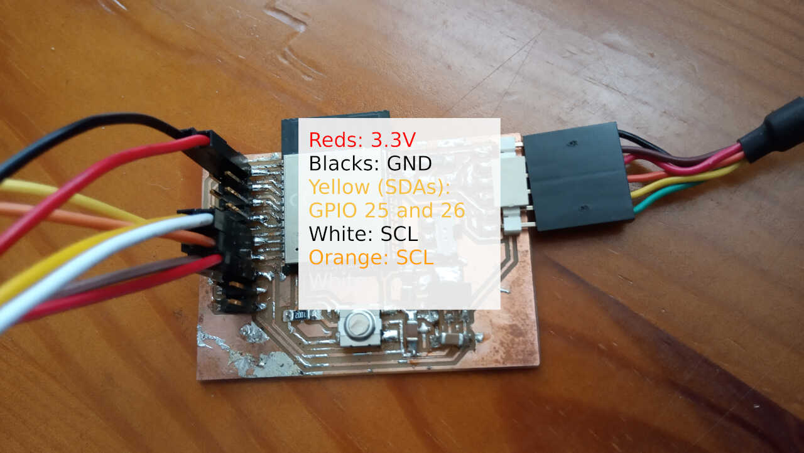

**Note here that this board is already a v2 from the original board done in week12. It has 6 extra pins at the bottom left, one pair for 3.3V and 2 pairs for 5V!** It will place here a picture to make it clearer to you dear reader.
<!-- boardv2 -->
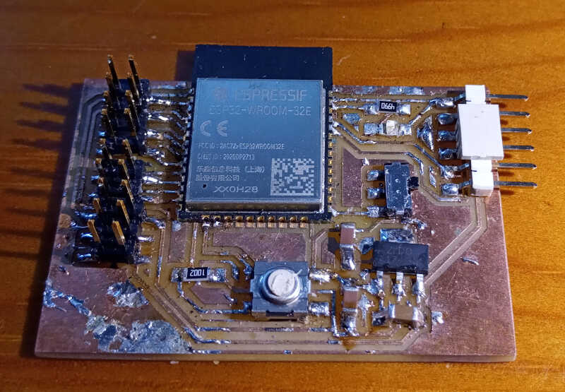


Before starting, I need to check if our devices are being detected. In order to do that I use the following program taken from the same Random Nerd page I mentioned before and also that I used during week 12.

        /*********
    MODIFIED BY VASCO NEVES @ 16/06/2021
    Rui Santos
    Complete project details at https://randomnerdtutorials.com  
    *********/

    #include <Wire.h>
    
    void setup() {
    Wire.begin(14,27);
    Wire1.begin(26,25);
    Serial.begin(115200);
    Serial.println("\nI2C Scanner");
    }
    
    void loop() {
    byte error,error1, address, address1;
    int nDevices,nDevices1;
    Serial.println("Scanning...");
    nDevices = 0;
    nDevices1=0;
    for(address = 1; address < 127; address++ ) {
        Wire.beginTransmission(address);
        Wire1.beginTransmission(address);
        error = Wire.endTransmission();
        error1 = Wire1.endTransmission();
        if (error == 0 or error1 == 0) {
        Serial.print("I2C device found at address 0x");
        if (address<16) {
            Serial.print("0");
        }
        Serial.println(address,HEX);
        nDevices++;
        }
        else if (error==4 or error1==4) {
        Serial.print("Unknow error at address 0x");
        if (address<16) {
            Serial.print("0");
        }
        Serial.println(address,HEX);
        }    
    }
    if (nDevices == 0) {
        Serial.println("No I2C devices found\n");
    }
    else {
        Serial.println("done\n");
    }
    delay(5000);          
    }

From the code, we observe the Wire.h library has been added, and then started with *Wire.begin()* and *Wire1.begin()* in the setup section, along with *Serial.begin()*. 
The main program loop goes through all possible I²C addreses and adds some conditions with the *if* statement. The *nDevices* variable controls how many variables were found and is used to show if there were no detected devices (nDevices==0) or if there was at least one device (nDevices > 0).

The result of this program can be seen in the following image, showing us the serial output.

<!--two_devices_detected  -->
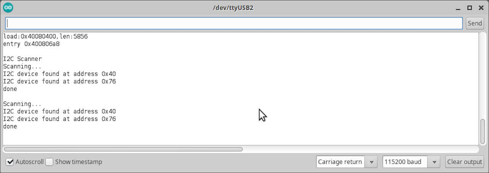

**The 0x40 address corresponds to the HM3301 device while the 0x76 corresponds to the BME280 device**.

### Measuring and sending data to the serial output.

Now that everything is in its place we just need a code to output the values of each sensor to the serial output. Again, most of the code I use was taken from this [Random Nerd tutorial page](https://randomnerdtutorials.com/esp32-i2c-communication-arduino-ide/), and some of the code was taken from [Arduino_Tomoto_HM330X github](https://github.com/tomoto/Arduino_Tomoto_HM330X) implementation, which is much simpler than the (**horrible!**) SEEED one.

    /*
    MODIFIED BY VASCO NEVES @ 17062021
    Rui Santos
    Complete project details at https://RandomNerdTutorials.com/esp32-i2c-communication-arduino-ide/
    
    Permission is hereby granted, free of charge, to any person obtaining a copy
    of this software and associated documentation files.
    
    The above copyright notice and this permission notice shall be included in all
    copies or substantial portions of the Software.
    */

    //#include <Wire.h>
    #include <Adafruit_Sensor.h>
    #include <Adafruit_BME280.h>
    #include <Tomoto_HM330X.h>


    #define SDA0 26
    #define SCL0 25

    #define SDA1 14
    #define SCL1 27

    Adafruit_BME280 bme; //BME280 as bme280
    Tomoto_HM330X sensor; //HM3301 as sensor

    void printValue(const char* label, int value) {
    Serial.print(label);
    Serial.print(": ");
    Serial.println(value);
    }

    int num=0;

    void setup() {
    
    Serial.begin(115200);
    Serial.println("Sensor inicialization..." );

    Wire.begin(SDA0,SCL0);
    
    if (!sensor.begin()) {
        Serial.println("failed to initialize HM3301");
        while(1);
    }
    
    Wire1.begin(SDA1,SCL1);
    //sensor.begin();

    bool status1 = bme.begin(0x76, &Wire1);  
    if (!status1) {
        Serial.println("Could not find a valid BME280_1 sensor, check wiring!");
        while (1);
    }

    
    //Read prep from HM3301
    sensor.readSensor(); //HM3301 Peparing sensor to read

    
    Serial.println("--------------------");
    }

    void loop() { 
    num = num+=1;
    Serial.print("Measurement #");
    Serial.println(num);
    Serial.println("--------------------");
    
    
    Serial.println("Concentration based on atmospheric environment (ug/m^3) --");
    printValue("PM1.0", sensor.atm.getPM1());
    printValue("PM2.5", sensor.atm.getPM2_5());
    printValue("PM10", sensor.atm.getPM10());
    
    Serial.println("--------------------");  

    // Read from bme
    Serial.print("Temperature from BME = ");
    Serial.print(bme.readTemperature());
    Serial.println(" *C");

    Serial.print("Humidity from BME = ");
    Serial.print(bme.readHumidity());
    Serial.println(" %");
    
    Serial.print("Pressure from BME = ");
    Serial.print(bme.readPressure() / 100.0F);
    Serial.println(" hPa");

    Serial.println("--------------------");  
    
    delay(5000);
    }


Let's analyse the code by parts as done before.

#### Link section

    //#include <Wire.h>
    #include <Adafruit_Sensor.h>
    #include <Adafruit_BME280.h>
    #include <Tomoto_HM330X.h>

Here I include some libraries that are needed to use the sensors. I excluded the Wire library because it's already included in at least on other library.

#### Global declaration section

    #define SDA0 26
    #define SCL0 25

    #define SDA1 14
    #define SCL1 27

    Adafruit_BME280 bme; //BME280 as bme280
    Tomoto_HM330X sensor; //HM3301 as sensor

    void printValue(const char* label, int value) {
    Serial.print(label);
    Serial.print(": ");
    Serial.println(value);
    }

    int num=0;

Here I define the values for the GPIO of the ESP32 that are going to be used by the I²C protocol. I also renamed the commands from adafruit and tomoto to more palatable names. 

A function is also here that will help me writing values to display in the serial output.

The counter num is also here.

#### Setup section

    void setup() {
    
    Serial.begin(115200);
    Serial.println("Sensor inicialization..." );

    Wire.begin(SDA0,SCL0);
    
    if (!sensor.begin()) {
        Serial.println("failed to initialize HM3301");
        while(1);
    }
    
    Wire1.begin(SDA1,SCL1);
    //sensor.begin();

    bool status1 = bme.begin(0x76, &Wire1);  
    if (!status1) {
        Serial.println("Could not find a valid BME280_1 sensor, check wiring!");
        while (1);
    }

    
    //Read prep from HM3301
    sensor.readSensor(); //HM3301 Peparing sensor to read

    
    Serial.println("--------------------");
    }

In the setup section I inicialize and test the sensors to see if they are ready to work. **The HM3301 needs to run the ```sensor.readSensor()``` line. Otherwise it will only give zeros.**

#### The main program

    void loop() { 
    num = num+=1;
    Serial.print("Measurement #");
    Serial.println(num);
    Serial.println("--------------------");
    
    
    Serial.println("Concentration based on atmospheric environment (ug/m^3) --");
    printValue("PM1.0", sensor.atm.getPM1());
    printValue("PM2.5", sensor.atm.getPM2_5());
    printValue("PM10", sensor.atm.getPM10());
    
    Serial.println("--------------------");  

    // Read from bme
    Serial.print("Temperature from BME = ");
    Serial.print(bme.readTemperature());
    Serial.println(" *C");

    Serial.print("Humidity from BME = ");
    Serial.print(bme.readHumidity());
    Serial.println(" %");
    
    Serial.print("Pressure from BME = ");
    Serial.print(bme.readPressure() / 100.0F);
    Serial.println(" hPa");

    Serial.println("--------------------");  
    
    delay(5000);
    }

The main code will perform the measurements and output them (for now) in the serial output screen. There is a 5 second delay between each measurement.

The serial output of the program can be seen here.

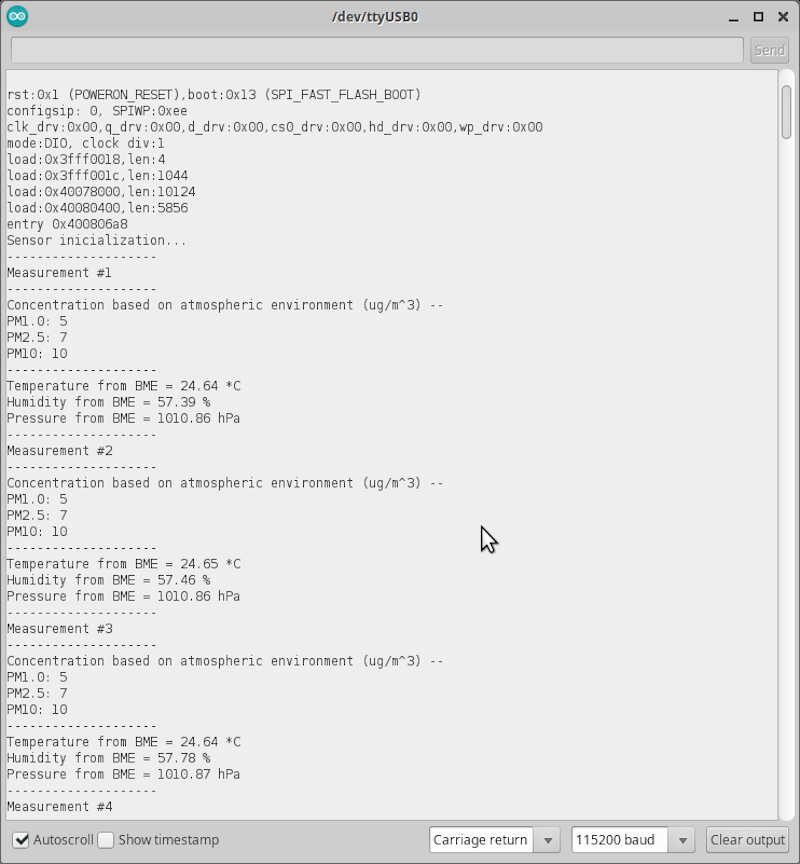


Finally, the following video shows everything in action.

<!-- input devices video -->

<video class="center" width="800" controls>
  <source src="../../files/week10/input_video.m4v" type="video/mp4">
Your browser does not support the video tag.
</video>


## References

* [Candle](https://github.com/Denvi/Candle)
* [Expressif webpage](https://www.espressif.com/en/)
* [Fab Academy](http://fabacademy.org/)
* [Inkscape](https://inkscape.org/)
* [SEEED](https://www.seeedstudio.com/)
* [Sparkfun](https://www.sparkfun.com/)
* [Octopart](https://octopart.com/)
* [Random Guy Tutorials](https://randomnerdtutorials.com/)


## Files

* [Input devices arduino program](../../files/week10/input_devices_ino.zip)
* [Check_i2c_addressv2 arduino program](../../files/week10/check_i2c_addressv2_ino.zip)
* [ESP32 hello board v1 with nc files](../../files/week10/esp32_hello_board_v1_with_nc_files.zip)
* [mq7_kicad_files](../../files/week10/mq7_kicad_files.zip)