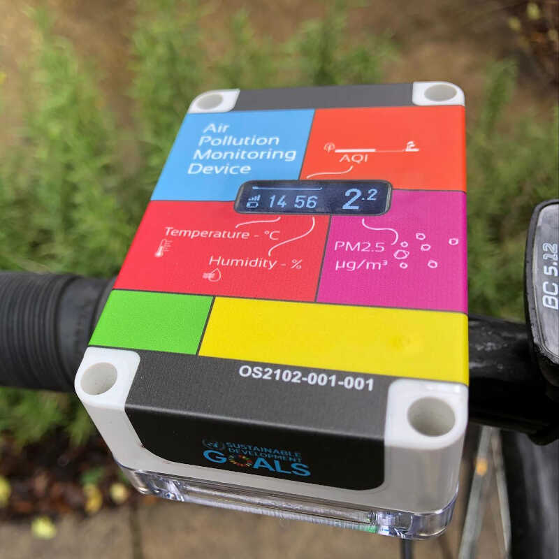
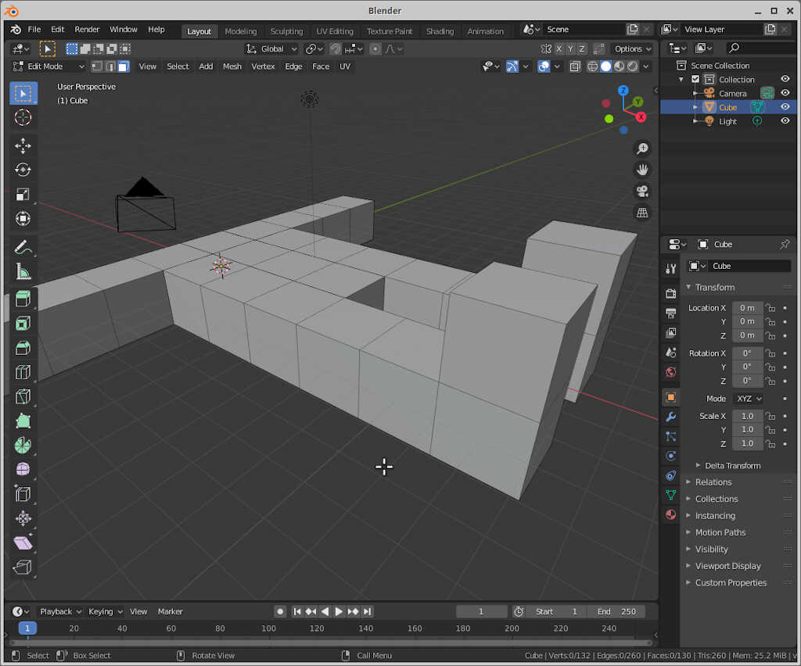
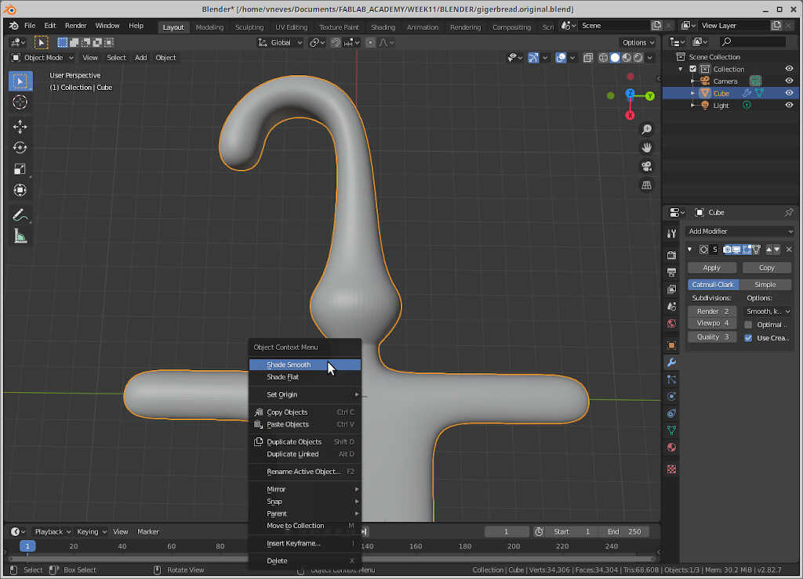
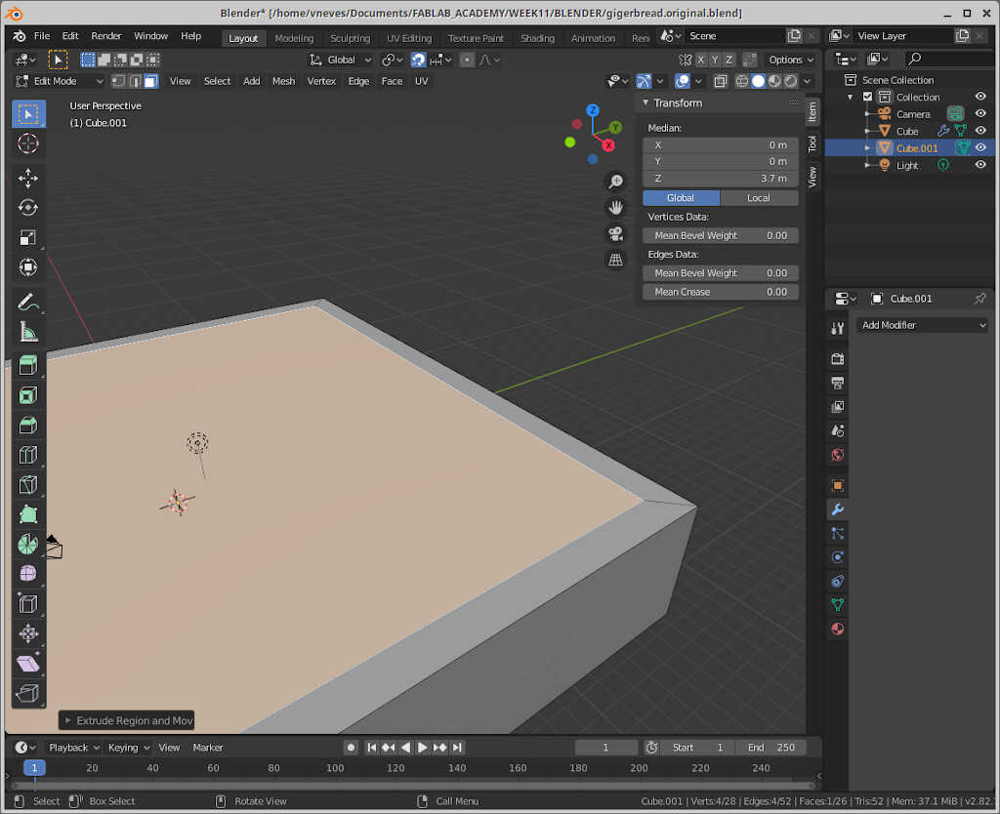

# 11. Molding and casting

## Assignments 

* *Group assignment:*
    * *Review the safety data sheets for each of your molding and casting materials*
    * *Make and compare test casts with each of them*
* *Individual assignment:*
    * *Design a 3D mould around the stock and tooling that you'll be using, mill it (rough cut + (at least) three-axis finish cut), and use it to cast parts.*

For week 11 I decided to make a prototype mold for one of the parts that I may use on the final project.

The part is a case that houses different sensors (PM sensor, temperature, humidity, and pressure sensor, CO2 Sensor...) and is meant to be attached to a bike's steering wheel, such as this one from the [Open Seneca project](https://open-seneca.org/).

<!-- place example image here -->

I researched many different designs that mostly required two components (the one attached to the steering wheel and the sensor casing) and needed screws, nuts and/or some kind of coupling or joint. For instance, in grabcad one can find a great number of [examples](https://grabcad.com/library?page=1&per_page=100&time=all_time&sort=recent&query=bike%20holder).

I also researched a bit about [snap fits](https://en.wikipedia.org/wiki/Snap-fit) in general. First I experimented to create a first draft in Fusion 360 so that I could snap fit it to the driving wheel and then have a double cantilever snap fit on the top, with a functional design similar to a [bag clip lock](https://grabcad.com/library/bag-clip-plastic-lock-1) where I could attach the sensor case. The figure shows a first draft of this type of design.

<!-- cad1 -->

I also took inspiration from some [Decathlon](https://www.decathlon.com/) designs such as this rear light with a snap fit joint

<!-- dec1 -->

and this front light with a flexible "tension" joint. I don't know which type of joint this is but I'm researching it. I will base my design on this part.

<!-- dec2 -->
<!-- dec3 -->

I decided to abandon the first design as it was and try a new one based on this latest decathlon design. At this time I also chose to use [silicon rubber](https://en.wikipedia.org/wiki/Silicone_rubber) as a material to cast due to its flexibility and impermeability. This enables me to create a single component, thus making the need for a joint unnecessary.

## Designing the silicone case

I designed the first version of my case with 82x50x20mm dimensions, taking into account the size of the inner components and giving some room for them to breathe. 

At this points the tentative components are:

* Circuit with ESP32 MC (TBD)
* PMS7001 particulate matter sensor
* BME280 temperature, humidity and pressure sensor
* inductive receiver coilusing the X-Carve Machine (Large CNC)
* Battery. The size of the battery needs to be ascertained with empirical experimentation. I will add a standard 18650 2600mAh battery just for reference.
* GPS module.

First I created a rectangular sketch with the 82x50mm dimensions. Then I filleted the four corners and extruded it 20mm up. With the `Shell tool` I made a hollow 

## Fulfilling the assignment

I spent too much time around the sensor box and I saw that I would not have time to finish the assignment, because the box still needs a lot of work before casting a version. Therefore, I did two simpler designs that I could cast as soon as I was able to. 

I first designed a "3D" map of a famous drawing from Joaquín Torres García, [América Invertida](https://en.wikipedia.org/wiki/Am%C3%A9rica_Invertida).

<!-- america_invertida -->

I downloaded the .jpg picture into Inkscape and transformed it into a vector image with ``Path/Trace Bitmap``. The result is shown below

<!-- ai2 -->

Then I saved it in .svg and imported the file into Fusion 360. I extruded the parts with different heights to have a map with some king of "3D" effect. The result is shown as follows

<!-- ai3 -->

Then Ferdi told me this was not 3d enough so I looked for another source of inspiration of a new design.

I found this "anonymous" symbol 

<!-- an1 -->
{: style="width:50%"}

I did the same procedure as before in inkscape and imported the svg to Fusion. 

<!-- anon1  -->

From here i did extrudes on all surfaces, with differences of 1mm in height. Then I filleted the desin and body parts until I got this result

<!-- anon2 -->

The next step would be to sculpt a bit the two designs...tbd...

## Fulfilling the assignment part 2

### Robo Gingerman design

To fulfill this assignment I first created a two part mold in [Blender](https://www.blender.org/). Designing in Blender is quite intuitive once you get the key shortcuts in order to move, change the angle and resize your objects. 

First, I took the lessons from [Ferdi's Blender class](http://fcycle.de/tutorials/blender/) and use the gingerman he created as a starting point of a design. To create the gingerman, I first added cubes in the XoY plane, as shown in the picture below. I always start with the same 2x2x2 cube and extrude from it. To do this, I click on `tab`, and choose face select (location shown in the mouse arrow) the other cubes with the shortcuts `ex2` or `ey2` or `ez2` if I want to create more cubes in the x, y or z directions respectively.

<!-- gman1 -->
{: style="width:100%"}

Using this simple technique you can start forming the gingerman.

<!-- gman2 -->
{: style="width:100%"}

I also added some feet do the gingerman by extruding in the z direction using `ez2`.

<!-- gman3 -->
{: style="width:100%"}

The head will be a bit different. First I added a new block  using `e1` and clicked enter. Then I did it again. Now, without deselecting, I pressed `s2`.

<!-- gman4 -->
{: style="width:100%"}

To continue, I wrote `e1` again and clicked enter. I repeated, and pressed `s0.5`. **The head is done!** From here we can do the gingerman's hat.

<!-- gman5 -->
{: style="width:100%"}

To do the hat I used something like the following command sequence: 

* `e6[enter]rz45[enter]e2[enter]rz45[enter]e2[enter]rz45[enter]e2[enter]`.

<!-- gman6 -->
{: style="width:100%"}

Our gingerman at this time is too boxy! To have rounder surfaces we use the `Subdivision Surface` modifier. To choose it, click on the **blue wrench icon** on the bottom right commands and click on `Add Modifier`. After that choose `Subdivision Surface`, with Viewport and render settings at 3.

<!-- gman8 -->
{: style="width:100%"}

To finish the the part I added some robotesque figurine by extruding the head face to the interior `e-4`.

<!-- gman8.1 -->
{: style="width:100%"}

To further improve the shade, go to **Object Mode** (`Tab`) and right click on the object and choose `Shade smooth`.

<!-- gman 9 -->
{: style="width:100%"}

I also decided to make some proper feet. To do this, I used `CTRL+R` in edit mode (`tab`) that allows subdivisions of the blocks. Then I dragged the subdivision down to make a "boot".

<!-- gman 11 -->
{: style="width:100%"}
<!-- gman 12 -->
{: style="width:100%"}

### The gingerman "coffin"

To create the master of the mold we need to frame our gingerman into a box. To do that we create a cube (`shift+A --> Mesh/Cube`) and transform it into a rectangular cuboid. In my case, I created one with a scaling factor of 20 for x and y and 3.7 for z (just for this example, the actual object may vary!)

<!-- gman13 -->
{: style="width:100%"}

From here, we subtract from the case two parts, using the extrude command. First we select the top layer (`tab+LMB`), then click on `s` and choose a good area for the external walls. Then you need to enable x-ray mode to see the internal walls (`alt+z)`. Then I extruded down with `e`. This should be aided with keypad key `3` so that the subtraction does go only to the green line, effectively separating the gingerman in half.

<!-- gman14 -->
{: style="width:100%"}
<!-- gman15 -->
{: style="width:100%"}

### Creating the master edges

The master needs to have diagonal edges so that the mold can "pop out". To do this, we need to go to edit mode and select the 4 inner edges as shown in the picture below and apply 3 units inward (e.g. `gy-3`)

<!-- gman 16 -->
{: style="width:100%"}
<!-- gman 17 -->
{: style="width:100%"}

### Creating the joints

From here we can create the first joint, in edit mode, face select. I went to edit mode (`tab`) and clicked again on the top face and then reduced the face that is going to be cut using `e`, then 'escape' and then `s`. It's a neat trick!

<!-- gman18 -->
{: style="width:100%"}

Now we can choose the four faces that go down 3 arbitrary units. The final result is shown below.

<!-- gman19 -->
{: style="width:100%"}

### A finish touch

To give a robotesque touch to the gingerman, I will extrude his head four units in the edit mode of the object.

<!-- gman20 -->
{: style="width:100%"}

### The chimney

We need to create a chimney so that the casting liquids can enter the mold. To this end I drew a cylinder.

<!-- gman21 -->
{: style="width:100%"}

### Adjusting the size

At this point I had to adjust the box size to 130x130x15 so that it could be adapted to cut 20mm foam.

<!-- gman22 -->
{: style="width:100%"}

### The back side

To do the backside, I just copied the box and the gingerman to the side and turned the gingerman 180 degrees on the x axis.

<!-- gman23 -->
{: style="width:100%"}

**Note that the gingerman is not centered but that does not change the mold, as both sides are on top of each other.**

I exported the file as .stl, first the front part then the back part. As I couldn't manage to mill it with mods, I did in in fab modules which was straightforward.

First I chose **mesh/stl** as input file and checked if the dimensions were compatible with my 3810 mill. I had to convert the units to mm using the 24.5 coefficient as shown in the picture below. Then I calculated the height map with a resolution of 300 dpi.

<!-- fm1 -->
{: style="width:100%"}

Then I chose **g-codes (.nc)** as **output format** and **foam rough cut** as **process**. I let everything on default except the tool diameter and cut depth (both 3 mm) and I machined at twice the speed (100 mm/s).

<!-- fm2 -->
{: style="width:100%"}

From here I used candle to cut the foam, as shown in previous weeks. The following picture shows the intermediate result for the front and the back.

<!-- result1 -->

<!-- result2 -->

To finish the cut I need to choose **foam finish cut** in the process menu with the default settings. **Just be careful not to lose the zero of the machine!** 

<!-- fm3 -->
{: style="width:100%"}

The final calculation looks like this.

<!-- fm4 -->
{: style="width:100%"}

And the final result on the foam can be seen below.

<!--result3  -->

## Molding 

I decided to try to make a mold with a Water/Gelatin/Gliceryn mix recipee Ferdi has given me. The mix is composed of:

* 2 volumes of water
* 1 volume of glycerin
* 1 volume of gelatin

<!-- mold1 -->

First I mixed the water and the glycerin and heated the mix in the microwave until it heats up but without boiling. Then I added the gelatin gradually and mixed it with a bamboo stick heating the mix again for 5 times until the mix is uniform. 

<!-- mold2 -->
{: style="width:25%"}

After waiting a while it becomes solid and tames the form of the "master". **This recipe can be reheated again many times and recycled!**

<!-- mold3 -->
{: style="width:25%"}

I reheated and poured the mix into the master. 

<!-- mold4 -->

After a few hours I could removed it. **However I noticed that it tends to stick too much to the master material which can result in the destruction of the mold as well as making some damage to the master.**

<!-- mold5 -->
{: style="width:50%"}
<!-- mold6 -->

### Casting with glycerin/gelatin mix

From this molds I made a cast using white silicone and corn starch. The recipe is as follows:

* 100 mg of white silicon
* 30 mg of corn starch

<!-- cast1 -->
{: style="width:25%"}

I mixed everything with a bamboo stick. It has the consistence of toothpaste. **The casting time is 10-20 minutes with curing time of a few hours**. From here I casted into my little gelatin/glycerin mold. To do this I needed two pieces of wood I sawed just before doing the mixture. 

<!-- comp -->

From here, I just pressed the casting material into the two mold parts and secured them with two rubber bands, before and after applying the bands...

<!-- c_mold1 -->

<!-- c_mold2 -->

...and the end result. **I should note here that the cast piece was not done well, because the silicone/starch mix was not placed properly as I'm going to show next. Pressure should be applied only on the mold profile and not everywhere.**

<!-- c_mold3 -->

**From this experience I noted that it was hard to remove the mold from the master. The cast piece was also very fragile, so I tried to make them this time with 40mm foam.**

<!-- result4 -->

I did the same design, but this time with 35 mm depth. The steps were similar to the ones shown above, except that the male-female connections are much deeper and the master in the z direction has twice the size.

<!-- result5 -->

Here we can see the molds being fabricated.

<!-- result6 -->

**Unfortunately having more depth got things worse! I could not remove a mold successfully**. So we decided to use the silicon-starch mix I used before for casting to do for the mold.

## Molding part 2

TBD...

## References

* [Blender](https://www.blender.org/)
* [Ferdi's homepage](http://fcycle.de/)

## Files

