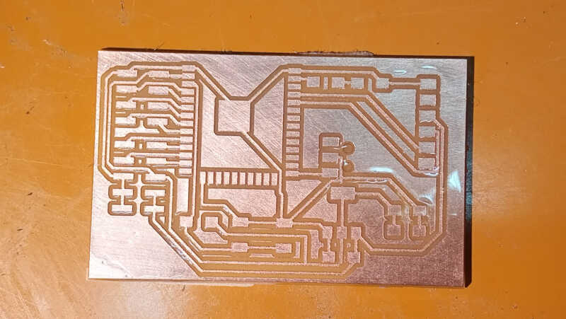
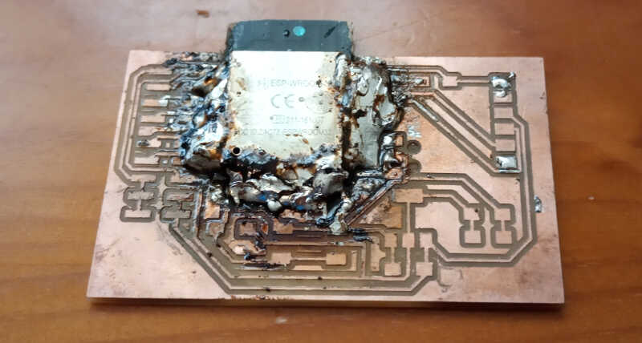
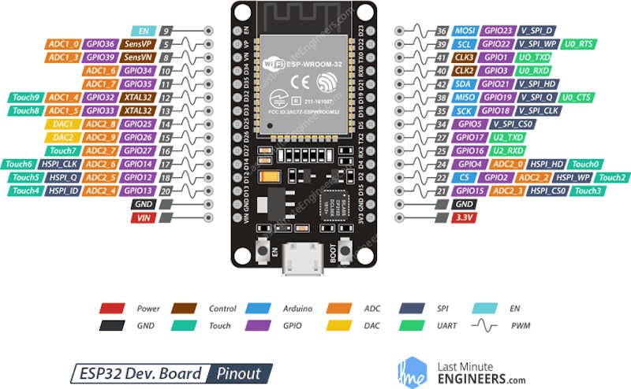
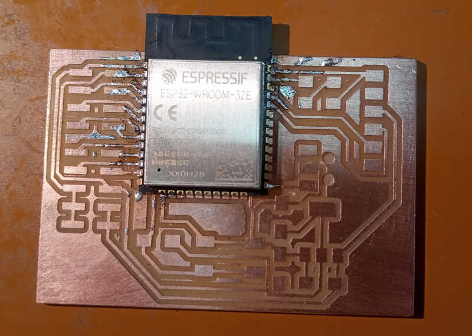

# 12. Output devices

I'm still at home and hopefully I'll be in Lisbon in the first week of May! Yay! :)

This week I'll try to finish the assignments of <s>both week 10 and</s> week 12. **I did week 10 after week 12 so please check it out**.


## Assignments

* Individual assignment:
      * Add an output device to a microcontroller board you've designed, and program it to do something

* Group assignment:
      * Measure the power consumption of an output device

## New version of the week 10 board

I have now all the components I need to build the week 10 board. However my available pins are aligned vertically, not horizontally. So, I needed to re-design the board done during break week. I also corrected some small mistakes I have done in the previous version of the board.

The next two pictures show the circuit schematics

<!-- ed1  -->
{: style="width:100%"}


and the PCB layout.

<!-- ed2 -->
{: style="width:100%"}

Then I fabricated the board in my 1060 milling machine, with the following design rules: 0.3 mm clearance (due to the small footprints of the ESP32) and 0.4 mm tracks.

<!-- board -->



## Two spectacular failures

I had two ESP32-WROOM MC to solder. I solder the first one using the "solder dabbing" technique, i.e. just throwing solder to the pins and the wick the excess solder out. 

It was going alright but I noticed that one trace had lifted and another had gone away altogether...I could find a wire to make a bridge but the biggest problem was about to come...

<!-- first board -->


After several attempts at wicking I couldn't desolder several pin. Even with the aid of a cutter I could not separate them.

I fabricated another board, and used the same "dabbing" technique **(why, oh why???)**. I got better looking results but had the same shorts problem despite sessions and sessions of whicking. I forgot to take a picture, but after talking to Ferdi about this he suggested that I could just fill the whole area of the contacts in solder and then try to detach the MC by continuously heating them in sequence.

<!-- second board -->


I try to desolder this even at 400º with the iron but it was no use. I needed maybe an oven but I couldn't use the domestic one. 

So now I'm waiting for another batch to to try it out again...**and this time sure, I'll do the soldering one pin at a time!!!**

Fortunately I asked André for a prototyping board the week before and I could use it to not completely trash my work week.

## Using a prototyping board to program an external device

Due to the spectacular failures regarding the soldering of the ESP32 chips onto the boards I've fabricated, I ended up using an ESP-32 prototyping board from [Joy-It](https://joy-it.net/en/).

<!-- esp32 -->


The first mandatory step was to install the EPS32 board managers. To do this I went to ``File/Preferences`` and clicked on the rightermost icon, where the mouse icon is, at the end of the line `Additional Boards Manager URLS``

<!-- esp1 -->


Then I added

      https://dl.espressif.com/dl/package_esp32_index.json

into the line list and clicked ok.

<!-- esp2 -->


To install the board drivers, I needed to go to ``Tools/Board:.../Boards Manager`` in the Arduino IDE drop down menus. Here, I searched for ESP32, clicked install and when it finished clicked on 'close'.

<!--esp3  -->


### Testing the board with a hello world message.

Before moving on to the external devices it is always advised to use a test program to see if the board is working allright. To do this, I tested Neil's ``hello.ino`` taken from the [embedded programming page](http://academy.cba.mit.edu/classes/networking_communications/ESP32/hello.ESP32-WROOM.echo.ino).

      //
      // hello.ESP32-WROOM.echo.ino
      //
      // ESP32-WROOM echo hello-world
      //
      // Neil Gershenfeld 1/6/20
      //
      // This work may be reproduced, modified, distributed,
      // performed, and displayed for any purpose, but must
      // acknowledge this project. Copyright is retained and
      // must be preserved. The work is provided as is; no
      // warranty is provided, and users accept all liability.
      //

      void setup() {
      Serial.begin(115200);
      }

      #define max_buffer 25

      void loop() {
      static char chr;
      static char buffer[max_buffer] = {0};
      static int index;
      if (Serial.available()) {
            chr = Serial.read();
            Serial.print("hello.ESP32-WROOM.echo: you typed \"");
            buffer[index++] = chr;
            if (index == (max_buffer-1))
            index = 0;
            Serial.print(buffer);
            Serial.println("\"");
            }
      }

The results can be seen below

<!-- hello_esp32_1 and 2 -->
{: style="width:100%"}
{: style="width:100%"}


### Hello OLED

Now I will connect an [OLED SSD1306](https://cdn-shop.adafruit.com/datasheets/SSD1306.pdf) to the board and experiment with it. The connection is straightforward, I just need to connect four FF wires: 3.3V power, ground, SCL and SDA.

<!-- components  -->


The OLED SSD1306 is a monocolor (white) with 128x64 pixels and communicates via [I²C](https://en.wikipedia.org/wiki/I%C2%B2C). You can display fonts and pictures with it, like this photo taken from [Random Nerd Tutorials](https://randomnerdtutorials.com/esp32-ssd1306-oled-display-arduino-ide/)

<!-- random_nerd foto -->


The next step will be to install the necessary libraries by going to ``Tools/Manage Libraries``. By typing 'SSD1306' we observe that are many libraries available for this device. We will install the **Adafruit SSD 1306 library**, which will also install the **Adafruit GFX Library** and **Adafruit BUSIO**. I will follow the [Random Nerd Tutorials ESP32-SSD1306 page](https://randomnerdtutorials.com/esp32-ssd1306-oled-display-arduino-ide/) to help me understand better all the necessary steps to set up the OLED screen.

In the ESP32 the native GPIO for I²S communication are GPIO21 (SDA) and GPIO22 (SCL) as shown in the following pinout diagram, taken from [Last Minute Engineers](https://lastminuteengineers.com/esp32-arduino-ide-tutorial/) page.

<!--esp32-pinout-diagram  -->



In this way, **I connected the GPIO21 pin (D21) of the board to the OLED SLA pin of the display (yellow wire), the GPIO22 pin (D22) to the SCL pin (orange wire), the 3.3V pin to the VCC pin (black wire) and the ground pins through the white wire**.

<!-- picture of the the wired diagram -->


After connecting to the USB port of the computer and restarting the Arduino IDE, I tested the OLED screen by choosing the Adafruit example at `File/Examples/AdaFruitSSD1306/ssd1306_128x64_i2c`. The first lines of the code containing the initialization are shown here

```
/**************************************************************************
 This is an example for our Monochrome OLEDs based on SSD1306 drivers

 Pick one up today in the adafruit shop!
 ------> http://www.adafruit.com/category/63_98

 This example is for a 128x64 pixel display using I2C to communicate
 3 pins are required to interface (two I2C and one reset).

 Adafruit invests time and resources providing this open
 source code, please support Adafruit and open-source
 hardware by purchasing products from Adafruit!

 Written by Limor Fried/Ladyada for Adafruit Industries,
 with contributions from the open source community.
 BSD license, check license.txt for more information
 All text above, and the splash screen below must be
 included in any redistribution.
 **************************************************************************/

#include <SPI.h>
#include <Wire.h>
#include <Adafruit_GFX.h>
#include <Adafruit_SSD1306.h>

#define SCREEN_WIDTH 128 // OLED display width, in pixels
#define SCREEN_HEIGHT 64 // OLED display height, in pixels

// Declaration for an SSD1306 display connected to I2C (SDA, SCL pins)
// The pins for I2C are defined by the Wire-library.
// On an arduino UNO:       A4(SDA), A5(SCL)
// On an arduino MEGA 2560: 20(SDA), 21(SCL)
// On an arduino LEONARDO:   2(SDA),  3(SCL), ...
#define OLED_RESET     -1 // Reset pin # (or -1 if sharing Arduino reset pin)
#define SCREEN_ADDRESS 0x3C ///< See datasheet for Address; 0x3D for 128x64, 0x3C for 128x32
Adafruit_SSD1306 display(SCREEN_WIDTH, SCREEN_HEIGHT, &Wire, OLED_RESET);
...
...
```

**This code is quite long, has a lot of functions and it's worth to go through it to learn how to write for the OLED display**. It is worth mentioning a few notes regarding the configuration:

* The Wire.h library is the one that controls the I²C communications.
* You need to define your SCREEN_WIDTH and SCREEN_HEIGHT to match your screen. In my case is **128x64**
* In my case I defined the **OLED_RESET = -1** because the screen does not have a reset button.
* At first the screen was blank because it was in the wrong I²C address. Moreover, the address at the back of my OLED screen shows a wrong address! The right address is, in fact, **0x3C** and not **0x78**! 

<!-- show back of oled screen -->
{: style="width:50%"}


I had to find the address myself by using this small program from the randomnerdtutorials. It was quite handy! :)

```
/*********
  Rui Santos
  Complete project details at https://randomnerdtutorials.com
*********/

#include <Wire.h>

void setup() {
  Wire.begin();
  Serial.begin(115200);
  Serial.println("\nI2C Scanner");
}

void loop() {
  byte error, address;
  int nDevices;
  Serial.println("Scanning...");
  nDevices = 0;
  for(address = 1; address < 127; address++ ) {
    Wire.beginTransmission(address);
    error = Wire.endTransmission();
    if (error == 0) {
      Serial.print("I2C device found at address 0x");
      if (address<16) {
        Serial.print("0");
      }
      Serial.println(address,HEX);
      nDevices++;
    }
    else if (error==4) {
      Serial.print("Unknow error at address 0x");
      if (address<16) {
        Serial.print("0");
      }
      Serial.println(address,HEX);
    }
  }
  if (nDevices == 0) {
    Serial.println("No I2C devices found\n");
  }
  else {
    Serial.println("done\n");
  }
  delay(5000);
}
```


The following video shows the demo in action

<!-- vid132636 -->
<video class="center" width="800" controls>
  <source src="../../files/week12/demo.m4v" type="video/mp4">
Your browser does not support the video tag.
</video>


Now that everything is working fine, I'll create a small hello OLED program. I took a program from Rui Santos that shows a static text and modified it to became a dynamic text display.

```
/*********
  Hello_LED
  Original code by Rui Santos
  Complete project details at https://randomnerdtutorials.com  
  Modified by Vasco Neves to display on the OLED as you type
*********/

#include <Wire.h>
#include <Adafruit_GFX.h>
#include <Adafruit_SSD1306.h>

#define SCREEN_WIDTH 128 // OLED display width, in pixels
#define SCREEN_HEIGHT 64 // OLED display height, in pixels

// Declaration for an SSD1306 display connected to I2C (SDA, SCL pins)
Adafruit_SSD1306 display(SCREEN_WIDTH, SCREEN_HEIGHT, &Wire, -1);

void setup() {
  
  Serial.begin(9600);

  if(!display.begin(SSD1306_SWITCHCAPVCC, 0x3C)) { // Address 0x3D for 128x64
    Serial.println(F("SSD1306 allocation failed"));
    //for(;;);
  }
  display.clearDisplay();
  display.setTextSize(2); //size 2 to be more visible in the video
  display.setTextColor(WHITE);
  display.setCursor(0, 10);
  display.write("> "); // cursor start
  display.display();
}

void loop() {
  char chr;
  if (Serial.available()) { 
    chr = Serial.read(); //using serial read to write on the OLED AND on the serial at the same time!
    display.write(chr);
    display.display();
    Serial.print(chr);
}
}
```
The following video shows how it works ;)

<!--vid_193700  -->
<video class="center" width="800" controls>
  <source src="../../files/week12/hello_oled.m4v" type="video/mp4">
Your browser does not support the video tag.
</video>


## Fabricating my ESP-32 device

Finally I ended up fabricating the ESP-32 device. This was very useful for [Week 13 - Network and communications](http://fab.academany.org/2021/labs/benfica/students/vasco-neves/assignments/week13/).

First I milled the PCB again with the same settings...

<!-- new_milled_pcb -->
  
<!-- {: style="width:50%"} -->

...then I soldered the ESP-32 chip pins to the board. This time I carefully soldered each pin I was going to use one at a time, and hoped for the best! :)

<!-- soldered_esp32 -->
  

Finally, I soldered all the other components to the board. Each part is shown on the picture below. **The program/run switch is used to switch between programming and run modes. The reset switch is used to reset the IC before programming.**

<!-- esp32_board_comment -->


## References

* [Fabacademy embedded programming page](http://academy.cba.mit.edu/classes/embedded_programming/index.html)
* [Fusion 360](https://www.autodesk.pt/products/fusion-360/overview?term=1-YEAR)
* [Grabcad](https://grabcad.com/)
* [Inkscape](https://inkscape.org/)
* [Open Seneca project](https://open-seneca.org/)
* [Random Nerd Tutorials](https://randomnerdtutorials.com/)
* [Wikipedia](https://en.wikipedia.org/)

## Files

***TBD: add files***
