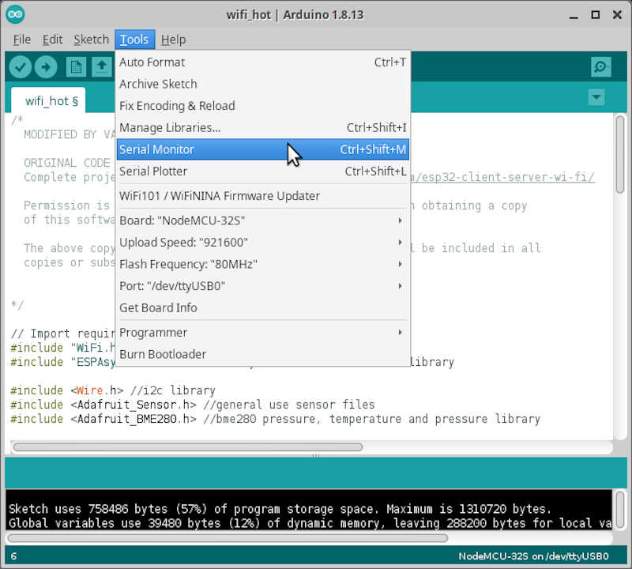

# 13. Network and communications

During this week I would like to tackle different networks and communication protocols, namely I²C (wired) and wi-fi and bluetooth (wireless). In the project development I'll be adding (hopefully!) LoRa to the group.

**Most importantly, I'm finally moving to Lisbon on the 3rd of May (Monday)!!!** So bare with me, this will be a very tight week.

**Unfortunately, due to time constrains I had to restrict myself to wireless communication via Wi-fi.**

Network science, according to Wikipedia, 

>is an academic field which studies complex networks such as telecommunication networks, computer networks, biological networks, cognitive and semantic networks, and social networks, considering distinct elements or actors represented by nodes (or vertices) and the connections between the elements or actors as links (or edges).

**In our case, we are interested in networks of embedded devices and how they communicate**. For practical reasons the communication will be restricted to, at most, three devices.

<!-- 
## I²C

I will start a networking demonstration by connecting two ESP32 devices using the I²C communications protocol. **Note that it is important that the devices share the same ground**. According to the [wikipedia](https://en.wikipedia.org/wiki/I%C2%B2C),

>I2C (Inter-Integrated Circuit), pronounced I-squared-C, is a synchronous, multi-master, multi-slave, packet switched, single-ended, serial communication bus >invented in 1982 by Philips Semiconductor (now NXP Semiconductors). It is widely used for attaching lower-speed peripheral ICs to processors and microcontrollers >in short-distance, intra-board communication.

***NPX Semiconductors? What a dreadful name!***

A schematic of an arbitrary I²C network is shown below

<!-- I2C_example -->

<!-- 
With I²C we can connect more than 100 devices at the same time, and allows one transmission per clock from ***teacher*** to ***student***. In my setup I will connect this ESP32 board I made this week (which I'll use to finish the input and output devices et al)

<!-- new board -->
<!-- 

with an ESP32 prototyping board.  
 -->

## Wi-fi

>Wi-fi is a family of wireless network protocols, based on the IEEE 802.11 family of standards, which are commonly used for local area networking of devices and Internet >access, allowing nearby digital devices to exchange data by radio waves. These are the most widely used computer networks in the world, used globally in home and >small office networks to link desktop and laptop computers, tablet computers, smartphones, smart TVs, printers, and smart speakers together and to a wireless >router to connect them to the Internet, and in wireless access points in public places like coffee shops, hotels, libraries and airports to provide the public >Internet access for mobile devices[^1].

[^1]: https://en.wikipedia.org/wiki/Wi-Fi

Here, I will setup an wi-fi hotspot with one ESP32 board which has a Temperature, Humidity and Pressure BME280 sensor attached to its I²C GPIOs. The other board, another ESP32 made by me will be configured as a wi-fi client and will show the received packages from the BME280 sensor through the serial output window and an SSD1306 OLED screen. 

**I chose this configuration because I will use both the sensor as the OLED screen in my project**. I closely followed the RandomNerd Tutorial [ESP32 Client-Server Wi-Fi Communication Between Two Boards](https://randomnerdtutorials.com/esp32-client-server-wi-fi/).

The following picture shows the general layout of my setup[^2]. 

<!-- RNlayout -->

[^2]: Adapted from [https://randomnerdtutorials.com/esp32-client-server-wi-fi/](https://randomnerdtutorials.com/esp32-client-server-wi-fi/)

* There are two ESP32 boards: one is the server, the other is the client
* On the server side a BME280 sensor is connected via I²S.
* On the client side an OLED screen is also connected via I²S and will show the information of the BME280 sensor sent by the ESP32 server.

The materials I used in this network are shown in the following picture

<!-- materials -->

### Prerequisites

Before beginning I need to install 2 libraries on arduino IDE which are not available through its library manager: 

* [ESPAsyncWebServer](https://github.com/me-no-dev/ESPAsyncWebServer) - The web server allows the ESP32 to create its own hotspot and connect and communicate to multiple devices.
* [AsyncTCP]() - This is an assyncronous [TCP](https://en.wikipedia.org/wiki/Transmission_Control_Protocol) library, enabling the use of a multi-connection network environment, using the TCP communication protocol.

**Note: to to this, it is better to download the zip file from github instead of cloning them, because arduino IDE prefers to integrate external libraries as zip files.**

After downloading both files, I opened Arduino IDE, went to ``Sketch/Include Library/Add ZIP Library`` drop-down menu and added both files, as shown in the picture below. You can always check if the libraries were properly installed in ``Tools/Manage Libraries...``.

<!-- ide1 -->
{: style="width:50%"}

I also need a few libraries that are available through the library manager:

* For the BME280 sensor
    * [Adafruit BME280 library](https://github.com/adafruit/Adafruit_BME280_Library)
    * [Adafruit unified sensor library](https://github.com/adafruit/Adafruit_Sensor)
* For the SSD1306 OLED screen
    * [Adafruit SSD1306](https://github.com/adafruit/Adafruit_SSD1306)
    * [Adafruit GFX Library](https://github.com/adafruit/Adafruit-GFX-Library)

To do this, I just need to access the drop-down menu ``Tools/Manage Libraries`` and search for each library.

Now that we are all set up we will proceed by programming the ESP32 Server and the ESP32 client boards.

### ESP32 Server

The server program will be hosted by the ESP32 prototyping board and will have a BME280 sensor connected to it which will measure temperature, humidity, and pressure, as shown in the picture below.

<!-- server_circuitv2 -->
{: style="width:100%"}

To program the server, I took the code from the mentioned Random Nerd page and modified it to suit my needs.

    /*
    MODIFIED BY VASCO NEVES 02/05/2021
    
    ORIGINAL CODE BY Rui Santos
    Complete project details at https://RandomNerdTutorials.com/esp32-client-server-wi-fi/
    
    Permission is hereby granted, free of charge, to any person obtaining a copy
    of this software and associated documentation files.
    
    The above copyright notice and this permission notice shall be included in all
    copies or substantial portions of the Software.

    
    */

    // Import required libraries
    #include "WiFi.h" // wi-fi libraries
    #include "ESPAsyncWebServer.h" //assyncronous communicacion library

    #include <Wire.h> //i2c library
    #include <Adafruit_Sensor.h> //general use sensor files
    #include <Adafruit_BME280.h> //bme280 pressure, temperature and pressure library

    // Set your access point network credentials
    const char* ssid = "ESP32-BME280-Hotspot";
    const char* password = "123456789";

    Adafruit_BME280 bme; // I2C mode for BME280

    // Create AsyncWebServer object on port 80
    AsyncWebServer server(80);

    String readTemp() { //function to read the temperature from the BME280 sensor
    return String(bme.readTemperature()); // return the temperature in ºC as a string
    //return String(1.8 * bme.readTemperature() + 32); //OPTIONAL: use this to convert ºC into farenheit degrees
    }

    String readHumi() { //function to read the relative humidity from the BME280 sensor
    return String(bme.readHumidity()); //return the relative humidity from the BME280 sensor as a string
    }

    String readPres() { //function to read the pressure from the BME280 sensor
    return String(bme.readPressure() / 100.0F); // Pressure in Pa converted to hPa - note that the 100.0F is to make sure the number is a float
    }

    void setup(){
    // Serial port for debugging purposes
    Serial.begin(115200);
    Serial.println();
    
    // Setting the ESP as an access point
    Serial.print("Setting AP (Access Point)…");
    // Remove the password parameter, if you want the AP (Access Point) to be open
    WiFi.softAP(ssid, password); //setting up the hotspot

    IPAddress IP = WiFi.softAPIP(); //will use the default IP for the hotspot: 192.168.4.1
    Serial.print("AP IP address: ");
    Serial.println(IP); //prints the IP Adress of the hotspot to the serial output

    server.on("/temperature", HTTP_GET, { //the server sends the temperature package as requested by clients
        request->send_P(200, "text/plain", readTemp().c_str());
    });
    server.on("/humidity", HTTP_GET, { //the server sends the humidity package as requested by clients
        request->send_P(200, "text/plain", readHumi().c_str());
    });
    server.on("/pressure", HTTP_GET, { // the server sends the temperature package as requested by clients
        request->send_P(200, "text/plain", readPres().c_str());
    });
    
    bool status;

    // default settings
    // (you can also pass in a Wire library object like &Wire2)
    status = bme.begin(0x76);  //if BME does not work check its address with program check_i2c_address - starts the
    if (!status) {
        Serial.println("Could not find a valid BME280 sensor, check wiring!");
        while (1); //creates an infinite loop, effectively STOPPING the program (but continues to waste energy...)
    }
    
    // Start server
    server.begin(); //stars the server. You don't need to place anything on the loop funcion. I used a few lines to print some diagnostics on the server side
    }
    
    void loop(){
    Serial.print("Server side temperature: ");
    Serial.println(bme.readTemperature());
    Serial.print("Server side humidity: ");
    Serial.println(bme.readHumidity());
    Serial.print("Server side pressure: ");
    Serial.println(bme.readPressure()/100); //convert from Pa to hPa
    delay(5000); //five second delay between each measurement

    
    }

**Let's analyse it by parts.**

#### Link section

In the link section we #include some libraries we need for the wi-fi and I²C communication, server set-up and sensor.

    // Import required libraries
    #include "WiFi.h" // wi-fi libraries
    #include "ESPAsyncWebServer.h" //assyncronous communicacion library

    #include <Wire.h> //i2c library
    #include <Adafruit_Sensor.h> //general use sensor files
    #include <Adafruit_BME280.h> //bme280 pressure, temperature and pressure library

#### Global declaration section

The global declaration section includes the configuration of the hotspot, the communication mode of the BME sensor (I²C or SPI), and which port the Server will use.

    // Set your access point network credentials
    const char* ssid = "ESP32-BME280-Hotspot";
    const char* password = "123456789";

    Adafruit_BME280 bme; // I2C mode for BME280

    // Create AsyncWebServer object on port 80
    AsyncWebServer server(80);

 It also contains three functions to read the Temperature, Humidity and Pressure from the sensor. It is using the bme.red* functions from the BME280 library to read the values.
 
    String readTemp() { //function to read the temperature from the BME280 sensor
    return String(bme.readTemperature()); // return the temperature in ºC as a string
    //return String(1.8 * bme.readTemperature() + 32); //OPTIONAL: use this to convert ºC into farenheit degrees
    }

    String readHumi() { //function to read the relative humidity from the BME280 sensor
    return String(bme.readHumidity()); //return the relative humidity from the BME280 sensor as a string
    }

    String readPres() { //function to read the pressure from the BME280 sensor
    return String(bme.readPressure() / 100.0F); // Pressure in Pa converted to hPa - note that the F in 100.0F is to make sure the number is a float
    }

#### Setup section

The setup section or function setups and starts the server:

Uses the serial port to print stuff on the screen

    void setup(){
    // Serial port for debugging purposes
    Serial.begin(115200);
    Serial.println();

Sets up the Wifi with ``Ẁifi-SoftAP``... 

    // Setting the ESP as an access point
    Serial.print("Setting AP (Access Point)…");
    // Remove the password parameter, if you want the AP (Access Point) to be open
    WiFi.softAP(ssid, password); //setting up the hotspot

...and its IP Adress that will be the default 192.168.4.1.

    IPAddress IP = WiFi.softAPIP(); //will use the default IP for the hotspot: 192.168.4.1
    Serial.print("AP IP address: ");
    Serial.println(IP); //prints the IP Adress of the hotspot to the serial output

Configures three server sends on request:

--> sends the temperature to the clients from 192.168.4.1/temperature 
    

    server.on("/temperature", HTTP_GET, { //the server sends the temperature package as requested by clients
        request->send_P(200, "text/plain", readTemp().c_str());
    });
    
--> sends the humidity to the clients from 192.168.4.1/humidity
    
    
    server.on("/humidity", HTTP_GET, { //the server sends the humidity package as requested by clients
        request->send_P(200, "text/plain", readHumi().c_str());
    });

--> sends the pressure to the clients from 192.168.4.1/pressure

    server.on("/pressure", HTTP_GET, { // the server sends the temperature package as requested by clients
        request->send_P(200, "text/plain", readPres().c_str());
    });
    
Starts the BME280 sensor with ``bme.begin(0x76)``, where the 0x76 is the I²C address of the sensor. If the sensor is not there (checked with the boolean variable ``status``), it begins an infinite loop and stops the program (``while(1)``).

    bool status;

    // default settings
    // (you can also pass in a Wire library object like &Wire2)
    status = bme.begin(0x76);  //if BME does not work check its address with program check_i2c_address - starts the
    if (!status) {
        Serial.println("Could not find a valid BME280 sensor, check wiring!");
        while (1); //creates an infinite loop, effectively STOPPING the program (but continues to waste energy...)
    }

Finally it starts the server. Nothing more is needed here.

    // Start server
    server.begin(); //stars the server. You don't need to place anything on the loop funcion. I used a few lines to print some diagnostics on the server side
    }

#### The main program

**These lines are not necessary, they are here purely for diagnostic purposes. They print on the screen the values from the sensor every five seconds.**

    void loop(){
    Serial.print("Server side temperature: ");
    Serial.println(bme.readTemperature());
    Serial.print("Server side humidity: ");
    Serial.println(bme.readHumidity());
    Serial.print("Server side pressure: ");
    Serial.println(bme.readPressure()/100); //convert from Pa to hPa
    delay(5000); //five second delay between each measurement

#### Testing the server

To test the server, I uploaded the program to the prototyping board and went to ``Tools/Serial Monitor`` on the Arduino IDE program.

<!-- server_monitor 1 -->
{: style="width:50%"}

In the picture we can observe the Hotspot is up and running @ 192.168.4.1.

<!-- server_monitor_2 -->
{: style="width:100%"}

**To access it as a client** I went to my computer's wifi network selector and chose the ESP32-BME280-Hotspot.

<!-- server_connect -->
{: style="width:25%"}

Then I went to the browser and typed 

    192.168.4.1/temperature
    192.168.4.1/humidity
    192.168.4.1/pressure

And obtained the following results.

<!-- server_temp server_humidity server_pressure-->
{: style="width:25%"}
{: style="width:25%"}
{: style="width:25%"}

**Seems that everything is running well on the server side!** Now I will move the the client side.

### ESP32 Client

The ESP32 Client is connected to an OLED SSD1306 as shown in the pictures below.

<!--client_1  -->
<!--client_2  -->
{: style="width:50%"}
{: style="width:50%"}

The loaded program is detailed below

    /*
    MODIFIED BY VASCO NEVES AT 02/05/2021
    Rui Santos
    Complete project details at https://RandomNerdTutorials.com/esp32-client-server-wi-fi/
    
    Permission is hereby granted, free of charge, to any person obtaining a copy
    of this software and associated documentation files.
    
    The above copyright notice and this permission notice shall be included in all
    copies or substantial portions of the Software.
    */

    #include <WiFi.h>
    #include <HTTPClient.h>
    #include <Wire.h>
    #include <Adafruit_GFX.h>
    #include <Adafruit_SSD1306.h>

    const char* ssid = "ESP32-BME280-Hotspot";
    const char* password = "123456789";

    //Your IP address or domain name with URL path
    const char* serverNameTemp = "http://192.168.4.1/temperature";
    const char* serverNameHumi = "http://192.168.4.1/humidity";
    const char* serverNamePres = "http://192.168.4.1/pressure";

    #define SCREEN_WIDTH 128 // OLED display width, in pixels
    #define SCREEN_HEIGHT 64 // OLED display height, in pixels

    // Declaration for an SSD1306 display connected to I2C (SDA, SCL pins)
    #define OLED_RESET     -1 // Reset pin # (or -1 if sharing Arduino reset pin)
    Adafruit_SSD1306 display(SCREEN_WIDTH, SCREEN_HEIGHT, &Wire, OLED_RESET);

    String temperature;
    String humidity;
    String pressure;

    unsigned long previousMillis = 0;
    const long interval = 5000; 

    void setup() {
    Wire.setPins(14,27); //setting the proper pins for i2c on the client board
    Wire.begin();
    Serial.begin(115200);
    
    // Address 0x3C for 128x64, you might need to change this value (use an I2C scanner)
    if(!display.begin(SSD1306_SWITCHCAPVCC, 0x3C)) { // in this case the address is  0x3C
        Serial.println(F("SSD1306 allocation failed.STOP"));
        for(;;); // Don't proceed, loop forever STOP
    }
    display.clearDisplay();
    display.setTextColor(WHITE);
    
    WiFi.begin(ssid, password);
    Serial.println("Connecting");
    while(WiFi.status() != WL_CONNECTED) { 
        delay(500);
        Serial.print(".");
    }
    Serial.println("");
    Serial.print("Connected to WiFi network with IP Address: ");
    Serial.println(WiFi.localIP());
    }

    void loop() {
    unsigned long currentMillis = millis();
    
    if(currentMillis - previousMillis >= interval) {
        // Check WiFi connection status
        if(WiFi.status()== WL_CONNECTED ){ 
        temperature = httpGETRequest(serverNameTemp);
        humidity = httpGETRequest(serverNameHumi);
        pressure = httpGETRequest(serverNamePres);
        Serial.println("Temperature: " + temperature + " *C - Humidity: " + humidity + " % - Pressure: " + pressure + " hPa");
        
        display.clearDisplay();
        
        // display temperature
        display.setTextSize(2);
        display.setTextColor(WHITE);
        display.setCursor(0,0);
        display.print("T: ");
        display.print(temperature);
        display.print(" ");
        display.setTextSize(1);
        display.cp437(true);
        display.write(248);
        display.setTextSize(2);
        display.print("C");
        
        // display humidity
        display.setTextSize(2);
        display.setCursor(0, 25);
        display.print("H: ");
        display.print(humidity);
        display.print(" %"); 
        
        // display pressure
        display.setTextSize(2);
        display.setCursor(0, 50);
        display.print("P:");
        display.print(pressure);
        display.setTextSize(1);
        display.setCursor(110, 56);
        display.print("hPa");
            
        display.display();
        
        // save the last HTTP GET Request
        previousMillis = currentMillis;
        }
        else {
        Serial.println("WiFi Disconnected");
        }
    }
    }

    String httpGETRequest(const char* serverName) { //function to obtain tcp information from X server
    HTTPClient http;
        
    // Your IP address with path or Domain name with URL path
    http.begin(serverName);
    
    // Send HTTP GET request
    int httpResponseCode = http.GET();
    
    String payload = "--"; 
    
    if (httpResponseCode>0) {
        Serial.print("HTTP Response code from ");
        Serial.print(serverName);
        Serial.print(" :");
        Serial.println(httpResponseCode);
        payload = http.getString();
    }
    else {
        Serial.print("Error code: ");
        Serial.println(httpResponseCode);
    }
    // Free resources
    http.end();

    return payload;
    }

**Let's look at the details now**

#### Link section

In the link section I included the Wi-fi, HTTP client, and the I²C libraries. I also included the necessary Adafruit libraries for use the OLED display.

    #include <WiFi.h>
    #include <HTTPClient.h>
    #include <Wire.h>
    #include <Adafruit_GFX.h>
    #include <Adafruit_SSD1306.h>

#### Global declaration section

Here I declared the correct configuration to access the other board's hotspot,

   const char* ssid = "ESP32-BME280-Hotspot";
    const char* password = "123456789";

as well as the HTTP addresses of the data for temperature, humidity, and pressure.

    //Your IP address or domain name with URL path
    const char* serverNameTemp = "http://192.168.4.1/temperature";
    const char* serverNameHumi = "http://192.168.4.1/humidity";
    const char* serverNamePres = "http://192.168.4.1/pressure";

Here I defined the display width and length as well as its configuration with the command ``Adafruit_SSD1306 display()``.

    #define SCREEN_WIDTH 128 // OLED display width, in pixels
    #define SCREEN_HEIGHT 64 // OLED display height, in pixels

    // Declaration for an SSD1306 display connected to I2C (SDA, SCL pins)
    #define OLED_RESET     -1 // Reset pin # (or -1 if sharing Arduino reset pin)
    Adafruit_SSD1306 display(SCREEN_WIDTH, SCREEN_HEIGHT, &Wire, OLED_RESET);

The variables are defined as strings here, because they will be sent as string type.

    String temperature;
    String humidity;
    String pressure;

These two variables are used in the setup section to control the length of time between each measurement (in this case, 5 seconds).

    unsigned long previousMillis = 0;
    const long interval = 5000; 

#### Setup section

Here I start by defining custom pins for my board, GPIO14 for SDA and GPIO27 for SCL, using the command ``Wire.setPins(14,27)``.

I also initialize the I²C communication (``Wire.begin()``) and the Serial to the screen (``Serial.begin(115200)``).

    void setup() {
    Wire.setPins(14,27); //setting the proper pins for i2c on the client board
    Wire.begin();
    Serial.begin(115200);

Here I check if we have a good connection to the display. If the cables are disconnected or the address is incorrect, the program will stop with an infinite loop.

    // Address 0x3C for 128x64, you might need to change this value (use an I2C scanner)
    if(!display.begin(SSD1306_SWITCHCAPVCC, 0x3C)) { // in this case the address is  0x3C
        Serial.println(F("SSD1306 allocation failed.STOP"));
        for(;;); // Don't proceed, loop forever STOP
    }

In these two lines we configure the display.

    display.clearDisplay();
    display.setTextColor(WHITE);

The wifi is started here with the proper ssid and password, define above. **If the connection is sucessful, the client will display on the serial monitor the IP of the server.**

    WiFi.begin(ssid, password);
    Serial.println("Connecting");
    while(WiFi.status() != WL_CONNECTED) { 
        delay(500);
        Serial.print(".");
    }
    Serial.println("");
    Serial.print("Connected to WiFi network with IP Address: ");
    Serial.println(WiFi.localIP());
    }

#### The main program

In the main program we use the variables ``currentMillis``, ``previousMilllis``, and ``interval`` to set the time interval between each measurement constant (at 5 seconds in this case). 

The command [``millis()``](https://www.arduino.cc/reference/en/language/functions/time/millis/) is used to get the number of milliseconds that passed since the program began. **NOTE: This number will overflow in ~ 50 days!**

    void loop() {
    unsigned long currentMillis = millis();
    
    if(currentMillis - previousMillis >= interval) {
        // Check WiFi connection status

Here it will make a ``httpGETRequest()`` for the three variables if the Wifi is connected, and prints the results on the serial monitor.

        if(WiFi.status()== WL_CONNECTED ){ 
        temperature = httpGETRequest(serverNameTemp);
        humidity = httpGETRequest(serverNameHumi);
        pressure = httpGETRequest(serverNamePres);
        Serial.println("Temperature: " + temperature + " *C - Humidity: " + humidity + " % - Pressure: " + pressure + " hPa");

The OLED display information is contructed here. 

* The command ``display.setTextSize()`` defines the size of the text.
* The command ``display.setCursor()`` positions the cursor on the 128x64 pixel grid.
* The command ``display.print()`` prints the text.
* The command ``display.cp437(true)`` enables the use of [ASCII Code Page 437 font](https://www.ascii-codes.com/). We need it to display the degree symbol (code number 248 used in the next line, ``display.write(248)``.
* Finally to display everything we write ``display.display()``.

        display.clearDisplay();
        
        // display temperature
        display.setTextSize(2);
        display.setTextColor(WHITE);
        display.setCursor(0,0);
        display.print("T: ");
        display.print(temperature);
        display.print(" ");
        display.setTextSize(1);
        display.cp437(true);
        display.write(248);
        display.setTextSize(2);
        display.print("C");
        
        // display humidity
        display.setTextSize(2);
        display.setCursor(0, 25);
        display.print("H: ");
        display.print(humidity);
        display.print(" %"); 
        
        // display pressure
        display.setTextSize(2);
        display.setCursor(0, 50);
        display.print("P:");
        display.print(pressure);
        display.setTextSize(1);
        display.setCursor(110, 56);
        display.print("hPa");
            
        display.display();
        
        // save the last HTTP GET Request
        previousMillis = currentMillis;
        }
        else {
        Serial.println("WiFi Disconnected");
        }
    }
    }

#### The subprogram section

Last but now least there is an important function at the end of the code. It is the function used in the previous lines of code to request the packages. It is called using ``httpGETRequest(serverName`` where serverName is a type character variable. 

    String httpGETRequest(const char* serverName) { //function to obtain tcp information from X server
    HTTPClient http;

Here it starts the connection to the server...

    // Your IP address with path or Domain name with URL path
    http.begin(serverName);

...and declares a variable to store the [GET request](https://en.wikipedia.org/wiki/Hypertext_Transfer_Protocol#Request_methods)

    // Send HTTP GET request
    int httpResponseCode = http.GET();

The `String payload` variable is here defined as "--" and appears only if it gets no value from the server.

    String payload = "--";

The if conditions waits for a positive [HTTP code](https://en.wikipedia.org/wiki/List_of_HTTP_status_codes), hopefully 200, which means the operation was successfull. 

It prints on the serial monitor the code number and then saves the obtained string in the ``payload`` variable, which will be the function's output. Else, it outputs an error code.

    if (httpResponseCode>0) {
        Serial.print("HTTP Response code from ");
        Serial.print(serverName);
        Serial.print(" :");
        Serial.println(httpResponseCode);
        payload = http.getString();
    }
    else {
        Serial.print("Error code: ");
        Serial.println(httpResponseCode);
    }
    // Free resources
    http.end();

    return payload;
    }

The full setup looks like this.

<!--full setup v2  -->

The following video shows the whole system working, showing sequentially the BME280 sensor, the server board, the client board, the OLED display and finally the serial monitor output from both boards. **In the last seconds of the video, the system monitor on the upper window is the server and on the lower window is the client**.

<!-- video -->
<video class="center" width="800" controls>
  <source src="../../files/week13/wifi_network.m4v" type="video/mp4">
Your browser does not support the video tag.
</video>

# References

* [Random Nerd Tutorials](https://randomnerdtutorials.com/)
* [Wikipedia](https://en.wikipedia.org/)

# Files

