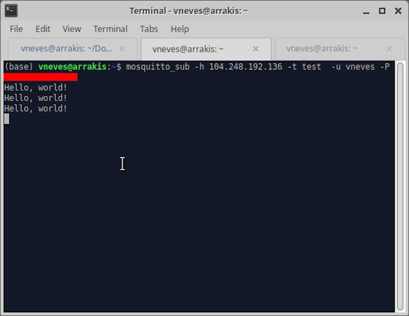
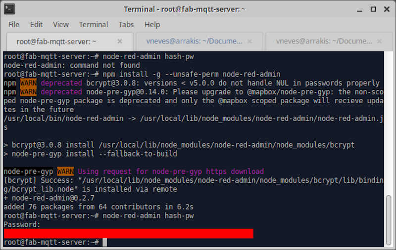
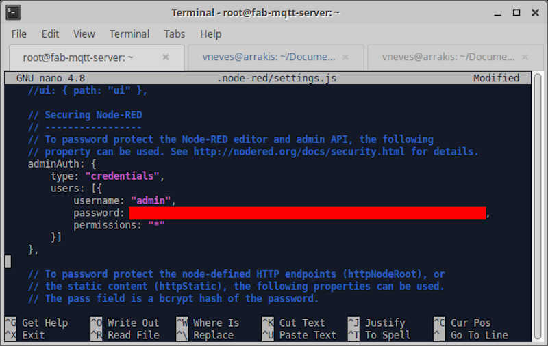
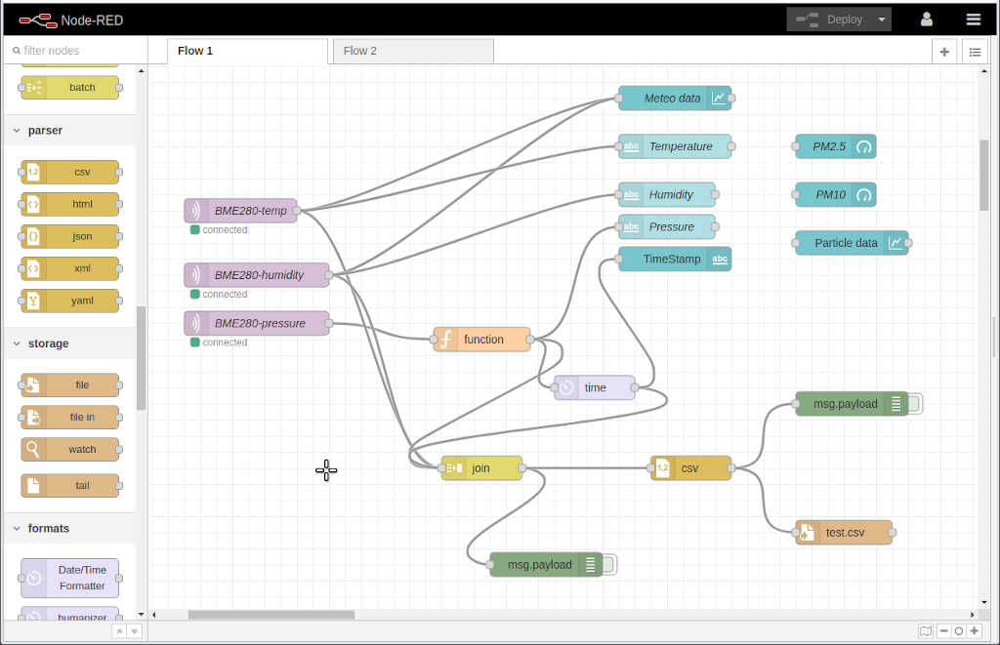
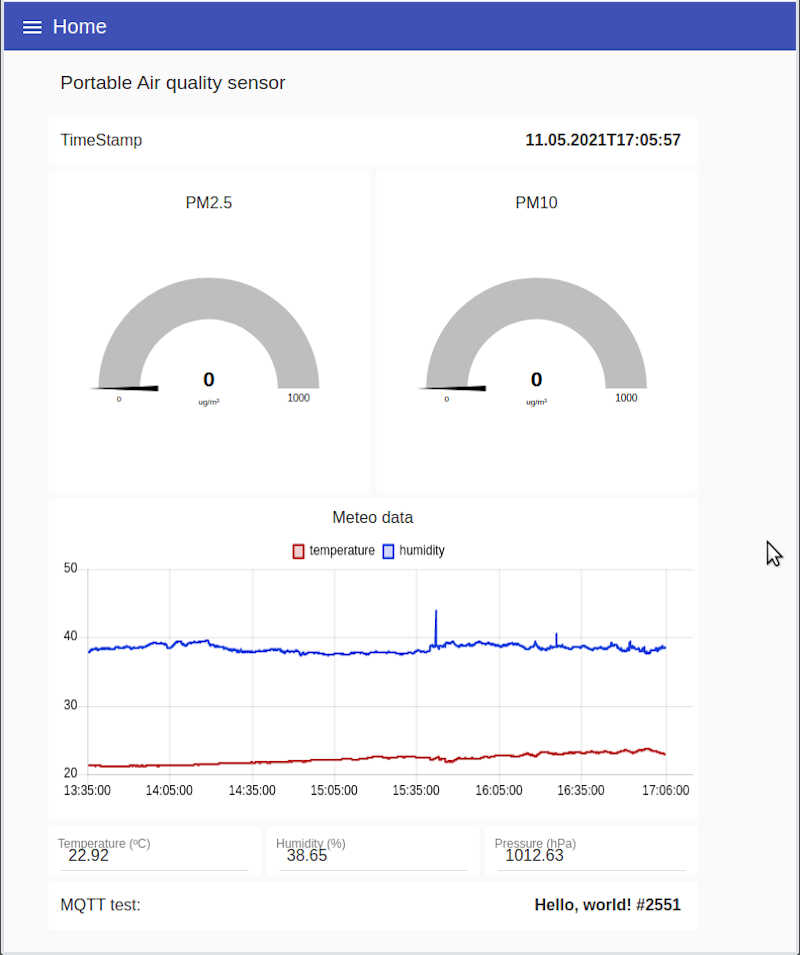

# 14. Interface and Application Programming

## Assignments

* individual assignment:
    * write an application that interfaces a user with an input &/or output device that you made
* group assignment:
      * compare as many tool options as possible

To this assignment I will continue to do a direct applications towards my final project. In that regard, I will use the devices from previous weeks and implement the following:

* Use MQTT as a device interface protocol
* Create an [MQTT broker](https://en.wikipedia.org/wiki/MQTT#MQTT_broker) and use Node-RED to program it
* Create a [Node-RED](https://nodered.org/) dashboard with (almost) everything I need for the final project

## MQTT

MQTT is an acronym of **M**essage **Q**ueuing **T**elemetry **T**ransport. According to [mqtt.org](https://mqtt.org/), 

>MQTT is an OASIS standard messaging protocol for the [Internet of Things](https://en.wikipedia.org/wiki/Internet_of_things) (IoT). It is designed as an extremely lightweight publish/subscribe messaging transport that is ideal for connecting remote devices with a small code footprint and minimal network bandwidth. MQTT today is used in a wide variety of industries, such as automotive, manufacturing, telecommunications, oil and gas, etc.

Here, I will use MQTT to transmit the sensors information to an internet connected MQTT broker and from there to any client requesting the data on the internet. The MQTT broker will be controlled by Node-RED.

The MQTT 5.0 specifications can be accessed on this [page](https://docs.oasis-open.org/mqtt/mqtt/v5.0/mqtt-v5.0.html).

## MQTT Broker

The MQTT Broker is a program installed locally or in the cloud and 

>acts as a post office. MQTT doesn't use the address of the intended recipient but uses the subject line called “Topic”, and anyone who wants a copy of that message will subscribe to that topic. Multiple clients can receive the message from a single broker (one to many capability). Similarly, multiple publishers can publish topics to a single subscriber (many to one).[^1]

[^1]: citation taken from [https://en.wikipedia.org/wiki/MQTT#MQTT_broker](https://en.wikipedia.org/wiki/MQTT#MQTT_broker).

The following Figure[^2] illustrates how a typical broker works

<!-- broker1 -->
 <!-- {: style="width:100%"} -->

[^2]: Picture taken from [https://randomnerdtutorials.com/cloud-mqtt-mosquitto-broker-access-anywhere-digital-ocean/](https://randomnerdtutorials.com/cloud-mqtt-mosquitto-broker-access-anywhere-digital-ocean/)

Each client can both produce and receive data by both publishing and subscribing. MQTT is therefore bi-directional. 

According to the MQTT broker Wikipedia page mentioned above, the main advantages of the MQTT broker are:

1. The elimination of vulnerable and insecure client connections.
2. Easy scalability from a single device to thousands.
3. Manages and tracks all client connection states, including security credentials and certificates.
4. Reduces network strain without compromising the security (cellular or satellite network).

### MQTT Mosquitto Broker

I will use the open source [MQTT Mosquitto Broker](https://mosquitto.org/) as a cloud server acting between the sensor boards and the clients.

I will now detail here the steps to install it on the virtual machine I created in [Digital Ocean](https://www.digitalocean.com/?refcode=e8a7842ff717), where I set up a Ubuntu 20.04 virtual machine. To that end, I followed (again) a [Random Nerd Tutorial](https://randomnerdtutorials.com/cloud-mqtt-mosquitto-broker-access-anywhere-digital-ocean/) that addresses exactly this topic. 

The great advantage of using a Cloud MQTT broker is that you can have several IoT devices communication with each other via MQTT on completely different networks. The following Figure[^2] illustrates well that advantage.

<!-- broker2 -->

After creating and configuring an account on Digital Ocean (I will leave those details for you, reader, to find out ;) ) I first accessed the console of my virtual machine.

<!-- broker3 -->
{: style="width:100%"}

Then, I inserted root as login and its password. Now I am ready to install Mosquitto.

<!-- broker4 -->

Before installing it, it is wise to run this command to update and upgrade your server

    sudo apt update && sudo apt upgrade -y

To install Mosquitto just write this code on the console

    sudo apt install mosquitto mosquitto-clients -y

#### Testing the Mosquitto broker

To test the broker I used the ``ssh`` command on the terminal. 

First we need a **publisher**, then a **subscriber**. The publisher will be created on the server, the subscriber will be my local computer.

To publish, I first login into the server using ssh. The IP number is the server's.

    ssh root@104.248.192.136

<!-- broker5 -->
{: style="width:50%"}

Then, I used the command `mosquitto_sub` to tell mosquitto on my local computer to listen to incoming packets from the server (`-h`) on the topic 'test' (`-t`).

    mosquitto_sub -h 104.248.192.136 -t test

Afterwards, I used the command `mosquito_pub` to publish something (`-m`) on the server (being inside the server that is).

    mosquitto_pub -h localhost -t test -m "Hello, world!"

This way, mosquitto is publishing the message **"Hello, world!"** at the localhost (-h) with the topic (-t) test. The packets are accessed by topic, so when subscribing you need to make it explicitly. I also added the key `-d` to see more information regarding what is going on under the hood. 

So I published the message 'Hello World!' three times on the server and my computer received it three times as well, as observed in the following pictures. The upper terminal shows the host computer, and the lower terminal shows the local client.

<!-- broker6 -->
<!-- broker7 -->
{: style="width:50%"}
{: style="width:50%"}

#### Protecting the MQTT Broker

At this time **anyone** on the internet that knows the MQTT broker IP can publish and subscribe to any of my topics!

In order to protect the broker I needed to add a password by typing the following command on the server side.

    sudo mosquitto_passwd -c /etc/mosquitto/passwd YOUR_USERNAME

After setting up the password, I needed to create or make changes on the **default.conf** file as shown 

    sudo nano /etc/mosquitto/conf.d/default.conf

After being inside this file I added the following two lines

    allow_anonymous false
    password_file /etc/mosquitto/passwd

and saved the file.

Now I need to restart the broker. To do that I wrote the following line on the server

    sudo systemctl restart mosquitto

Let's now try the previous command and publish a new message. Can we do it?

    mosquitto_pub -h localhost -t test -m "Hello, world!"

No! As seen in the following picture, there is now a connection error.

<!-- broker 8 -->
{: style="width:50%"}

To use it again we need to add `-u` and `-P` arguments (username and password respectively) to the mosquitto_pub and mosquitto_sub commands.

In my case, I will subscribe in my local computer using this command line

    mosquitto_sub -h localhost -t test -u vneves -P MY_PASSWORD

And I will publish on the cloud server with 

    mosquitto_pub -h localhost -t test -m "Hello, world!" -u vneves -P MY_PASSWORD

The following pictures show respectively the subscribe and the publish side.

<!-- broker 9 -->
<!-- broker 10 -->
{: style="width:50%"}
{: style="width:50%"}

### Connecting an ESP32 board to the MQTT Mosquitto broker

#### Prerequisites

As usual there are some stuff that needs to be done before start programming. 

I'm here assuming that the ESP32 libraries are already installed. If not please check a tutorial e.g. [Installing the ESP32 Board in Arduino IDE (Windows, Mac OS X, Linux)](https://randomnerdtutorials.com/installing-the-esp32-board-in-arduino-ide-windows-instructions/).

After installing the ESP32 libraries, I needed to install the [Async MQTT client library](https://github.com/marvinroger/async-mqtt-client) and the [Async TCP Library](https://github.com/me-no-dev/AsyncTCP). 

First, I went to `Arduino/libraries` using the terminal and executed 

    git clone https://github.com/marvinroger/async-mqtt-client.git

to install the Async MQTT client library.

and 

    git clone https://github.com/me-no-dev/AsyncTCP.git

to install the Async TCP Library. After restarting the IDE, the libraries are now accessible and can be checked in `Tools/Manage Libraries...`.

The next step was to load this code to the ESP32 board I fabricated in a previous week. The original code is from the Random Nerd Tutorials page already mentioned here.

    /*
    MODIFIED BY VASCO NEVES @ 09/05/2021
    
    Rui Santos
    Complete project details at https://RandomNerdTutorials.com/cloud-mqtt-mosquitto-broker-access-anywhere-digital-ocean/
    
    Permission is hereby granted, free of charge, to any person obtaining a copy
    of this software and associated documentation files.
    
    The above copyright notice and this permission notice shall be included in all
    copies or substantial portions of the Software.
    */

    #include <WiFi.h>
    extern "C" {
    #include "freertos/FreeRTOS.h" //including h files from the ESP32 library
    #include "freertos/timers.h"   //
    }
    #include <AsyncMqttClient.h>

    #define WIFI_SSID "YOUR LOCAL WIFI" //local WIFI SSID
    #define WIFI_PASSWORD "YOUR LOCAL WIFI PASSWORD" //local WIFI PASSWORD

    // Digital Ocean MQTT Mosquitto Broker
    #define MQTT_HOST IPAddress(104, 248, 192, 136) //MQTT IP
    // For a cloud MQTT broker, type the domain name
    //#define MQTT_HOST "example.com"
    #define MQTT_PORT 1883 // using the default port 1883

    #define MQTT_USERNAME "USERNAME"
    #define MQTT_PASSWORD "PASSWORD"

    // Test MQTT Topic
    #define MQTT_PUB_TEST "test"

    AsyncMqttClient mqttClient; //Declaring the AsyncMqttClient as mqttclient
    TimerHandle_t mqttReconnectTimer; //Timer handles for the mqtt and wifi reconnection
    TimerHandle_t wifiReconnectTimer;

    unsigned long previousMillis = 0;   // Stores last time information was published
    const long interval = 5000;         // Interval at which to publish information

    int i = 0; //declration of a counter for the number of published packets

    // subfunctions
    //function to connecto to the wifi network
    void connectToWifi() {
    Serial.println("Connecting to Wi-Fi...");
    WiFi.begin(WIFI_SSID, WIFI_PASSWORD);
    }
    //function to connect to the MQTT server
    void connectToMqtt() {
    Serial.println("Connecting to MQTT...");
    mqttClient.connect();
    }
    //function to flag WiFi encoded events from 0 to 25 (check text)
    void WiFiEvent(WiFiEvent_t event) {
    Serial.printf("[WiFi-event] event: %d\n", event);
    switch(event) { //switch...case control structure
        case SYSTEM_EVENT_STA_GOT_IP: //this is event 7
        Serial.println("WiFi connected");
        Serial.println("IP address: ");
        Serial.println(WiFi.localIP());
        connectToMqtt();
        break;
        case SYSTEM_EVENT_STA_DISCONNECTED: //this is event 5
        Serial.println("WiFi lost connection");
        xTimerStop(mqttReconnectTimer, 0); // ensure we don't reconnect to MQTT while reconnecting to Wi-Fi
        xTimerStart(wifiReconnectTimer, 0);
        break;
    }
    }

    void onMqttConnect(bool sessionPresent) {
    Serial.println("Connected to MQTT.");
    Serial.print("Session present: ");
    Serial.println(sessionPresent);
    }

    void onMqttDisconnect(AsyncMqttClientDisconnectReason reason) {
    Serial.println("Disconnected from MQTT.");
    if (WiFi.isConnected()) {
        xTimerStart(mqttReconnectTimer, 0);
    }
    }

    /*void onMqttSubscribe(uint16_t packetId, uint8_t qos) {
    Serial.println("Subscribe acknowledged.");
    Serial.print("  packetId: ");
    Serial.println(packetId);
    Serial.print("  qos: ");
    Serial.println(qos);
    }
    void onMqttUnsubscribe(uint16_t packetId) {
    Serial.println("Unsubscribe acknowledged.");
    Serial.print("  packetId: ");
    Serial.println(packetId);
    }*/

    void onMqttPublish(uint16_t packetId) {
    Serial.print("Publish acknowledged.");
    Serial.print("  packetId: ");
    Serial.println(packetId);
    }

    void setup() {
    Serial.begin(115200);
    Serial.println();

    mqttReconnectTimer = xTimerCreate("mqttTimer", pdMS_TO_TICKS(2000), pdFALSE, (void*)0, reinterpret_cast<TimerCallbackFunction_t>(connectToMqtt)); //xtimercreate is a function from the freeRTOS library
    wifiReconnectTimer = xTimerCreate("wifiTimer", pdMS_TO_TICKS(2000), pdFALSE, (void*)0, reinterpret_cast<TimerCallbackFunction_t>(connectToWifi)); //check the main text

    WiFi.onEvent(WiFiEvent); //if there is a Wi-fi event the program automatically calls the function WifiEvent. This has global reach.

    mqttClient.onConnect(onMqttConnect); //the function onMqttConnect is called if there is an MQTT connection
    mqttClient.onDisconnect(onMqttDisconnect); //the function onMqttDisconnect is called if there is an MQTT disconnecton
    /*mqttClient.onSubscribe(onMqttSubscribe); //these two lines are only used if the ESP32 is going to subscribe as well as to publish
    mqttClient.onUnsubscribe(onMqttUnsubscribe);*/
    mqttClient.onPublish(onMqttPublish);
    mqttClient.setServer(MQTT_HOST, MQTT_PORT); //MTTT server configuration
    // If your broker requires authentication (username and password), set them below
    mqttClient.setCredentials(MQTT_USERNAME, MQTT_PASSWORD); 
    connectToWifi(); //The wifi connection is established (or not)
    }

    void loop() {
    unsigned long currentMillis = millis();
    // Every X number of seconds (interval = 5 seconds) 
    // it publishes a new MQTT message
    if (currentMillis - previousMillis >= interval) {
        // Save the last time a new reading was published
        previousMillis = currentMillis;
        
        String testString = "Hello, world! #" + String(i);
        // Publish an MQTT message on topic test
        uint16_t packetIdPub1 = mqttClient.publish(MQTT_PUB_TEST, 1, true, String(testString).c_str());                            
        Serial.printf("Publishing on topic %s at QoS 1, packetId: %i", MQTT_PUB_TEST, packetIdPub1);
        Serial.print(" Message: ");
        Serial.println(testString);
        i++;
    }
    }

I will explain each part now. 

#### Link section

    #include <WiFi.h>
    extern "C" {
    #include "freertos/FreeRTOS.h" //including h files from the ESP32 library
    #include "freertos/timers.h"   
    }
    #include <AsyncMqttClient.h>

 * The Wifi.h is the ESP32 Wifi library.
 * The two freeRTOS files are part of the ESP32 library for Arduino IDE. [FreeRTOS](https://www.freertos.org/) is a real time operating system for microcontrollers.
 * The AsyncMqttClient.h is the Async MQTT client library.

#### Global declaration section

Here I declare and prepare the definitions for the configuration of the Wi-Fi and MQTT.

    #define WIFI_SSID "ASK4 WiFi" //local WIFI SSID
    #define WIFI_PASSWORD "" //local WIFI PASSWORD

    // Digital Ocean MQTT Mosquitto Broker
    #define MQTT_HOST IPAddress(104, 248, 192, 136) //MQTT IP
    // For a cloud MQTT broker, type the domain name
    //#define MQTT_HOST "example.com"
    #define MQTT_PORT 1883 // using the default port 1883

    #define MQTT_USERNAME "vneves"
    #define MQTT_PASSWORD "the_password_is_hidden!"

    // Test MQTT Topic
    #define MQTT_PUB_TEST "test" //this will be the publishing topic

    AsyncMqttClient mqttClient; //Declaring the AsyncMqttClient as mqttclient
    TimerHandle_t mqttReconnectTimer; //Timer handles for the mqtt and wifi reconnection
    TimerHandle_t wifiReconnectTimer;

    unsigned long previousMillis = 0;   // Stores last time information was published
    const long interval = 5000;         // Interval at which to publish information

    int i = 0; //declration of a counter for the number of published packets

There are also eight functions in this section, as described on the comments inside the code.

The functions **onMqttsubscribe** and **onMqttunsubscribe** are commented because, at this time, our ESP32 board will only publish, not subscribe anything. The function's use will be detailed further on. 

    // subfunctions
    //function to connecto to the wifi network
    void connectToWifi() {
    Serial.println("Connecting to Wi-Fi...");
    WiFi.begin(WIFI_SSID, WIFI_PASSWORD);
    }
    //function to connect to the MQTT server
    void connectToMqtt() {
    Serial.println("Connecting to MQTT...");
    mqttClient.connect();
    }
    //function to flag WiFi encoded events from 0 to 25 (check text)
    void WiFiEvent(WiFiEvent_t event) {
    Serial.printf("[WiFi-event] event: %d\n", event);
    switch(event) { //switch...case control structure
        case SYSTEM_EVENT_STA_GOT_IP: //this is event 7
        Serial.println("WiFi connected");
        Serial.println("IP address: ");
        Serial.println(WiFi.localIP());
        connectToMqtt();
        break;
        case SYSTEM_EVENT_STA_DISCONNECTED: //this is event 5
        Serial.println("WiFi lost connection");
        xTimerStop(mqttReconnectTimer, 0); // ensure we don't reconnect to MQTT while reconnecting to Wi-Fi
        xTimerStart(wifiReconnectTimer, 0);
        break;
    }
    }

    void onMqttConnect(bool sessionPresent) {
    Serial.println("Connected to MQTT.");
    Serial.print("Session present: ");
    Serial.println(sessionPresent);
    }

    void onMqttDisconnect(AsyncMqttClientDisconnectReason reason) {
    Serial.println("Disconnected from MQTT.");
    if (WiFi.isConnected()) {
        xTimerStart(mqttReconnectTimer, 0);
    }
    }

    /*void onMqttSubscribe(uint16_t packetId, uint8_t qos) {
    Serial.println("Subscribe acknowledged.");
    Serial.print("  packetId: ");
    Serial.println(packetId);
    Serial.print("  qos: ");
    Serial.println(qos);
    }
    void onMqttUnsubscribe(uint16_t packetId) {
    Serial.println("Unsubscribe acknowledged.");
    Serial.print("  packetId: ");
    Serial.println(packetId);
    }*/

    void onMqttPublish(uint16_t packetId) {
    Serial.print("Publish acknowledged.");
    Serial.print("  packetId: ");
    Serial.println(packetId);
    }

#### The Setup Section

In the setup section, the code begins by initiating the serial output to the screen.

    void setup() {
    Serial.begin(115200);
    Serial.println();

These two timers are from the freeRTOS library and are used to try to reconnect to the MQTT server and the wifi respectively, when a certain amount of time (in this case 2000 milliseconds) passes. This timer will only happen at the beginning and then stops. It can be restarted when called (in this case inside the function **WifiEvent**).

    mqttReconnectTimer = xTimerCreate("mqttTimer", pdMS_TO_TICKS(2000), pdFALSE, (void*)0, reinterpret_cast<TimerCallbackFunction_t>(connectToMqtt)); //xtimercreate is a function from the freeRTOS library
    wifiReconnectTimer = xTimerCreate("wifiTimer", pdMS_TO_TICKS(2000), pdFALSE, (void*)0, reinterpret_cast<TimerCallbackFunction_t>(connectToWifi)); //check the main text

The function **Wifi.onEvent** is **very important**. It is called in the setup section, but will always be ready to be activated in case there is a **Wi-Fi event**, where it will call the function **WifiEvent**. In the case the event is **7** or **5** (SYSTEM_EVENT_WIFI_STA_GOT_IP or SYSTEM_EVENT_WIFI_STA_DISCONNECTED respectively) it will execute the code for both **cases**. In the case the ESP32 got an IP it will print a message on the screen and try to connect to MQTT. Otherwise, it will try to reconnect to the Wi-Fi, but resets the MQTT reconnect timer so that it does not try to connect to MQTT while disconnected from the Wi-Fi. The list describing all events can be found on the *ESP-32 Wifi Section* of **[this page](https://randomnerdtutorials.com/esp32-useful-wi-fi-functions-arduino/)**.

    WiFi.onEvent(WiFiEvent); //if there is a Wi-fi event the program automatically calls the function WifiEvent. This has global reach.

The first two **on** functions run the respective functions if MQTT is connected or disconnected. The next two functions are commented out because they are used when subscribing or unsubscribing. The last function runs the when something is published. 

    mqttClient.onConnect(onMqttConnect); //the function onMqttConnect is called if there is an MQTT connection.
    mqttClient.onDisconnect(onMqttDisconnect); //the function onMqttDisconnect is called if there is an MQTT disconnecton
    /*mqttClient.onSubscribe(onMqttSubscribe); //these two lines are only used if the ESP32 is going to subscribe as well as to publish
    mqttClient.onUnsubscribe(onMqttUnsubscribe);*/
    mqttClient.onPublish(onMqttPublish);

The function **setServer** is used to configure the host IP and its respective port. The **setCredentials** function will take the username and password that were defined before at the beginning of the code.

    mqttClient.setServer(MQTT_HOST, MQTT_PORT); //MTTT server configuration
    // If your broker requires authentication (username and password), set them below
    mqttClient.setCredentials(MQTT_USERNAME, MQTT_PASSWORD); 
    connectToWifi(); //The wifi connection is established (or not)
    }

#### The main program

The main program is very small. It only sets the timer that should repeat the publishing requests every five seconds.

The **previousMillis** variable is set to zero at the beginning, and then updated to **currentMillis** when exactly 5 seconds have passed.

    void loop() {
    unsigned long currentMillis = millis();
    // Every X number of seconds (interval = 5 seconds) 
    // it publishes a new MQTT message
    if (currentMillis - previousMillis >= interval) {
        // Save the last time a new reading was published
        previousMillis = currentMillis;
        
        String testString = "Hello, world! #" + String(i);
        // Publish an MQTT message on topic test
        
Finally the message is published with the function **mqttClient.publish**. The **MQTT_PUB_TEST** is the topic, the second argument is the quality of service (QoS), the third argument controls the payload retention, and the last argument is the payload (the **teststring**). For more details check out the [async-mqtt-client github page](https://github.com/marvinroger/async-mqtt-client).

        uint16_t packetIdPub1 = mqttClient.publish(MQTT_PUB_TEST, 1, true, String(testString).c_str());                            
        Serial.printf("Publishing on topic %s at QoS 1, packetId: %i", MQTT_PUB_TEST, packetIdPub1);
        Serial.print(" Message: ");
        Serial.println(testString);
        i++; //here the counter i is updated.
    }
    }

#### Running the program

After uploading the program to the ESP32 board I opened the serial monitor and observed that is correctly connecting to the Wi-Fi router, to the MQTT server and is sending the packages under the topic 'test'.

<!-- broker11 -->
{: style="width:100%"}

At the same time, I opened a ssh connection to the server where the MQTT program is installed, executed the command line

    mosquitto_sub -h 104.248.192.136 -p 1883 -u vneves -P MYPASSOWRD -t test

and obtained the following output. **The eight packets sent were successfully subscribed!**

<!-- broker12 -->
{: style="width:50%"}

The following video shows the whole process.

<!-- video -->
<video class="center" width="800" controls>
  <source src="../../files/week14/mosquitto.m4v" type="video/mp4">
Your browser does not support the video tag.
</video>

## Node-RED

I will now show how to use Node-Red with Mosquitto and make a dashboard that I can use for the final project.

From [nodered.org](https://nodered.org/) we read that 

>Node-RED is a programming tool for wiring together hardware devices, APIs and online services in new and interesting ways.

>It provides a browser-based editor that makes it easy to wire together flows using the wide range of nodes in the palette that can be deployed to its runtime in a single-click.

Node-Red has many nodes that can be connected in many ways. It is a visual programming language, and you can always program any node with .js code. 

### Installation

I will install node-RED in the cloud server. First of all, as always, it is wise to check for any updates and upgrades by executing

    sudo apt update && sudo apt upgrade -y

Then we need to install the dependency [npm](https://www.npmjs.com/)

    sudo apt install npm -y

Finally, I installed node-RED as a global module (-g) 

    sudo npm install -g --unsafe-perm node-red

The installation process should give a few warnings, but it's normal.

<!-- node-red_installation -->
{: style="width:60%"}

After installing, I just executed node-RED

    node-red start

<!-- node-red-start -->
{: style="width:60%"}

As shown in the picture, the server is running on `http://127.0.0.1:1880`. To open it on the client side, I typed `104.248.192.136:1880` and obtained the node-RED console.

<!-- node-red-console -->
{: style="width:100%"}

At this time, our console is unprotected and anyone with the IP can gain acess to it! To secure Node-RED, I first installed node-red-admin package

    npm install -g --unsafe-perm node-red-admin

and then ran

    node-red-admin hash-pw

to create a password hash. 

<!-- node-red-admin-pass -->
{: style="width:60%"}

Then, I copied the hash string generated by my password and opened the settings.js file with nano.

    sudo nano .node-red/settings.js 

Inside the editor, I found the header *Securing Node-RED* and uncommented all lines inside **adminAuth**. **Note that the username in this case is *admin* but you can change it to whatever you like.

To save and close nano I used the shortcuts `CTRL+O` and `CTRL+X`.

<!-- node-red-settings -->
{: style="width:60%"}

After restarting node-red, a login menu will appear

<!-- node-red-login -->
{: style="width:100%"}

### Testing an MQTT message

I set up a simple flow to test if I could get the MQTT message from the ESP32 Board.

The flow is composed of two nodes:

* The test node is a **network --> mqtt in node**. It connects to the MQTT broker and, in this case, subscribes to the topic **test**.
* The msg.payload is a **common --> debug node**. It shows the messages that arrive in the debug window (`ctrl-g + d`).

From the debug window I observe that the messages are arriving as expected.

<!--node-red-testing  -->
{: style="width:100%"}

### Creating a v0.1 dashboard for Node-RED

The next step involves creating a dashboard for my final project. This dashboard will be comprised of:

* PM1, PM2.5 and PM10 readings from a planttower pms530/730 particle sensor 
* Temperature, Humidity and Pressure Readings from a BME280 sensor
* Carbon Dioxide Sensor MH-Z19 sensor

First, I need to create a flow in Node-Red. I will briefly explain here the general idea from the following picture.

<!--node-red-flow-1-->
{: style="width:100%"}

* On the left of the flow we have three MQTT inputs, in purple. Each one is receiving a different topic that is being sent by the EPS32 board with a BME-280 sensor attached to it.
* There are two main branches:
    * The first one, above, feeds the dashboard. 
        * All **dashboard nodes** are depicted in Light Blue(?). Here the MQTT payloads send the temperature and humidity data to a chart (above) and to text boxes.
        *  The pressure data is processed within a **function node** (in orange) that transforms the value from Atmospheres to hPa. Then it is also sent to a text box.
        * From the same function we acquire the timestamp, using a **formats --> humanizer node renamed to time node in light purple) that will feed the **dashboard --> timestamp text box node** (in light blue). 
    * The second one is used to join all data and output everything to a .csv file on the server.
        * The data is combined according to each topic in a key/value .js Object, using a **sequence --> join** node, depicted in yellow.
        * The join node outputs to a **parser --> csv** node (in dark yellow) which transforms the object to a .csv format.
        * The csv node then outputs to a **storage --> file** in the server (brown node).
* The green nodes are for debugging purposes only.

From this flow I generated the following dashboard, which has the BME-280 information for now. 

<!-- node-red-dashboard -->
{: style="width:80%"}

### The ESP32 board

The board sending the MQTT packages via Wi-Fi with a BME-280 sensor is depicted in the following picture.

<!-- ESP32-BME280 check the phone -->
{: style="width:50%"}

The program that runs the ESP32, shown below, is a mixture of the program to send the MQTT packages detailed above and the last week's program that ran the BME-280 sensor. 

    /*
    MODIFIED BY VASCO NEVES @ 11/05/2021
    
    Rui Santos
    Complete project details at https://RandomNerdTutorials.com/cloud-mqtt-mosquitto-broker-access-anywhere-digital-ocean/
    
    Permission is hereby granted, free of charge, to any person obtaining a copy
    of this software and associated documentation files.
    
    The above copyright notice and this permission notice shall be included in all
    copies or substantial portions of the Software.
    */

    #include <WiFi.h>
    extern "C" {
    #include "freertos/FreeRTOS.h" //including h files from the ESP32 library
    #include "freertos/timers.h"   //
    }
    #include <AsyncMqttClient.h>

    #include <Wire.h> //i2c library
    #include <Adafruit_Sensor.h> //general use sensor files
    #include <Adafruit_BME280.h> //bme280 pressure, temperature and pressure library

    Adafruit_BME280 bme; // I2C mode for BME280

    #define WIFI_SSID "baleinha voadora" //local WIFI SSID
    #define WIFI_PASSWORD "123456789" //local WIFI PASSWORD

    // Digital Ocean MQTT Mosquitto Broker
    #define MQTT_HOST IPAddress(104, 248, 192, 136) //MQTT IP
    // For a cloud MQTT broker, type the domain name
    //#define MQTT_HOST "example.com"
    #define MQTT_PORT 1883 // using the default port 1883

    #define MQTT_USERNAME "vneves"
    #define MQTT_PASSWORD "oratoroeuarolha"

    // Test MQTT Topic
    #define MQTT_PUB_TEST "test"
    //BME280 Topics
    #define TEMP "temperature"
    #define HUMI "humidity"
    #define PRES "pressure"

    AsyncMqttClient mqttClient; //Declaring the AsyncMqttClient as mqttclient
    TimerHandle_t mqttReconnectTimer; //Timer handles for the mqtt and wifi reconnection
    TimerHandle_t wifiReconnectTimer;

    unsigned long previousMillis = 0;   // Stores last time information was published
    const long interval = 5000;         // Interval at which to publish information

    int i = 0; //declration of a counter for the number of published packets

    // subfunctions
    //function to connecto to the wifi network
    void connectToWifi() {
    Serial.println("Connecting to Wi-Fi...");
    WiFi.begin(WIFI_SSID, WIFI_PASSWORD);
    }
    //function to connect to the MQTT server
    void connectToMqtt() {
    Serial.println("Connecting to MQTT...");
    mqttClient.connect();
    }
    //function to flag WiFi encoded events from 0 to 25 (check text)
    void WiFiEvent(WiFiEvent_t event) {
    Serial.printf("[WiFi-event] event: %d\n", event);
    switch(event) { //switch...case control structure
        case SYSTEM_EVENT_STA_GOT_IP: //this is event 7
        Serial.println("WiFi connected");
        Serial.println("IP address: ");
        Serial.println(WiFi.localIP());
        connectToMqtt();
        break;
        case SYSTEM_EVENT_STA_DISCONNECTED: //this is event 5
        Serial.println("WiFi lost connection");
        xTimerStop(mqttReconnectTimer, 0); // ensure we don't reconnect to MQTT while reconnecting to Wi-Fi
        xTimerStart(wifiReconnectTimer, 0);
        break;
    }
    }

    void onMqttConnect(bool sessionPresent) {
    Serial.println("Connected to MQTT.");
    Serial.print("Session present: ");
    Serial.println(sessionPresent);
    }

    void onMqttDisconnect(AsyncMqttClientDisconnectReason reason) {
    Serial.println("Disconnected from MQTT.");
    if (WiFi.isConnected()) {
        xTimerStart(mqttReconnectTimer, 0);
    }
    }

    /*void onMqttSubscribe(uint16_t packetId, uint8_t qos) {
    Serial.println("Subscribe acknowledged.");
    Serial.print("  packetId: ");
    Serial.println(packetId);
    Serial.print("  qos: ");
    Serial.println(qos);
    }
    void onMqttUnsubscribe(uint16_t packetId) {
    Serial.println("Unsubscribe acknowledged.");
    Serial.print("  packetId: ");
    Serial.println(packetId);
    }*/

    void onMqttPublish(uint16_t packetId) {
    Serial.print("Publish acknowledged.");
    Serial.print("  packetId: ");
    Serial.println(packetId);
    }

    String readTemp() { //function to read the temperature from the BME280 sensor
    return String(bme.readTemperature()); // return the temperature in ºC as a string
    //return String(1.8 * bme.readTemperature() + 32); //OPTIONAL: use this to convert ºC into farenheit degrees
    }

    String readHumi() { //function to read the relative humidity from the BME280 sensor
    return String(bme.readHumidity()); //return the relative humidity from the BME280 sensor as a string
    }

    String readPres() { //function to read the pressure from the BME280 sensor
    return String(bme.readPressure() / 100.0F); // Pressure in Pa converted to hPa - note that the 100.0F is to make sure the number is a float
    }

    void setup() {
    Serial.begin(115200);
    Serial.println();

    Wire.setPins(14,27); //setting the proper pins for i2c on the client board

    mqttReconnectTimer = xTimerCreate("mqttTimer", pdMS_TO_TICKS(2000), pdFALSE, (void*)0, reinterpret_cast<TimerCallbackFunction_t>(connectToMqtt)); //xtimercreate is a function from the freeRTOS library
    wifiReconnectTimer = xTimerCreate("wifiTimer", pdMS_TO_TICKS(2000), pdFALSE, (void*)0, reinterpret_cast<TimerCallbackFunction_t>(connectToWifi)); //check the main text

    WiFi.onEvent(WiFiEvent); //if there is a Wi-fi event the program automatically calls the function WifiEvent. This has global reach.

    mqttClient.onConnect(onMqttConnect); //the function onMqttConnect is called if there is an MQTT connection
    mqttClient.onDisconnect(onMqttDisconnect); //the function onMqttDisconnect is called if there is an MQTT disconnecton
    /*mqttClient.onSubscribe(onMqttSubscribe); //these two lines are only used if the ESP32 is going to subscribe as well as to publish
    mqttClient.onUnsubscribe(onMqttUnsubscribe);*/
    mqttClient.onPublish(onMqttPublish);
    mqttClient.setServer(MQTT_HOST, MQTT_PORT); //MTTT server configuration
    // If your broker requires authentication (username and password), set them below
    mqttClient.setCredentials(MQTT_USERNAME, MQTT_PASSWORD); 
    connectToWifi(); //The wifi connection is established (or not)

    bool status;

    // default settings
    // (you can also pass in a Wire library object like &Wire2)
    status = bme.begin(0x76);  //if BME does not work check its address with program check_i2c_address - starts the
    if (!status) {
        Serial.println("Could not find a valid BME280 sensor, check wiring!");
        while (1); //creates an infinite loop, effectively STOPPING the program (but continues to waste energy...)
    }
    }

    void loop() {
    unsigned long currentMillis = millis();
    // Every X number of seconds (interval = 5 seconds) 
    // it publishes a new MQTT message
    if (currentMillis - previousMillis >= interval) {

        Serial.print("Server side temperature: ");
        Serial.println(bme.readTemperature());
        Serial.print("Server side humidity: ");
        Serial.println(bme.readHumidity());
        Serial.print("Server side pressure: ");
        Serial.println(bme.readPressure()/100); //convert from Pa to hPa

        // Save the last time a new reading was published
        previousMillis = currentMillis;
        
        String testString = "Hello, world! #" + String(i);
        String temp = String(bme.readTemperature());
        String humi = String(bme.readHumidity());
        String pres = String(bme.readPressure());
        // Publish an MQTT message on topic test
        uint16_t packetIdPub1 = mqttClient.publish(MQTT_PUB_TEST, 1, true, String(testString).c_str());
        uint16_t packetIdPub2 = mqttClient.publish(TEMP, 1, true, temp.c_str());
        uint16_t packetIdPub3 = mqttClient.publish(HUMI, 1, true, humi.c_str());
        uint16_t packetIdPub4 = mqttClient.publish(PRES, 1, true, pres.c_str());
        Serial.printf("Publishing on topic %s at QoS 1, packetId: %i", MQTT_PUB_TEST, packetIdPub1);
        Serial.print(" Message: ");
        Serial.println(testString);
        i++;
    }
    }

## References
* [Arduino IDE](https://www.arduino.cc/en/software)
* [FreeRTOS](https://www.freertos.org/)
* [mqtt.org](https://mqtt.org/)
* [MQTT Mosquitto Broker](https://mosquitto.org/)
* [Node-RED](https://nodered.org/)
* [Random Nerd Tutorials](https://randomnerdtutorials.com/)
* [Wikipedia](https://en.wikipedia.org/)

## Files

* [mqtt client test arduino sketch file](../../files/week14/mqtt_client_test.ino)
* [mqtt client v1 arduino sketch file](../../files/week14/mqtt_client_v1.ino)
* [node-RED dashboard .json file](../../files/week14/dashboard.json)

