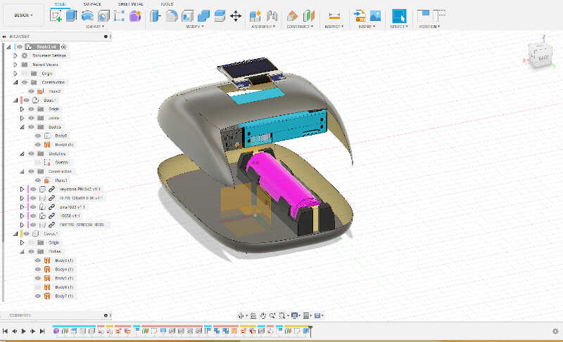
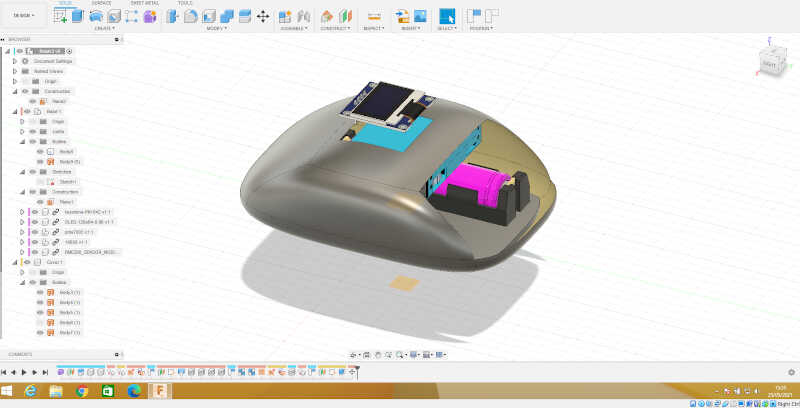

# 16. Applications and implications

## Assignment
*Propose a final project masterpiece that integrates the range of units covered, answering:*

*- What will it do?*

*- Who's done what beforehand?*

*- What will you design?*

*- What materials and components will be used?*

*- Where will come from?*

*- How much will they cost?*

*- What parts and systems will be made?*

*- What processes will be used?*

*- What questions need to be answered?*

*- How will it be evaluated?*

*- Your project should incorporate 2D and 3D design, additive and subtractive fabrication processes, electronics design and production, embedded microcontroller interfacing and programming, system integration and packaging.*
*- Where possible, you should make rather than buy the parts of your project.*
*- Projects can be separate or joint, but need to show individual mastery of the skills, and be independently operable.*
 

---

After some thought, and considering all the experiences from the course and due to limited time, I decided to restrict my final project to one module. At this time it will not be possible to do a modular ecosystem, as expected.

Therefore I will concentrate my efforts on one of the modules: **the *on-the-go* bike mobile environmental monitor.**

**Here I will briefly answer the questions and detail them in the project page.**

## 1. *What will it do?*

The bike mobile environmental monitor will measure the *on-the-go* concentration of the particulate matter in the air, as well as humidity, temperature and pressure. It will also track its position via a gps module. 

The information will be send via LORa with MQTT packages to a cloud server. An online dashboard will be available to monitor and analyze the data in real time.

The device will have a 16650 battery that will be charged wirelessly via induction power.

## 2. *Who's done that beforehand?*

There are many open source projects on air quality monitoring **but some are not mobile**. For instance:

* [Sensor Community](https://sensor.community/en/). The latest version of an air quality (PM) and noise monitoring project, originally developed by [luftdaten.info](https://luftdaten.info/#pll_switcher) a project stemming from the [OK Lab Stuttgart](https://codefor.de/stuttgart/). I work with these sensors in [project MAPEAR](https://aspea.org/index.php/pt/o-que-fazemos/projetos-nacionais/mapear) and my project ideia is to improve on them.
* [Smart Citizen project](https://smartcitizen.me/). An initiative from Fablab Barcelona that took off globally, in a similar fashion as the Sensor Community project. They have three main products:
    * A more affordable smart citizen kit (~ 110 euro) that contains a PM counter, VOC and CO_2 sensors. It also measures weather conditions, noise pollution, and light pollution.
    * The smart citizen kit 2.1, which incorporates the smart citizen kit capabilities plus precisely measures Carbon Mononixe (CO), Nitrogen Dioxide (NO2), Ozone (O3) with electrochemical sensors.
    * The [platform](https://smartcitizen.me/kits/) that displays in real time the measurements made all over the world.
    * The [almabike branch project](https://docs.smartcitizen.me/Guides/deployments/Almabike%20sensors/) I found out recently. It is very similar to the one I'm developing. 
* [Air Casting](https://www.habitatmap.org/aircasting) from Habitat Map. It is a **mobile** and fixed mapping PM sensing with an online platform. It didn't took off for now. I tested their platform to track positon with the phone but there were crashing problems.
* [Open Seneca](https://open-seneca.org/). A very similar project, also doing bike measurements, but it is not clear if it is open source hardware or just open source software.

* There are many projects that had the duration of the funding period (e.g.):
    * [Hackair](https://www.hackair.eu/)
* There are also some previous (non-exhaustive!) air quality projects made in Fablab Academy:
    * 2019
        * [Project Canary](http://fab.academany.org/2019/labs/echofab/students/annie-ferlatte/1FinalProject.html#home) by Annie Ferlatte (not sure she finished it). Measures PMs. I guess she wants the wings to move according to the value of the PM (?).
        * [PM Air quality sensor](http://fab.academany.org/2019/labs/singapore/students/eng-lim/project_presentation.html) by Lucas Lim. Measures PM concentrations for wood workshop.
    * 2018
        * [NaviGaire](http://archive.fabacademy.org/2018/labs/fablabbottrop/students/tanja-lovric/home/final7.html) by Tanja Lovric. Measures indoors VOC to give a measure of air quality. 
        * [Air Quality Controlled Window Opener](http://archive.fabacademy.org/2018/labs/falabvestmannaeyjar/students/bergthoraolof-bjorgvinsdottir/final_project/index.html) by Bergbora Bjorgvinsdóttir. It senses Voc and then translates to equivalent CO2.
        * [Pollution Sensor Calibration Unit](http://archive.fabacademy.org/2018/labs/barcelona/students/oscar-gonzalezfernandez/finalproject.html) by Óscar González Fernández.
    * 2017
        * [Plant.air](http://archive.fabacademy.org/2017/fablabfct/students/352/project.html) by Ana Filipa Silva. A plant pot that measures indoor CO2.

## 3. *What will you design?*

I'll design a portable air quality sensor, based on particulate matter measurement. The following picture shows an early design with some components more or less in place. 

<!-- picture from the design -->
{: style="width:100%"}

And here I have a picture with the box closed.

<!-- closed -->
{: style="width:100%"}

## 4. *What materials and components will be used?*

* **Sensor Case**
    * The case will be done with [Mayku Formbox](https://www.mayku.me/) using a CNC machined mold. In principle a transparent or opaque material will be used.
* **Sensor base**
    * The base will be mostly 3d printed with **PLA**. There may be a laser cut **acrylic** part to show the inductive coil. 
* **Components**
    * [Receiver inductive coil](https://www.adafruit.com/product/1407#technical-details) from Adafruit.
    * 16650 lithium battery with [keystone-PN1042](https://www.keyelco.com/product.cfm/product_id/918) holder.
    * [BME280](https://www.bosch-sensortec.com/products/environmental-sensors/humidity-sensors-bme280/) Temperature, Humidity and Pressure sensor module.
    * [Plantower PMS 7003](http://www.plantower.com/en/content/?110.html) Particulate matter sensor (PM1, PM2.5, PM10)
    * [HoperF RMF96W IC module](https://www.hoperf.com/modules/lora/RFM96.html?/modules/index.html&gclid=Cj0KCQjwwLKFBhDPARIsAPzPi-JzlsaaWY6qkFfO2AUkWJrAxaaoQvLmihRpTq9hUzXZoOy_5uIMSacaApbxEALw_wcB) to add to the final PCB.
    * Electronic components: capacitors, resistors, regulators, LEDs, diodes...
    * [U-blox NEO-6M](https://www.u-blox.com/en/product/neo-6-series) GPS module.

## 5. *Where it will come from?*

Most materials come from the lab itself. Some have been bought in [mauser](https://mauser.pt/), [mouser](https://pt.mouser.com/) and [farnell](https://pt.farnell.com/?CMP=KNC-GPT-PFB-New-customers-TargetIS&mckv=saO4I0k4r_dc|pcrid|484602294717|kword|farnell|match|e|plid||slid||product||pgrid|112977831045|ptaid|kwd-133401130|&gclid=Cj0KCQjwwLKFBhDPARIsAPzPi-I8dAOZyqlI4zcISw3DJJ3grKQIMmL5Zn2tKB0hSTHv53hlV8IYYGwaAoPiEALw_wcB) . Also, I already had a few of the modules I will use.

## 6. *How much do they cost?*

Here I will make a preliminary BOM to estimate the price of the whole thing.

| Part | Cost (euro) | link
| ----------- | -----------| ----------- |
| Inductive coil pair 5V @ 500mA | 8.20  | [link](https://octopart.com/1407-adafruit+industries-61582040?r=sp)
| 16650 Battery | 7.45  | [link](https://www.nkon.nl/pt/keeppower-16650-2500mah-protected-7a.html?gclid=Cj0KCQjwwLKFBhDPARIsAPzPi-JEMIloi0c5s6lLTA3hK-iMazeb4_z43RXlmSQrhV1xuPIsm2BeeZYaAhnzEALw_wcB)
| Keystone PN1042 Battery holder | 2,94 | [link](https://pt.farnell.com/keystone/1042p/battery-holder-18650-smd/dp/2674338?ost=keystone+pn+1042&pm=true)
| OLED Display 0.96'' I2C 128x64 SSD1306 White | 4,54 | [link](https://nettigo.eu/products/oled-display-0-96-i2c-128x64-ssd1306-white)
| NEO6Mv2 GPS module | 5,90 | [link](https://nettigo.eu/products/neo6mv2-gps-module-with-active-antenna)
| BME280 Temp/Humi/Pressure module | 5,68 | [link](https://nettigo.eu/products/module-pressure-humidity-and-temperature-sensor-bosch-bme280)
|PMS 7003 PM Sensor | 23,89 | [link](https://www.amazon.es/M%C3%B3dulo-sensor-ventilador-incorporado-PMS7003/dp/B08N4Q9BCM/ref=sr_1_1_sspa?__mk_es_ES=%C3%85M%C3%85%C5%BD%C3%95%C3%91&dchild=1&keywords=pms7003&qid=1621946883&sr=8-1-spons&psc=1&smid=A21312XZUBAZON&spLa=ZW5jcnlwdGVkUXVhbGlmaWVyPUEzQTU1R1ExRkQ0MUZRJmVuY3J5cHRlZElkPUExMDA4NjYySEhNTEFPMERYV0o0JmVuY3J5cHRlZEFkSWQ9QTAyMDMwMzMxWUw5UUQ5OEY1SVlLJndpZGdldE5hbWU9c3BfYXRmJmFjdGlvbj1jbGlja1JlZGlyZWN0JmRvTm90TG9nQ2xpY2s9dHJ1ZQ==)
| RFM96W LORA IC | 14,00 | [link](https://octopart.com/rfm96w-433s2-hope+microelectronics-61519277?r=sp)
| ESP32-WROOM-32E (16MB) | 2,98 | [link](https://octopart.com/esp32-wroom-32e+%2816mb%29-espressif+systems-107867769?r=sp)
| Electronic parts and components (FR1, resistors, condensers, switches, regulators, diodes, pins, buttons...) | 10,00 | estimated
| 12V Charger | 4,92 | [link](https://mauser.pt/catalog/product_info.php?cPath=23_66_883&products_id=035-2580)
| PLA plastic | 5,00 | estimated
| Thermoforming sheet | 1,00 | estimated
| Acrylic laser cut part | 1,00 | estimated

**Grand Total: 97,50 €**

## 7. What parts and systems will be made?

I will fabricate:

* Electronic PCB with ESP32 IC and LORA IC RMF96W. I will base my design in the one made on [week 12](http://fab.academany.org/2021/labs/benfica/students/vasco-neves/assignments/week12/).

* Part of the case cover with the thermoforming machine, using a mold made with the CNC cutting machine. 

* Case base and part of the cover with the 3d printing.

* Part of the base with the laser cutting machine.

* Embedded interface with a node-RED dashboard on the cloud (for now).

* Embedded programming integrating all inputs/outputs.

## 8. What processes will be used.

Vacuum forming, 3d printing, laser cutting, cnc cutting, electronics production, embedded interfacing and programming.

## 9. What questions need to be answered?

* What is the air quality of our cities? 

* How can we continuously monitor everything, so that we have a better idea of the quality of the air that we breathe?

* How can we use this information to influence public policies and to raise public awareness?

* How can we involve the public in this process? How to create communities of practice around air quality issues?

* How can we involve the public in citizen science practices?

## 10. How it will be evaluated?

For evaluation I will use the following strategies:

* Analysis of the output values (PMs, temperature, humidity, pressure, coordinates, LORA signal) and comparison with similar devices/projects to check their viability. There will be a Node-RED dashboard to monitor the output values.
* Extensive on-the-bike all-weather testing. 
* 

## References

* [Air Casting](https://www.habitatmap.org/aircasting)

* [Air Quality Controlled Window Opener](http://archive.fabacademy.org/2018/labs/falabvestmannaeyjar/students/bergthoraolof-bjorgvinsdottir/final_project/index.html).

* [Almabike project](https://docs.smartcitizen.me/Guides/deployments/Almabike%20sensors/)

* [Hackair](https://www.hackair.eu/)

* [luftdaten.info](https://luftdaten.info/#pll_switcher)

* [Mayku Formbox](https://www.mayku.me/)

* [NaviGaire](http://archive.fabacademy.org/2018/labs/fablabbottrop/students/tanja-lovric/home/final7.html).

* [Open Seneca](https://open-seneca.org/)

* [Plant.air](http://archive.fabacademy.org/2017/fablabfct/students/352/project.html).

* [PM Air quality sensor](http://fab.academany.org/2019/labs/singapore/students/eng-lim/project_presentation.html).

* [Pollution Sensor Calibration Unit](http://archive.fabacademy.org/2018/labs/barcelona/students/oscar-gonzalezfernandez/finalproject.html).

* [Project Canary](http://fab.academany.org/2019/labs/echofab/students/annie-ferlatte/1FinalProject.html#home)

* [Sensor Community](https://sensor.community/en/)

* [Smart Citizen project](https://smartcitizen.me/)

    

