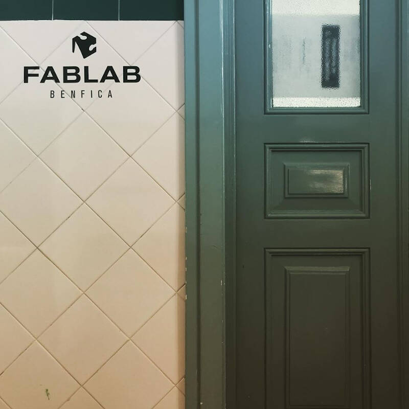
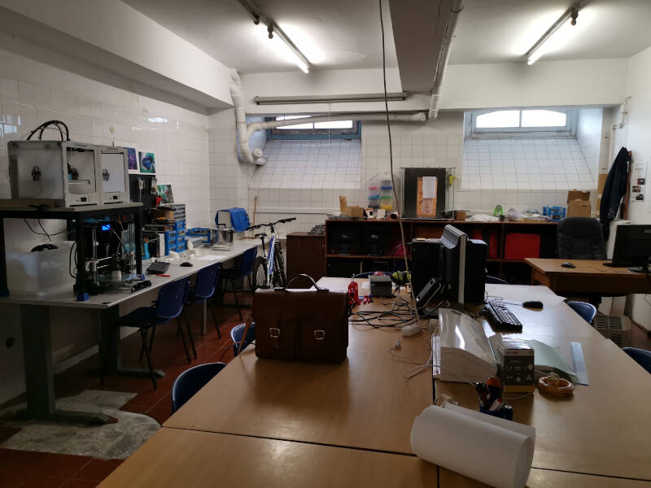
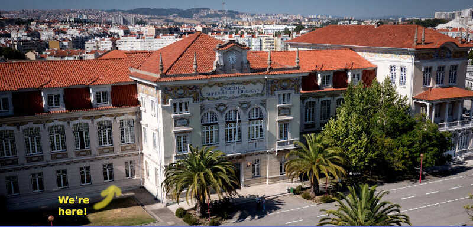

# Home

## Welcome!

I'm Vasco and this is my Fablab Academy personal web page.

I'm from Aveiro, a coastal city in the north of Portugal. At this time I was supposed to be in Lisbon, but we're currently in lockdown, and we may not have access to the Lab for some time &nbsp;  :( . But I'm confident that André, my instructor, will send all the necessary material to my place, machines included! :)

I'm the first (and only!) student at [Fablab Benfica](https://www.fablabs.io/labs/fablabbenfica).

<!-- imagem -->

At this time, the Lab is expanding! In 2020, new and larger facilities were assigned to the lab inside the institute.

<!-- imagem -->

Fablab Benfica is located at [Escola Superior de Educação](https://www.eselx.ipl.pt/) (Education Superior School) which is part of [Instituto Politécnico de Lisboa](https://www.ipl.pt/) (Lisbon Polytechnic Institute).

<!-- imagem -->

We're located in Benfica council of Lisboa (hence the name of the Lab). The following movie shows our place in the world. ;)

<video class="center" width="800" height="452" controls>
  <source src="files/ESELxv5.m4v" type="video/mp4">
Your browser does not support the video tag.
</video>
