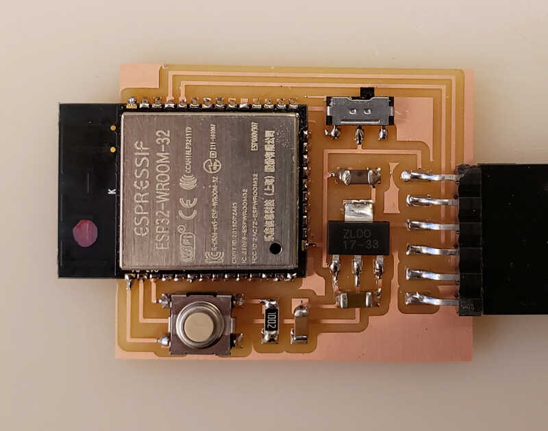

# Final Project

The initial idea is to create a customizable, modular, IoT, on-the-go environmental indoor/outdoor personal monitoring ecosystem. 

I worked on this idea in week01 and week03 and I've returned back to the final project on week08.

## Week01

The environmental personal monitor (EPM) is comprised of a base station and a two (for now) modular devices with specific functions:

* **Micrometric particle concentration measurement (PM10, PM2.5, PM1)**
* **Meteorologic physical variables measurement (Temperature, Humidity, Pressure)**
* **Cell phone App with control and simple data analysis capability**
* Integrated CO, Smoke and Gas Alarm device (indoor - optional)
* Noise and Illumination measurement (optional)
* Air quality forecast information (optional - if there is time)
* ...

The ones this project will address first and foremost are in **bold**.

The base station connects to the internet via wi-fi and to the other devices via wi-fi or/and bluetooth or/and LoRa or/and radio. The devices recharge their batteries via an [inductive charging](https://en.wikipedia.org/wiki/Inductive_charging) pad or surface. All devices are controlled by a simple cell phone app.

**The intended audience for this product would be:**

* Everyone who has the need to know their own personal air quality, whether it may be indoors, outdoors or on the go.
* People with respiratory conditions to know the quality of the air around them, and empowering them and act accordingly.
* People with fireplaces and appliances that use gas to know if they have a potentially deadly problem on their hands, and it can also double up as a smoke detector.
* Everyone working inside all the time during the pandemic and worried about indoor air quality.

I (tried to) sketched this idea by hand. I hope you can understand it! :) I will start with the base station and one device and, if time allows, I will move on to other devices.

<!-- image with sketched idea -->

## Week02

During week02 a made an initial basic sketch of the design (v0.1) of the base station. The initial design idea here was inspired by several organic designs around the circular charging pad to make it emotionally more appealing and interesting. I thought to add to the design, for example, some lotus flower petals or some leafs (left image). I also thought about using an ellipsoidal form (middle left image), a bird's nest design (middle right right image) or a more organic, tree like structure around the base (rightmost image).

<!-- place here an example of lotus leafs, architecture design, and bird's nest -->

The details of the design construction process are shown on [week02 documentation](http://fabacademy.org/2021/labs/benfica/students/vasco-neves/assignments/week02/#base-station-design). The complete v0.1 design is pictured below.

<!-- pic -->

I will leave this design at this point. Things than need to be done:

* Create realistic leafs. I am thinking about a 3D 3 spline leaf design: four going from the middle center down and 3 or 4 going up.
* Adding some tolerances.
* Create an alternative design for the base station.
* Set up places for the leds, PCB, wiring, components.

## Week03-07

During these weeks I was too busy to even think about the project. I hope I can, from now on, and especially after the machine design and construction week, to dedicate more time to the final project.

## Week08

### Updating the initial idea

In week08 I updated my original idea to include more detail.

What would be the functions of each element of the EPM?

* Base station
  * [Inductive charging](https://en.wikipedia.org/wiki/Inductive_charging) pad.
  * [Wi-fi](https://en.wikipedia.org/wiki/Wi-Fi), [BLE](https://en.wikipedia.org/wiki/Bluetooth_Low_Energy) and [LORA-WAN](https://en.wikipedia.org/wiki/LoRa) communication.

* Alarm monitor
  * Sensing capabilities: VOCs, CO, Gas, Smoke
  * Wi-fi and LORA-WAN communication
  * Battery and integrated inductive coils

* Indoor/Outdoor/On the Go environmental monitor
  * Sensing capabilities: Temperature, Humidity, Pressure, PMs, CO2, VOCs...
  * Wi-fi, BLE and LORA-WAN communication
  * Ability to detect movement to increase measurements on the go
  * Battery and integrated inductive coils

## Week09

What would be the best MC platform for this project?

After some research and reflection **I ended up choosing [ESP32](https://www.espressif.com/en/products/modules/esp32) as the ideal platform for this project.** 

<!-- esp32wroom -->

The advantages are many namely:

* Very powerful and fast (160-240 MHz) chip for the price ($1-$5 dollars each for a prototyping board)
* A generous flash memory (4,8 or 16 MB)
* **Integrated Wi-Fi and Bluetooth BLE** 
* Loads of interface options: 
  * [SD Card](https://en.wikipedia.org/wiki/SD_card)
  * [Universal Asynchronous receiver-transmitter (UART)](https://en.wikipedia.org/wiki/Universal_asynchronous_receiver-transmitter)
  * [Serial Peripheral Interface (SPI)](https://en.wikipedia.org/wiki/Serial_Peripheral_Interface)
  * [Secure Digital Input Output (SDIO)](https://en.wikipedia.org/wiki/SDIO)
  * [Inter-Integrated Circuit (I²C)](https://en.wikipedia.org/wiki/I%C2%B2C)
  * [LED Pulse width modulation (PWM)](https://en.wikipedia.org/wiki/Pulse-width_modulation)
  * [Motor PWM](https://en.wikipedia.org/wiki/Pulse-width_modulation)
  * [Inter-IC Sound (I²S)](https://en.wikipedia.org/wiki/I%C2%B2S)
  * IR
  * Pulse counter
  * GPIO
  * Capacitive touch sensor
  * ADC
  * DAC

I don't know yet which specific ESP32 chip I'm going to choose but I'll see about that later on.

What would be the preferential communication protocol? 

## Break week

During the break week I was mostly sick with a strong spring allergy :\ but I could think about some designs for a prototyping board. **And yes..still at home. :(**

After some iterations, I designed a ESP32 board, based on [Neil's design](http://academy.cba.mit.edu/classes/networking_communications/ESP32/hello.ESP32-WROOM.png), as shown below.

<!-- neil board -->

The new board design, shown below, has:

* 12 I/O ports 
* FTDI communication
* 2 3V power pins and 2 5V power pins.
* reset button
* programming switch
* LED light

<!-- protob1 -->
{: style="width:100%"}

The idea is to be able to connect several sensor devices at the same time and have a board for other uses and projects. The relevant files are at the bottom of this page.

## Week 12

During [week 12](http://fab.academany.org/2021/labs/benfica/students/vasco-neves/assignments/week12/) I successfully connected an OLED screen to a ESP32 prototyping board. My fabricated board didn't came out well so I had to do it in the following week. 

The following picture shows the wired setup communicating via I²C. 

<!-- picture of the the wired diagram -->

The following video shows the OLED screen output of a "hello world" message just typed on the keyboard.

<!--vid_193700  -->
<video class="center" width="800" controls>
  <source src="../../files/week12/hello_oled.m4v" type="video/mp4">
Your browser does not support the video tag.
</video>

## Week 13

From the board designed in the Break Week, I created a simpler one to fabricate for the output devices week, and corrected a few mistakes. It is basically the same board, but with less I/O pins and a more concentrated design.

The next two pictures show the circuit schematics

<!-- ed1  -->
{: style="width:100%"}

and the PCB layout.

<!-- ed2 -->
{: style="width:100%"}

Then I fabricated the board in my 1060 milling machine, with the following design rules: 0.3 mm clearance (due to the small footprints of the ESP32) and 0.4 mm tracks.

<!-- board -->

The fabricated board is shown here. I could only fabricate it on [week14](http://fab.academany.org/2021/labs/benfica/students/vasco-neves/assignments/week14/) though, and I used it during this week (for now). **Anyway, I'll need a new version of the board for the final project.**

After the board is ready, I established a communication via wifi between my own fabricated board and and ESP32 prototyping board. A BME280 sensor was connected to one of them and the other was connected to the OLED screen. The materials I used are depicted in the following picture.

<!-- materials -->

The prototyping board (ESP32 Server) was connected to the BME280 and my board (ESP32 Client) was connected to the OLED screen, as shown in the picture below.

<!--full setup v2  -->

The following video shows the whole system working, showing sequentially the BME280 sensor, the server board, the client board, the OLED display and finally the serial monitor output from both boards. **In the last seconds of the video, the system monitor on the upper window is the server and on the lower window is the client**.

<!-- video -->
<video class="center" width="800" controls>
  <source src="../../files/week13/wifi_network.m4v" type="video/mp4">
Your browser does not support the video tag.
</video>

## Week 14

During week 14 I created an MQTT broker on the cloud and used Node-RED to program it and to display a dashboard of the measurements.

The following video shows the packets being transferred from the MQTT client (left window) to the MQTT server (right window), using the Mosquitto MQTT broker.

<!-- video -->
<video class="center" width="800" controls>
  <source src="../../files/week14/mosquitto.m4v" type="video/mp4">
Your browser does not support the video tag.
</video>

Then I setup a Node-RED server on the cloud. The Node-Red flow is depicted below.

{: style="width:100%"}

From here I created this simple dashboard to test it out.

<!-- node-red-dashboard -->
{: style="width:80%"}

The circuit feeding this dashboard can be seen below.

<!-- ESP32-BME280 check the phone -->
{: style="width:50%"}

## Research

There are many open source projects on air quality monitoring **but some are not mobile**. For instance:

* [Sensor Community](https://sensor.community/en/). The latest version of an air quality (PM) and noise monitoring project, originally developed by [luftdaten.info](https://luftdaten.info/#pll_switcher) a project stemming from the [OK Lab Stuttgart](https://codefor.de/stuttgart/). I work with these sensors in [project MAPEAR](https://aspea.org/index.php/pt/o-que-fazemos/projetos-nacionais/mapear) and my project ideia is to improve on them.
* [Smart Citizen project](https://smartcitizen.me/). An initiative from Fablab Barcelona that took off globally, in a similar fashion as the Sensor Community project. They have three main products:
    * A more affordable smart citizen kit (~ 110 euro) that contains a PM counter, VOC and CO_2 sensors. It also measures weather conditions, noise pollution, and light pollution.
    * The smart citizen kit 2.1, which incorporates the smart citizen kit capabilities plus precisely measures Carbon Mononixe (CO), Nitrogen Dioxide (NO2), Ozone (O3) with electrochemical sensors.
    * The [platform](https://smartcitizen.me/kits/) that displays in real time the measurements made all over the world.
    * The [almabike branch project](https://docs.smartcitizen.me/Guides/deployments/Almabike%20sensors/) I found out recently. It is very similar to the one I'm developing. 
* [Air Casting](https://www.habitatmap.org/aircasting) from Habitat Map. It is a **mobile** and fixed mapping PM sensing with an online platform. It didn't took off for now. I tested their platform to track positon with the phone but there were crashing problems.
* [Open Seneca](https://open-seneca.org/). A very similar project, also doing bike measurements, but it is not clear if it is open source hardware or just open source software.

* There are many projects that had the duration of the funding period (e.g.):
    * [Hackair](https://www.hackair.eu/)
* There are also some previous (non-exhaustive!) air quality projects made in Fablab Academy:
    * 2019
        * [Project Canary](http://fab.academany.org/2019/labs/echofab/students/annie-ferlatte/1FinalProject.html#home) by Annie Ferlatte (not sure she finished it). Measures PMs. I guess she wants the wings to move according to the value of the PM (?).
        * [PM Air quality sensor](http://fab.academany.org/2019/labs/singapore/students/eng-lim/project_presentation.html) by Lucas Lim. Measures PM concentrations for wood workshop.
    * 2018
        * [NaviGaire](http://archive.fabacademy.org/2018/labs/fablabbottrop/students/tanja-lovric/home/final7.html) by Tanja Lovric. Measures indoors VOC to give a measure of air quality. 
        * [Air Quality Controlled Window Opener](http://archive.fabacademy.org/2018/labs/falabvestmannaeyjar/students/bergthoraolof-bjorgvinsdottir/final_project/index.html) by Bergbora Bjorgvinsdóttir. It senses Voc and then translates to equivalent CO2.
        * [Pollution Sensor Calibration Unit](http://archive.fabacademy.org/2018/labs/barcelona/students/oscar-gonzalezfernandez/finalproject.html) by Óscar González Fernández.
    * 2017
        * [Plant.air](http://archive.fabacademy.org/2017/fablabfct/students/352/project.html) by Ana Filipa Silva. A plant pot that measures indoor CO2.

## 2D and 3D Modeling

## Materials

The materials section is still in its early stages. A [preliminary online BOM listing](https://docs.google.com/spreadsheets/d/1TCPXBotLpmmzKyvyE7MEZckPoZr5FrSRkHaYjzf6OfM/edit?usp=sharing) is being constantly updated.

I also did a more recent version of that list during week 16, shown here.

| Part | Cost (euro) | link
| ----------- | -----------| ----------- |
| Inductive coil pair 5V @ 500mA | 8.20  | [link](https://octopart.com/1407-adafruit+industries-61582040?r=sp)
| 16650 Battery | 7.45  | [link](https://www.nkon.nl/pt/keeppower-16650-2500mah-protected-7a.html?gclid=Cj0KCQjwwLKFBhDPARIsAPzPi-JEMIloi0c5s6lLTA3hK-iMazeb4_z43RXlmSQrhV1xuPIsm2BeeZYaAhnzEALw_wcB)
| Keystone PN1042 Battery holder | 2,94 | [link](https://pt.farnell.com/keystone/1042p/battery-holder-18650-smd/dp/2674338?ost=keystone+pn+1042&pm=true)
| OLED Display 0.96'' I2C 128x64 SSD1306 White | 4,54 | [link](https://nettigo.eu/products/oled-display-0-96-i2c-128x64-ssd1306-white)
| NEO6Mv2 GPS module | 5,90 | [link](https://nettigo.eu/products/neo6mv2-gps-module-with-active-antenna)
| BME280 Temp/Humi/Pressure module | 5,68 | [link](https://nettigo.eu/products/module-pressure-humidity-and-temperature-sensor-bosch-bme280)
|PMS 7003 PM Sensor | 23,89 | [link](https://www.amazon.es/M%C3%B3dulo-sensor-ventilador-incorporado-PMS7003/dp/B08N4Q9BCM/ref=sr_1_1_sspa?__mk_es_ES=%C3%85M%C3%85%C5%BD%C3%95%C3%91&dchild=1&keywords=pms7003&qid=1621946883&sr=8-1-spons&psc=1&smid=A21312XZUBAZON&spLa=ZW5jcnlwdGVkUXVhbGlmaWVyPUEzQTU1R1ExRkQ0MUZRJmVuY3J5cHRlZElkPUExMDA4NjYySEhNTEFPMERYV0o0JmVuY3J5cHRlZEFkSWQ9QTAyMDMwMzMxWUw5UUQ5OEY1SVlLJndpZGdldE5hbWU9c3BfYXRmJmFjdGlvbj1jbGlja1JlZGlyZWN0JmRvTm90TG9nQ2xpY2s9dHJ1ZQ==)
| RFM96W LORA IC | 14,00 | [link](https://octopart.com/rfm96w-433s2-hope+microelectronics-61519277?r=sp)
| ESP32-WROOM-32E (16MB) | 2,98 | [link](https://octopart.com/esp32-wroom-32e+%2816mb%29-espressif+systems-107867769?r=sp)
| Electronic parts and components (FR1, resistors, condensers, switches, regulators, diodes, pins, buttons...) | 10,00 | estimated
| 12V Charger | 4,92 | [link](https://mauser.pt/catalog/product_info.php?cPath=23_66_883&products_id=035-2580)
| PLA plastic | 5,00 | estimated
| Thermoforming sheet | 1,00 | estimated
| Acrylic laser cut part | 1,00 | estimated

**Grand Total: 97,50 €**

## Useful links

* [https://randomnerdtutorials.com/esp32-lora-rfm95-transceiver-arduino-ide/](https://randomnerdtutorials.com/esp32-lora-rfm95-transceiver-arduino-ide/)
* [About LoraWan](https://lora-alliance.org/about-lorawan/)
* [Andreas Spiess - How to measure CO2 and VOC with Arduino. Which one is better?](https://www.youtube.com/watch?v=FL0L-nic9Vw)
* [Random Nerd Tutorials](https://randomnerdtutorials.com/)
* [Andreas Spiess Tutorials](https://www.youtube.com/channel/UCu7_D0o48KbfhpEohoP7YSQ)
* [Andreas Spiess - LoraWan Demistified](https://www.youtube.com/watch?v=hMOwbNUpDQA)
* [Wikipedia](https://en.wikipedia.org/wiki/Main_Page)
* Wireless charging
  * [https://www.nutsvolts.com/magazine/article/august2013_Bates](https://www.nutsvolts.com/magazine/article/august2013_Bates)
  * [https://www.instructables.com/DIY-Wireless-Charger-1/](https://www.instructables.com/DIY-Wireless-Charger-1/)
* Sensors
  * EQ Sensors
    * [MQ2 - ]
* [Open Seneca project](https://open-seneca.org/)

## Files

